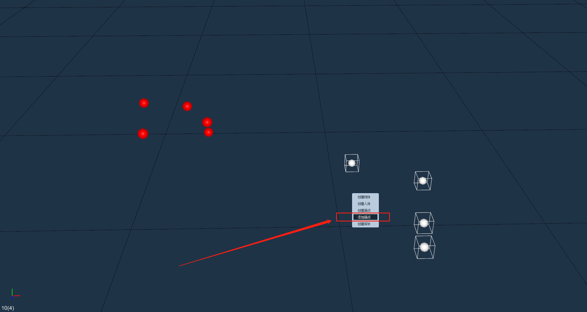

# （七）免标定（锚点标定）

### 创建锚点： 

* 请在捕捉场景的边缘一圈放置Marker点，确保放置的Marker点的位置在捕捉场景的边缘处且3D视图中可以重建出放置的Marker点，接下来点击冻结帧将3D视图冻结，选中需要创建锚点的Marker点，鼠标右键选择“创建锚点”，锚点创建后3D视图中的Marker由白色变为红色锚点；


<mark style="color:orange;">支持创建的锚点数量为5-100个。</mark>


### 删除锚点 

*   首先将软件暂停播放，打开标定面板，在面板中点击右侧齿轮按钮打开标定设置，选择免标定，点击“删除锚点”按钮后锚点便会被删除（8.7.1）；\

    <figure><figcaption>
8.7.1
</figcaption></figure>

### 开启免标定 

* 创建锚点后打开标定面板，在面板中点击右侧齿轮按钮打开标定设置，选择免标定，勾选“使用免标定”复选框后软件会每隔一个小时进行一次标定（8.7.2），也可以手动点击“刷新”按钮，手动触发一次标定。标定完成后，会自动更新当前加载的标定文件，在“免标定”界面会显示最近一次更新的时间。

<figure><figcaption>
8.7.2
</figcaption></figure>

### 手动增加锚点

*   在创建出锚点后，若需要在现有的锚点数量上再增加锚点，首先点击冻结帧按钮，将需要添加锚点的未命名点框选上，点击右键选择增加锚点，软件上会弹出一个提示窗口，点击确定后指定的未命名点会变成锚点显示在3D视图上了。\

    <figure><figcaption>
8.7.3
</figcaption></figure>


<mark style="color:orange;">锚点创建成功后请不要随意改变锚点的位置，保证开启免标定期间3D视图中创建的锚点正确识别上；</mark>

