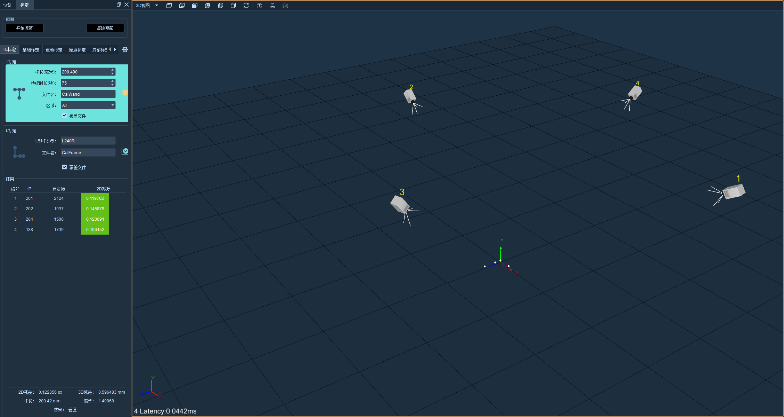
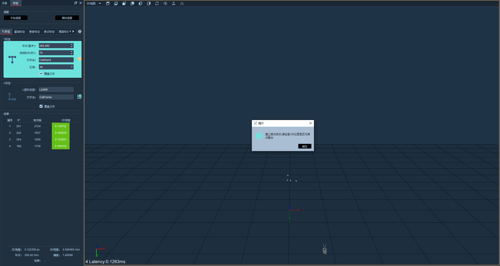

# （二）T+L标定

T+L标定。先进行T标定，然后再进行L标定。界面如下：

<figure><figcaption></figcaption></figure>

* 标定参数。“杆长”表示所用 T 型杆两端反光标记点的距离，输入 T 型杆上标签所标注的数字即可；“持续时间”为标定时间，一般为 60-120s，设置完毕后点击“下一步按钮，挥杆人员手持 T 型标定杆，在捕捉区域内反复挥动，镜头采集到有效数据则相应的区域会变成灰色，保证每个镜头有效数据量足够即每个镜头随着采集数据量的增加，颜色由浅变深；“文件名”为标定挥杆数据保存的文件名称。
* T标定进度。T标定中显示出进度条，进度条随着挥杆的时间逐渐向前移动，当进度条进行到50%时，T标定背景色会由橙黄色变为绿色，挥动T型杆，尽可能覆盖到镜头可见的每个角落，所有镜头的2D视图中都至多看到T型杆的三个marker（即所有镜头的2D视图中左下角的数字均小于等于3，尽量使尽可能多的镜头数字等于3），标定过程中，2D界面中显示标定杆扫过的区域，可实时显示可用的数据量及杂质情况，当对话框显示达到预定帧数时，会有声音提示，也就是进度条100%时浮窗下方出现计算按钮。T标定完成的三个条件：1、单镜头有效帧数  2、标定时间  3、单镜头挥杆区域覆盖率。

<figure><figcaption></figcaption></figure>

* T标定结果。挥杆完成后，点击计算，软件进入计算过程，计算结束后，软件会反馈出标定结果（评价为较差\普通\良好\完美），T标定右侧也会根据标定结果显示出不同的图标；在镜头列表处，会显示每个镜头的2D残差数据。（若标定结果显示“较差”或者单个镜头的2D残差较大，建议重新标定）。计算过程中可以随时点击中止按钮停止计算流程，如果计算结果为较差或者普通，可以直接点击页面上的“上一步”返回到计算前页面，再次计算结果；或者直接点击两次“上一步”按钮，返回到T挥杆开始前状态，重新进行挥杆。

<figure><figcaption></figcaption></figure>

* 原点标定。T标定完成后，切换视图到3D视图（保证3D视图中只显示了L型杆的4个点），选择L型杆的类型和L标定的文件名，点击L标定。

<figure><figcaption></figcaption></figure>

* 保存标定文件，即可正常使用系统。
