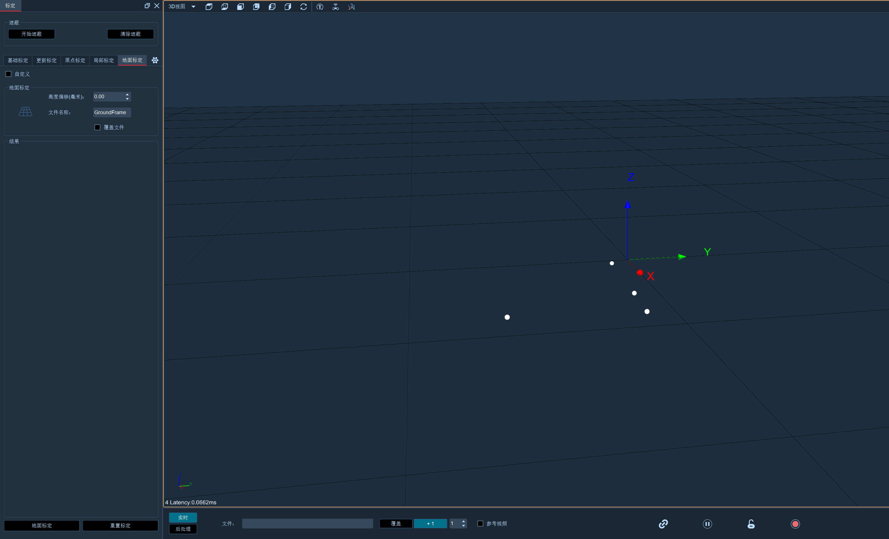
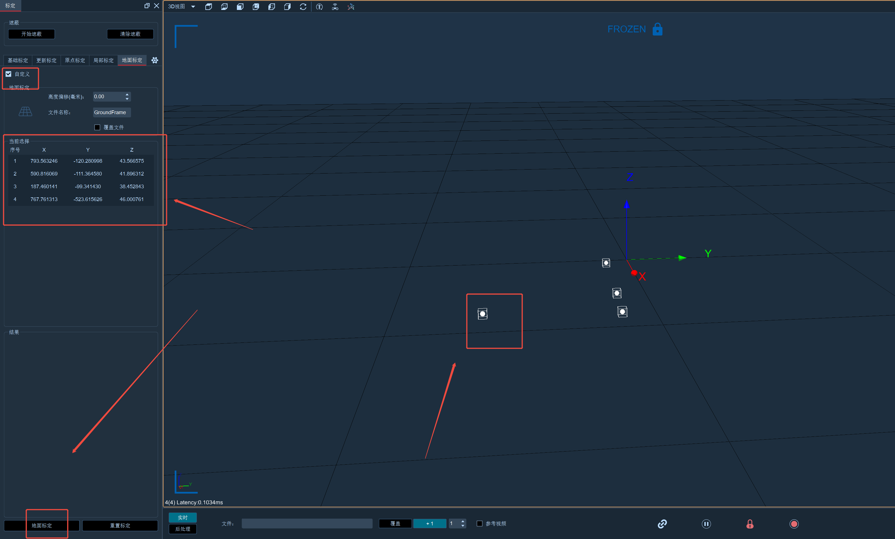

# （六）地面标定

### 地面标定：

切换2D视图，点击标定，选择地面标定，保持默认参数和名称，再次检查场地中Marker点数量，点击标定（8.6.1），标定完成3D视图所有中点都在地面上，点击保存会弹出文件框，点击确定；\

<figure><figcaption></figcaption></figure>


注意：Marker点数必须大于3，并且场地中除了放置的点外没有其他杂点；


### 高度偏移：

以点为参照，填写Marker的半径，标定完成后Marker会完整显示在地面上，默认是0，注意：数值单位是毫米；

自定义地面标定操作步骤：

1. 开启自定义地面标定模式，软件界面会显示冻结帧，并且会冻结当前帧画面。
2. 选择点以确定地面信息 ​单点选择：按住CTRL键，在3D视图画面中选择任意点。每选择一个点，该点的XYZ位置会在标定面板显示出来。 ​框选多个点：按住SHIFT键，在3D视图画面中框选任意多个点。被框选的这些点的XYZ位置同样会在标定面板显示。
3. 关于高度偏移 需要特别留意，高度偏移对自定义地面标定操作不会产生影响，在进行标定过程中无需考虑此因素。
4.  保存标定文件 标定完成后，要手动保存标定文件。因为如果不手动保存，一旦软件退出，之前所做的标定信息将会丢失 。\

    <figure><figcaption></figcaption></figure>
