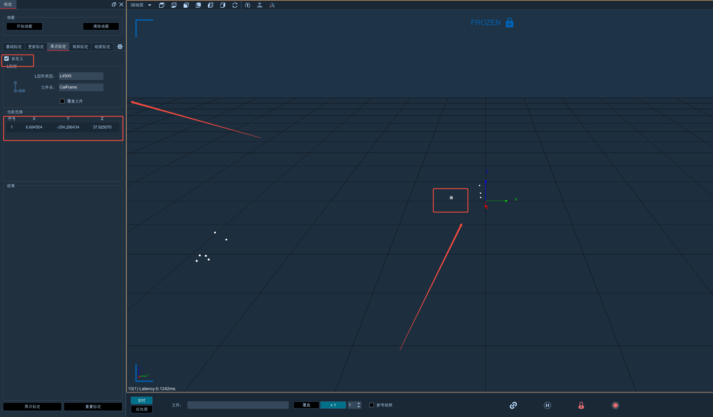

# （四）原点标定

1. 针对现有的标定文件，在不标定整个动捕系统的情况下（也就是不进行T标定），可以单独进行L标定，更新坐标系原点，标定完成后会更新3D视图上原来的坐标系原点位置；
2. 原点标定前，请先确定好要更新的原点位置，将L型标定杆放置于动捕场地中，在2D视图中至少1/4镜头可以完整的捕捉到L型杆上的四个Marker点，且2D视图中除L型杆上的四个Marker点无其他噪点；
3. 打开标定面板，选择原点标定，点击齿轮打开标定设置，设置此次原点标定使用的L型杆类型，请勿修改“标定轴向”；
4. 关闭原点标定设置，点击标定面板底部的“原点标定”按钮，标定完成后，点击完成“按钮”，将此次原点标定的标定文件另存，若需要重新标定可点击“重置标定”按钮；
5. 可参照本手册“八、（二）基础标定”中的L标定步骤；
6.  切换到3D视图，原点位置就会更新到L型杆放置的位置了。\

    <figure><figcaption></figcaption></figure>

自定义原点标定操作步骤：

1. 开启自定义原点标定 软件会冻结当前帧，3D界面显示冻结状态。
2. 选择点以确定坐标轴和原点 ​：
3. 选择第一个点：在3D视图里挑选一个点，软件会把这个点冻结并认定为原点。此时，标定面板会显示该点的XYZ位置信息。 ​
4. 选择第二个点：继续在3D视图中选择另外一个点，此点将用于确定长轴方向。同样，标定面板会更新显示新选择点的XYZ位置。 ​
5. 选择第三个点：再选择一个点，这个点的作用是确定短轴方向。每选择一个点，标定面板都会实时显示其XYZ坐标。
6. 3D视图选择点后点击L标定

<figure><figcaption></figcaption></figure>


多选点的操作方式 在选择剩余点时，可以按住CTRL键进行多选操作，这样能提高选择效率， 如果一共选择了四个点，软件将执行原点标定操作。



自定义原点标定必须选择点，否则无法完成标定。&#x20;

在选择点的过程中，要确保所选的点能准确代表所需的原点和坐标轴方向，否则可能会导致标定结果不准确。

