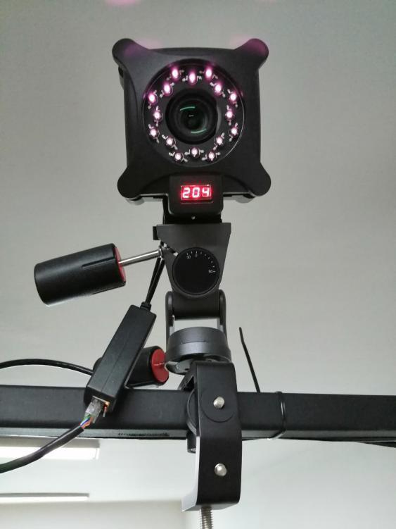

# （三）镜头放置与交换机的连接

1. 安装镜头前，请确保固定在桁架上的三向云台无松动；
2.  将镜头通过快装片与三向云台连接，再将三向云台与三脚架或 C 型夹进行连接（2.3.1)为方便调试，镜头可按背面标签的 IP 地址顺序放置；

    

3. 将 POE 分离器插入镜头背面的 RJ45 网口和 DC 电源孔；将每个镜头的 POE 分离器通过网线与交换机进行连接，接口无顺序要求，但不能接到 8 口交换机 LAN/NVR 或是 24 口交换机的 25/26 接口上；若是 8 口交换机，将一根网线，连接交换机的 LAN 口和电脑的网口；
4. 若有多个8 口交换机，需使用网线将交换机A的LAN口与交换机B的NVR口连接，然后将交换机B的 LAN 口与电脑连接。2.若是 16口交换机，将一根网线，连接交换机的第15或16口和电脑；若有多个16口交换机，需使用网线将交换机A的第15接口与交换机B的第16接口连接，然后将交换机B的第15接口与电脑连接；交换机通电，等待约 20s，确认各镜头已通电亮起，镜头正下方的数码管亮起且显示出IP地址后三位数；


**注意：**

**1.请确认您所使用的相机型号，以下相机型号不使用POE分离器**

**Mars系列：Mars9H、Mars9HW、Mars18H 、Mars18HW、Mars26H、Mars26HW**

**Pluto系列全部型号；**

**VRT系列全部型号；**

**如有疑问，请联系Nokov工程师咨询。**

**2.Orbit长条镜头使用网线连接镜头和电脑，可以不使用交换机。**


>
