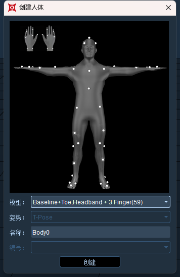
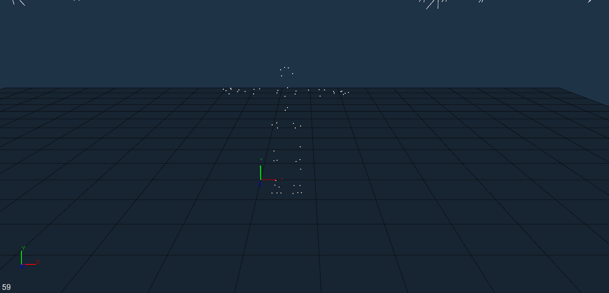
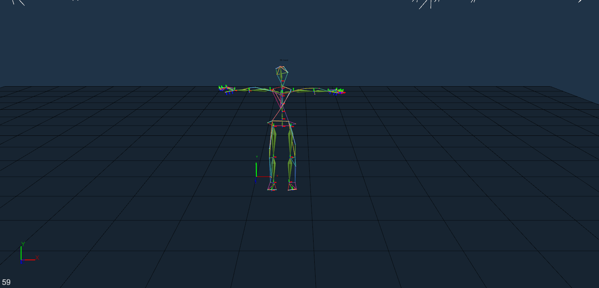

# （二）Body（人体）

#### **Baseline+Toe,Headband(53)**

1.  在实时模式下创建53点人体，需要模特穿上动捕服并正确贴好53个反光标记点，在3D视图下可以看到每一个反光标记点且场地内无其他杂点，创建53贴点的人体请确定3D视图左下角的数字为53（9.2.1），根据贴点图及指导视频进行贴点（若贴点困难或有其他问题请联系技术工程师）；\

    .png>)
2.  确认软件处于播放状态，模特以TPOSE站立，标定文件为Y轴向上时，模特面向Z轴，手臂与X轴平行，点击冻结，在3D界面鼠标右击选择“创建人体”，在“创建人体”窗口的下拉框中选择“Baseline+Toe,Headband(53)”，将鼠标光标放在贴点图片上，滚动鼠标滚轮，可查看不同角度的贴点位置（9.2.2），在确认实际贴点与贴点图片一致后，点击“Create”创建人体模型；\

    .png>)
3.  53贴点的人体模型（9.2.3），在实时模式下，点击3D视图上方的“识别重置”按钮（9.2.4）可对人体模型进行重新识别；\

    .png>)

    .png>)
4. 如果创建多个人体模板，需要创建一个人体模板之后，该模特完全走出场地，另一个模特再进入到场地，确保3D视图中只有人体身上的53个Marker点，重复上述步骤 ；也可多人同时T-Pose站立在捕捉场地中，通过框选Marker点的方式来创建人体;
5. 解除 3D 视图的冻结状态，此时模特任意运动， 可看到人体Markerset 将实时跟随模特的活动，在该状态下也可直接采集数据;
6. 如果53点人体走出场外后丢失1-3颗点可以识别出人体;
7. 53点人体骨骼None朝向;


注意不包括头部，如果人体头部丢点将无法识别

注意None骨骼人体录制的数据，使用3.3之前版本加载会出现异常


***

#### **VR Body**

1. 在实时模式下创建VR Body。需要模特戴上贴有反光标记点的刚性Rig板，分别在模特的双手手背、双手大臂外侧、后腰、前胸、头顶、双脚脚背处戴上刚性Rig板，并紧固防止创建人体后在模特在运动过程中移动了Rig板影响人体效果。在3D视图下可以看到Rig板上的每一个反光标记点且场地内无其他杂点，创建VR Body请确定3D视图左下角的数字为各个Rig板上反光标记点的总数，每个Rig板上的反光标记点不得低于三个（9.2.5）；
2.  确认软件处于播放状态，点击“冻结”按钮，将3D视图冻结，成功冻结后该按钮会显示“解除冻结”；模特以TPOSE站立，标定文件为Y轴向上时，面向Z轴，手臂与X轴平行，点击冻结帧，在3D界面鼠标右击选择“Create Body”，在“创建人体”窗口的下拉框中选择“VR Body”；\

    .png>)
3. 创建的VR Body人体如下图（9.2.6）;

.png>)

***

#### **Helenhayes Body**

1. XINGYING在实时模式下可创建三种海伦海耶斯人体模型，分别为Helenhayes FullBodyWithHead(29 Static)、Helenhayes FullBody(26 Static)、Helenhayes LowerBody(19 Static)。贴点时可使用双面胶将Marker点直接粘在皮肤上，具体贴点位置可参照创建人体窗口中的贴点图示，若对贴点存在疑问或有其他问题请联系技术工程师；
2. 创建完海伦海耶斯模型后，软件会自动生成静态海伦海耶斯模型和动态海伦海耶斯模型，请注意区分静态和动态模型，静态模型软件默认命名规则为“人体名称+ \_static”,动态模型命名规则为“人体名称+ \_dynamic”。创建完静态模型后，若需要使用动态模型，请分别将模特双腿内脚踝的两个Marker点和膝盖内侧的两个Marker点去除后，再使用软件上方的“添加/移除”将静态模型文件移除，即可识别上动态海伦海耶斯模型了；
3.  **Helenhayes FullBodyWithHead(29 Static)：**&#x32;9点全身静态海伦海耶斯模型，将Marker点贴在身体的对应位置后，模特应以TPOSE站立，若标定文件为Y轴向上时，面向Z轴（Z轴向上时，则面向Y轴负方向），手臂与X轴平行（手臂位置不得低于前腰上的两个Marker点），点击冻结，在3D界面鼠标右键选择“Create Body”，在“模型创建”窗口的下拉框中选择“Helenhayes FullBodyWithHead(29 Static)”，将鼠标光标放在贴点图片上，滚动鼠标滚轮，可查看不同角度的贴点位置，在确认实际贴点与贴点图片一致后，点击“Create”，29点静态、动态海伦海耶斯模型（9.2.7、9.2.8）；\

    .png>)

    .png>)

4.  **Helenhayes FullBodyWithHead(26 Static)：**&#x32;6点静态海伦海耶斯模型，相比29点模型，26点去除了头部上的三个Marekr点，其余位置贴点和29点海伦海耶斯模型的贴点一致，在“模型创建”窗口的下拉框中选择“Helenhayes FullBody(26 Static)”。26点静态、动态海伦海耶斯模型（9.2.9、9.2.10）；\

    .png>)

    .png>)
5.  **Helenhayes LowerBody(19 Static)：**&#x31;9点静态海伦海耶斯模型，相比29点模型，19点模型将上半身的Marker点全部去除（除腰上三个点不去除），其余位置贴点和29点海伦海耶斯模型的贴点一致，在“模型创建”窗口的下拉框中选择“Helenhayes LowerBody(19 Static)”。19点静态、动态海伦海耶斯模型（9.2.11、9.2.12）；\

    .png>)

    .png>)
6. 若在实时模式下创建海伦海耶斯模型时手臂无法正常屈伸或者大腿无法正常站立，这种情况我们建议在后处理使用自定义海伦海耶斯模板进行创建，请咨询我们的工程师获取海伦海耶斯人体模板；

***

#### **Baseline+Toe+Hand，Headband(53)** 

1.  启动VRTRIXGloveServer软件端，配对手套，软件显示就绪后，将手套矫正(9.2.13)；\

    .png>)
2. 打开XINGYING，连接镜头播放，模特站在动捕场地中穿上动捕服戴上数据手套并正确贴好反光标记点，在3D视图下可以看到每一个反光标记点且场地内无其他杂点，创建53贴点的手套人体请在无遮挡点的情况下3D视图左下角的数字为53，根据贴点图及指导视频进行贴点（若贴点困难或有其他问题请联系技术工程师）；
3.  佩戴手套后拇指关节以及手指间隙的调整，可以打开数据手套服务端软件->显示3d视图功能选项，打开高级设置，进行调整（9.2.14）；\

    <figure><figcaption>
9.2.14
</figcaption></figure>
4.  上图右侧显示数据手套的状态栏，从上到下分别为数据手套无线通信信号强度示意，校准程度（可理解为磁场干扰状态）示意，电池剩余电量百分比，以及每秒数据手套发送的数据包帧率。下方“Trigger Haptics”按钮代表触发振动，“Reset”按钮指重置 3D 视图中的手套方向为正前方；\

    <figure><figcaption>
9.2.15
</figcaption></figure>

    * 点击勾选“Advanced Panel”之后，会出现上图数据手套算法微调框体，在该框体中可以对数据手套目前的形态进行微调；
    * “Unlock Yaw”：数据手套航向角解锁，勾选后可以解锁数据手套五指航向张开的功能。但是注意该功能开启后需要手套远离磁性物体，包括但不限于铁质物品，手机，电脑机箱，音箱等；
    * “Finger Spacing”：当无需五指航向张开功能时，可以固定手指之间的夹角 ，可根据不同模型进行微调，角度设置越大即手指张开程度越大；
    * “Curved Spacing”：代表握拳时五指的间距，通常我们希望五指伸直时有一定的夹角，但五指握拳状态时基本处于并拢状态，该参数用于调整这个状态；
    * “Thumb Proximal/Middle/Distal Offset”:分别代表拇指三个关节的偏差值，可通过下拉框进行切换，该偏差值主要由于 3D 模型绑定时骨骼和真实骨骼的偏差决定，一般来说只调整 Thumb Proximal Offset 即可使拇指关节正常；
    * “Reset Value”：用于使拇指所有关节的偏差值复位为初始值；
    * “Align Fingers”：由于用户手型不同以及传感器的装配偏差，如果感觉使用时手指弯曲程度不一，可以将五指并拢伸直后，点击该按钮 进行校准，该校准类似 T-Pose 校准， 只是该功能是分别校准左手和右手，方便单人操作；
5. 确认软件处于播放状态；模特以TPOSE站立，标定文件为Y轴向上时，面向Z轴（Z轴向上时，面向Y负轴），手臂与X轴平行，点击冻结帧，在3D界面鼠标右击选择“创建人体”，在“创建人体”窗口的下拉框中选择“Baseline+Toe+Hand，Headband(53)”的人体姿势，将鼠标光标放在贴点图片上，滚动鼠标滚轮，可查看不同角度的贴点位置，在确认实际贴点与贴点图片一致后，点击“Create”创建人体，手套人体创建成功后，后续使用与人体应用一致；
6. 创建53贴点的人体手套模型后，在实时模式3d视图中可观察到对应手指骨骼的小坐标系(9.2.16)，点击“识别重置”按钮可对人体模型进行重新识别；

<figure><figcaption>
9.2.16
</figcaption></figure>

佩戴手套做T-Pose时的要求：

四指并拢，与手腕保持一条直线

拇指自然外张，与食指水平方向约45°夹角

拇指自然外张，与食指垂直方向约20%夹角

***

#### **CGM2 43人体贴点模型**

1.  在实时模式下创建43点人体，需要模特穿上动捕服并正确贴好43个反光标记点，在3D视图下可以看到每一个反光标记点且场地内无其他杂点，创建43贴点的人体请确定3D视图左下角的数字为43（9.2.17），根据贴点图及指导视频进行贴点（若贴点困难或有其他问题请联系技术工程师）;

    <figure><figcaption>
9.2.17
</figcaption></figure>
2.  确认软件处于播放状态，模特以TPOSE站立，标定文件为Y轴向上时，模特面向Z轴，手臂与X轴平行，点击冻结，在3D界面鼠标右击选择“创建人体”，在“创建人体”窗口的下拉框中选择“CGM2 FullBody(43 Static)”，将鼠标光标放在贴点图片上，滚动鼠标滚轮，可查看不同角度的贴点位置，在确认实际贴点与贴点图片一致后，点击“Create”创建人体模型(9.2.18)；\

    <figure><figcaption>
9.2.18
</figcaption></figure>
3.  创建完43贴点模型后，软件会自动生成静态模型和动态模型(9.2.19)，请注意区分静态和动态模型，静态模型软件默认命名规则为“人体名称+ \_static”,动态模型命名规则为“人体名称+ \_dynamic”。创建完静态模型后，若需要使用动态模型，请分别将模特双腿内脚踝的两个Marker点和膝盖内侧的两个Marker点去除后，再将静态模型文件移除，即可识别上动态模型了；\

    <figure><figcaption>
9.2.19
</figcaption></figure>

***

**CGM2 20点人体模型**

&#x20;    20点人体模型，相比43点模型，20点模型将上半身的Marker点全部去除，其余位置贴点和43点模型的贴点一致，在“模型创建”窗口的下拉框中选择“CGM2 FullBody(20Static)”，（9.2.20） 软件会自动生成静态模型和动态模型，请注意区分静态和动态模型，静态模型软件默认命名规则为“人体名称+ \_static”,动态模型命名规则为“人体名称+ \_dynamic”（9.2.21）；

<figure><figcaption>
9.2.20
</figcaption></figure>

<figure><figcaption>
9.2.21
</figcaption></figure>

***

**Left\Right Hand(24)点模型**

1. 在实时模式下创建手指模板。需要模特在手上贴有反光标记点，分别将反光marker贴在手指各关节处（9.2.22）。在3D视图下可以看到每一个反光标记点且场地内无点，创建手指请确定3D视图左下角的数字为反光标记点的总数（9.2.23）；

<figure><figcaption>
9.2.22
</figcaption></figure>

<figure><figcaption>
9.2.23
</figcaption></figure>

2. 确认软件处于播放状态，点击“冻结”按钮，将3D视图冻结，成功冻结后该按钮会显示“解除冻结”；双收平放，标定文件为Y轴向上时，手指朝向Z轴正方向（Z轴向上时，手指向Y轴），点击冻结帧，在3D界面鼠标右击选择“创建人体”，在“创建人体”窗口的下拉框中选择“Left\Right Hand(24)”；

***

**63点人体模型**

1.  在实时模式下创建63点人体模板。需要模特在身上贴有反光标记点，分别将反光marker贴在手指各关节处（9.2.24）。在3D视图下可以看到每一个反光标记点且场地内无点，创建手指请确定3D视图左下角的数字为反光标记点的总数（9.2.25）；\

    <figure><figcaption>
9.2.24
</figcaption></figure>

    <figure><figcaption>
9.2.25
</figcaption></figure>
2.  确认软件处于播放状态，点击“冻结”按钮，将3D视图冻结，成功冻结后该按钮会显示“解除冻结”；模特以TPOSE站立，标定文件为Y轴向上时，面向Z轴正方向，手臂与X轴平行，点击冻结帧，在3D界面鼠标右击选择“创建人体”，在“创建人体”窗口的下拉框中选择“Baseline+Toe,Headband+5 Finger(63)”点击确定（9.2.26）；\

    <figure><figcaption>
9.2.26
</figcaption></figure>

***

**59点人体模型**

1.  在实时模式下创建59点人体模板。需要模特在身上贴有反光标记点，分别将反光marker贴在手指各关节处（9.2.27）。在3D视图下可以看到每一个反光标记点且场地内无点，创建手指请确定3D视图左下角的数字为反光标记点的总数（9.2.28）；\

    <figure><figcaption>
9.2.27
</figcaption></figure>

    <figure><figcaption>
9.2.28
</figcaption></figure>
2.  确认软件处于播放状态，点击“冻结”按钮，将3D视图冻结，成功冻结后该按钮会显示“解除冻结”；模特以TPOSE站立，标定文件为Y轴向上时，面向Z轴正方向，手臂与X轴平行，点击冻结帧，在3D界面鼠标右击选择“创建人体”，在“创建人体”窗口的下拉框中选择“Baseline+Toe,Headband+3 Finger(59)”点击确定（9.2.29）；\

    <figure><figcaption>
9.2.29
</figcaption></figure>

***

**PlugIn Gait FullBody(39)**

1.  在实时模式下创建39点人体模板。将39个反光标记点贴在模特身上正确的位置，在3D视图下可以看到每一个反光标记点，请确定3D视图左下角的数字为39（9.2.30）；\

    <figure><figcaption>
9.2.30
</figcaption></figure>
2. 软件处于播放状态，3D视图的向上轴必须为Z轴向上，若轴向错误请阅读上文的标定章节重新进行标定。
3.  模特以T-POSE站立，面向Y轴正方向，手臂与X轴平行，点击冻结帧，在3D界面鼠标右击选择“创建人体”，在“创建人体”窗口的模型下拉框中选择“PlugIn Gait FullBody(39)”模型，将鼠标光标放在贴点图片上，滚动鼠标滚轮，可查看不同角度的贴点位置（9.2.31），在确认实际贴点与贴点图片一致后，点击“创建”按钮，人体创建成功（9.2.32）；\

    <figure><figcaption>
9.2.31
</figcaption></figure>

    <figure><figcaption>
9.2.32
</figcaption></figure>
4. 此时可以解除冻结，可以看到“PlugIn Gait FullBody(39)”人体模型被正确识别上。

***

**PlugIn Gait FullBody(16)**

1. “PlugIn Gait FullBody(16)”人体模型为下肢人体模型，请参考上文的“PlugIn Gait FullBody(39)”模型创建的步骤。
2. 冻结帧后在“创建人体”窗口的模型下拉框中选择“PlugIn Gait FullBody(16)”模型进行创建（9.2.33）。
3.  “PlugIn Gait FullBody(16)”下肢人体模型创建完成后，解除冻结，可以看到“PlugIn Gait FullBody(16)”人体模型被正确识别上（9.2.34）。\

    <figure><figcaption>
9.2.33
</figcaption></figure>

    <figure><figcaption>
9.2.34
</figcaption></figure>

