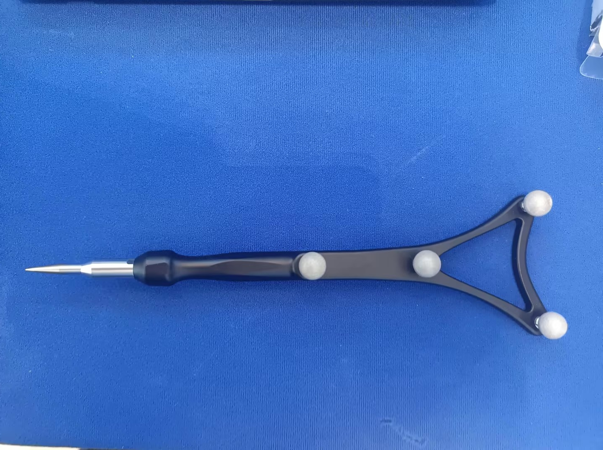
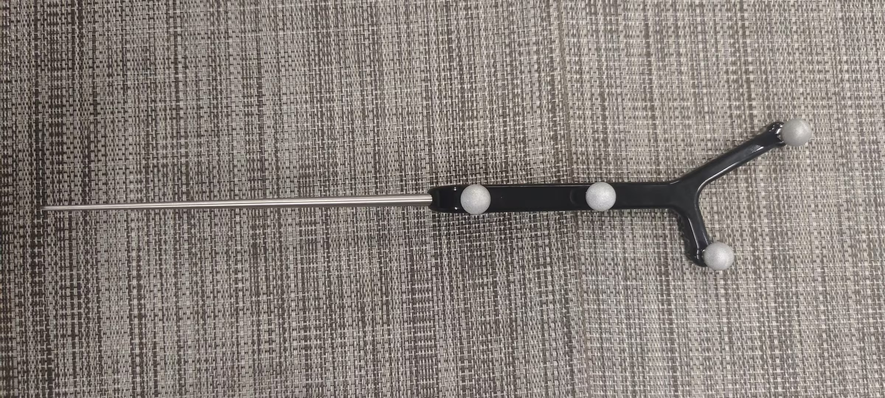

# （六）探针

### 内置探针模型

系统内置Nokov探针模版1（9.6.1），型号：LY-0020

<figure><figcaption>
9.6.1
</figcaption></figure>

系统内置Nokov探针模版2（9.6.2），型号：LY-0021\

<figure><figcaption></figcaption></figure>

1. 将Nokov探针-LY-0020竖立在场地中间，点击冻结，框选探针点，点击鼠标右键选择”创建探针“，选择 “内置”，模版选择“LY-0020”，点击创建（9.6.3）；

<figure><figcaption>
9.6.3
</figcaption></figure>

1. 探针创建成功后资产界面显示创建成功的探针信息，3D视图显示创建完成的探针刚体；


注意：其他探针使用内置探针模板无法成功创建；


### 自定义探针模型

1. 将自定义探针竖立在场地中间，点击冻结，框选探针点，点击鼠标右键选择‘创建探针’，选择“自定义”；
2. 输入探针名称及校准帧数后，点击创建，（自定义模式时，点击创建后自动取消冻结状态）；
3. 这个时候将探针在固定点成锥形绕动，采集满指定的帧数后，3D视图中显示创建完成的探针刚体；


注意：探针在绕动时需要保持探针针尖在固定点不移动

注意：在收集过程中点击取消，将停止数据收集和校准


### 探针属性

1. 勾选探针资产后，点击探针属性图标（9.6.4），显示出探针属性窗体（9.6.5）

<figure><figcaption>
9.6.4
</figcaption></figure>

<figure><figcaption>
9.6.5
</figcaption></figure>

1. 在这个页面中点击校准可对选择的已经创建好的探针重新校准计算，实时探针测量中显示实时探针针尖数据；
2. 点击校准后界面显示探针数据采集状态，这时在固定点位成锥形绕动探针，开始收集数据进行校准，点击取消可停止校准，校准完成后视图中显示更新后刚体；
