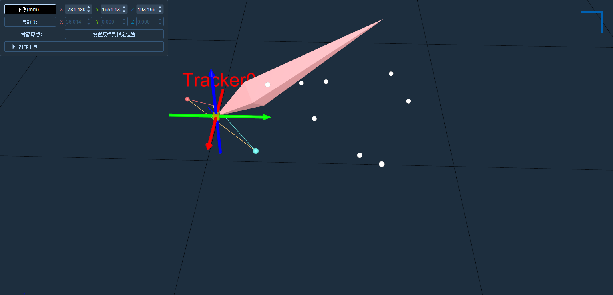

# （一）Rigid（刚体）

XINGYING 软件支持在实时下创建 Markerset ，需在场地内放置有已贴好反光标记点的物体，并且能在软件中的 3D 视图下看到每一个反光标记点（9.1.1）；\

.png>)

1. 确认软件处于播放状态，点击软件界面下方的“冻结”按钮，将 3D 视图冻结；
2. 选中3D视图中的反光标记点有以下方法：通过按住Shift键的同时，按住鼠标左键拖动框选，选中需要创建刚体的反光标记点进行刚体的创建。也可按住Ctrl或者Shift键，使用鼠标左键逐个点击选中需要创建刚体的反光标记点，通过鼠标在3D视图中选中附着于该刚体表面的多个反光标记点，一个刚体至少需要有3个反光标记点（9.1.2），冻结帧框选了未命名点后，3D视图左下角实时显示出框选的未命名点的数量，括号内的数字代表的就是框选点的数量，括号左侧的数字是代表3D视图中Marker点的总数；

.png>)

***

#### **创建单个刚体**

1.  在3D视图上框选需要创建刚体的反光点并冻结帧（创建刚体框选的Marker点数量为3\~19个），点击鼠标右键，选择 ”创建刚体“，在刚体创建窗口中可自定义创建的刚体名称（9.1.3），选择创建”单个“或”多个“刚体。\

    .png>)
2. 选择”单个“，点击创建，多个点将构成一个 Markerset，反光标记点将被命名并连线，可根据需要创建刚体会朝向（9.1.4），软件默认创建Y轴正方向；

.png>)

***

#### **多帧方式创建刚体**

1.在3D视图上框选需要创建刚体的点并冻结帧（创建刚体框选的Marker点数量为3\~19个），点击鼠标右键，选择 ”创建刚体“，在刚体创建窗口中选择创建“多帧”刚体。

<figure><figcaption>
9.1.5
</figcaption></figure>

2.在场地中缓慢的移动刚体，收集数据，待数据收集完成后，会显示改善后的误差和原始误差，点击确定按钮，保存改善后的刚体资产，点击取消，应用刚开始创建的单帧刚体。

<figure><figcaption>
9.1.6
</figcaption></figure>

<figure><figcaption>
9.1.7
</figcaption></figure>

***

#### **实时模式创建自定义局部坐标刚体**

1.  首先将被测物放入捕捉区域，提前测量好被测物上的点的位置坐标，在3D视图上按住Shift键+鼠标左键框选被测物上的未命名点，右键点击创建刚体，在弹出的创建刚体窗口中选择“自定义”选项，自定义创建刚体的名称默认从“CTracker0”开始递增，在下方选择刚体的骨骼朝向，点击创建按钮；\

    <figure><figcaption></figcaption></figure>

2.  软件界面上会弹出输入局部坐标的窗口，在窗口双击输入行，依次输入各个未命名点的XYZ局部坐标，全部输入完成后点击确认按钮完成创建，3D视图中会成功创建出一个自定义刚体；\

    
<figure><figcaption></figcaption></figure> <figure><figcaption></figcaption></figure>

3. 输入行中输入的局部坐标单位为毫米（mm）。实时模式下局部坐标输入窗口中无法新增行，局部坐标输入窗口中的行数为您框选的未命名点数，最多支持框选20个未命名点创建自定义刚体；
4. 若输入的未命名点局部坐标错误时，点击创建后刚体可能会创建失败，输入的未命名点局部坐标与真实点的局部坐标一致时刚体会被成功创建；
5. 当某一行XYZ其中的一个局部坐标未输入时，默认为0；
6. **清空整行：**&#x8F93;入未命名点的XYZ局部坐标后，在窗口上点击右键，会弹出菜单栏，点击清空整行选项，会将当前焦点行中输入的XYZ局部坐标全部清除，填充一个默认值0；
7.  **清除所有：**&#x70B9;击清除所有选项，会将所有行中输入的XYZ局部坐标全部清除，所有行中的值恢复默认值。\

    <figure><figcaption></figcaption></figure>

#### **后处理模式创建自定义局部坐标刚体**

1.  在实时模式录制被测物的数据，在后处理模式加载，在资产面板中点击创建按钮，在弹出的创建资产窗口中输入资产名称，类型选择为刚体，并勾选下方的“自定义”复选框，点击“创建对象”按钮；\

    <figure><figcaption></figcaption></figure>

2. 软件界面会弹出局部坐标输入窗口，在输入行中输入未命名点的局部坐标，输入一行后，窗口中会自动新增一行，最多存在20行，根据被测物上的贴点数量输入对应行数的局部坐标，点击确认按钮，模板创建成功，模板的Marker名称、Link连线及其骨骼也会被自动创建出来，骨骼的类型为“Calcium”。
3.  点击跟踪识别按钮，对未命名点进行跟踪识别，跟踪识别上后，未命名点会变为命名点，命名点之间也会显示出Link连线。若未识别上，则可能是在创建模板时输入的未命名点的局部坐标有误，也可能是被测物上的贴点位置发生了变化；\

    <figure><figcaption></figcaption></figure>

4.  跟踪识别上后，点击解算按钮，等待解算的进度条结束，刚体的骨骼会被解算出来显示在刚体上。若点击跟踪识别模板未识别上，则点击解算按钮后骨骼也不会被解算出来。\

    <figure><figcaption></figcaption></figure>
5. **删除一行：**&#x540E;处理模式创建自定义刚体，在局部坐标输入窗口中点击右键，在右键菜单点击“删除一行”，当前焦点行中输入的XYZ局部坐标会被清除，当前行也会被删除；
6.  **删除所有：**&#x5728;局部坐标输入窗口中点击右键，在右键菜单点击“删除所有”，输入的所有XYZ局部坐标会被清除，行数会被全部删除，只保留一行输入。\

    <figure><figcaption></figcaption></figure>

7. 在资产面板中点击保存按钮，保存创建的自定义刚体模板，点击左上角文件--保存动捕数据，切换到实时模式，在资产列表中勾选上创建的自定义刚体模板的复选框，点击播放，即可在实时模式中使用您在后处理创建的自定义刚体模板。

***

#### **创建多个刚体**

1.创建多个刚体的功能，多用于场地刚体较多的场景，如无人机集群需要创建多个刚体，那么就可以使用这个功能来快速创建刚体，在使用此功能前应将场景中各被捕物较均匀的放置，各个被捕物体之间的距离尽量保持一致，每个被捕物上各反光标志点之间的间距一致；

<figure><figcaption>
9.1.8
</figcaption></figure>

2.无需选中反光标志点，刚体创建窗口中选择”多个“，设置"骨骼朝向"和"领域半径"，点击创建，多个刚体被创建成功。

***

#### **注意**


软件中不允许有相同名称的刚体，在创建刚体时若名称重复，则“创建”按钮为灰色不可点击，请更换刚体名称进行创建，或者在当前工作路径中删除重复名称的 .mars文件再进行创建。

####

当工作路径中有不连续序号的刚体名称时，在创建刚体命名时软件默认优先生成序号低的刚体名称。

在不修改刚体名称的情况下，创建单个刚体的名称会默认从”Tracker0、Tracker1.....”递增。创建多个刚体的名称默认从“MTracker0、MTracker1......”开始递增；


> 创建刚体的数量上限为100个，当创建到第一百零一个刚体时，软件会弹窗提示；
>
>
>
> 点击“冻结”按钮，解除 3D 视图的冻结状态，此时活动被捕捉物， 可看到 Markerset 将实时跟随被捕捉物的活动，在该状态下也可直接采集数据；

#### **添加、删除Marker**

已创建的刚体，在冻结状态下，可以添加、删除marker，操作入口见下图（9.1.9）

<figure><figcaption>
9.1.9
</figcaption></figure>

**添加Marker**：冻结状态下，点击“添加Marker”按钮，进入添加Marker状态，在3D视图中鼠标点击未命令点或者按住Shit键，鼠标框选多个点，可以实时将选中的Marker添加到刚体中，刚体的最大Marker数量不能超过20，添加第21个Marker时会报错提示。添加完成后、再次点击“添加Marker”按钮，即可退出添加Marker状态，接触冻结后即可正常跟踪刚体状态。

**删除Marker**：冻结状态下，点击“删除Marker”按钮，进入删除Marker状态，在3D视图中鼠标点击当前刚体的命令点或者在刚体属性的标记列表中鼠标点击Marker信息，可以实时将选中的Marker从当前刚体中删除，刚体的最小Marker数量为3，删除后只剩2个Marker点时，会删除失败，提示用户失败原因。删除完成后、再次点击“删除Marker”按钮，即可退出删除Marker状态，接触冻结后即可正常跟踪刚体状态。

#### **两点确定刚体的朝向**

> 创建刚体可自定义刚体的朝向，具体操作方法为：冻结后，按下Ctrl键，鼠标左键选取3D视图中的Marker点，创建成功后刚体的朝向会由Marker1指向Marker2，也就是根据Ctrl键选取的第一个和第二个Marker点来确定刚体朝向。

***

**坐标轴工具**

* 平移操作

1. 选择刚体：在右侧列表选中要调整的刚体（skb 类型刚体不适用）。
2. 高亮骨骼：选中刚体对应骨骼或资产组件中栏的骨骼名称，使刚体骨骼高亮；若未选骨骼，打开窗口后会自动选中当前刚体骨骼。
3. 打开调整窗口：点击上方菜单栏的平移旋转调整按钮，弹出平移旋转窗口，显示当前选中骨骼的平移旋转 x、y、z 信息。
4. &#x20;激活平移编辑：点击 “平移” 标签，x、y、z 信息编辑框变为可编辑，刚体骨骼原点显示平移坐标轴。
5. 数值输入平移：在对应 xyz 框输入数值，按下回车或输入框失去焦点，骨骼产生对应偏移。
6.  &#x20;拖拽平移：在平移坐标轴拖拽对应轴，骨骼在对应轴向上偏移，鼠标释放时窗口更新平移的 x、y、z 信息。\

    <figure><figcaption></figcaption></figure>

* 旋转操作

1. 选择刚体：在右侧列表选中要调整的刚体，若为 skb 类型刚体，仅开放输入值旋转，不显示圆环。
2. &#x20;高亮骨骼：选中刚体对应骨骼或资产组件中栏的骨骼名称，使刚体骨骼高亮；若未选骨骼，打开窗口后会自动选中当前刚体骨骼。
3. 打开调整窗口：点击上方菜单栏的平移旋转调整按钮，弹出平移旋转窗口，显示当前选中骨骼的平移旋转 x、y、z 信息。
4. &#x20;激活旋转编辑：点击 “旋转” 标签，x、y、z 信息编辑框变为可编辑，刚体骨骼原点显示旋转圆环。
5. 数值输入旋转：在对应 xyz 框输入数值，按下回车或输入框失去焦点，骨骼产生对应旋转。
6. 拖拽旋转：在旋转圆环拖拽对应轴环，骨骼在对应轴向上旋转，鼠标释放时窗口更新旋转的 x、y、z 信息。
7. &#x20;退出编辑：取消选中 “Rotation” 按钮，退出编辑状态，x、y、z 信息编辑框禁用，可任意拖拽 3D 界面。
8.  &#x20;重置状态：工具窗口关闭、切换资产时，对齐工具界面控件、重置按钮和输入框恢复默认编辑状态。\

    <figure><figcaption></figcaption></figure>

* #### 移动骨骼原点到指定位置

1. 冻结帧并选择刚体：在实时播放状态下冻结帧，在右侧列表中选中要调整的刚体名称。
2. 高亮刚体骨骼：选中对应刚体的骨骼，或选中资产对应组件中栏的骨骼名称，使刚体骨骼高亮显示。
3.  激活按钮并设置原点：激活平移旋转上方的 “设置原点到指定位置” 按钮，此时选中的刚体骨骼原点会出现平移坐标轴。在 3D 界面中点击本刚体的命名点或未命名点，骨骼原点将变更为所选 Marker 点的坐标，并移动到该位置。需注意，平移坐标轴不可拖拽。\

    <figure><figcaption></figcaption></figure>

* 对齐工具

打开调整窗口：点击菜单栏的坐标轴工具，弹出平移、旋转和对齐展开窗口，其中对齐界面默认折叠。​

1.  设置主轴参数：在主轴行下拉选择要调整的轴向及其方向（+X,+Y,+Z,-X,-Y,-Z），选择目标类型（轴、Marker、中心），然后选择目标（目标类型如果选择的是轴，目标列将会出现Global X,Global Y,Global Z,Local X,Local Y,Local Z下拉框供选择；目标类型若选择的是Marker或中心，目标列将会出现选择按钮，若是Marker，选择完后主轴行最后列会出现Marker点的名称标签，若是中心（按住shift框选多个点中心），选择完之后主轴行最后列会出现Marker点的个数标签，鼠标悬浮上去会出现各个Marker点的名称）\

    <figure><figcaption></figcaption></figure>
2. 设置辅助轴参数：对辅助轴进行与主轴相同的选择操作。​
3. &#x20;执行对齐操作：单击 “对齐” 按钮应用对齐操作。若主轴与辅助轴轴向或目标相同，弹出错误提示:目标不能方向不能相同；类型选 Center 或 Marker 时，所选点数量不符也会提示。
4.  &#x20;示例：对象的主轴局部x轴正方向与全局x轴对齐。辅助轴局部y轴正方向是源自刚体骨骼原点和Marker4标记方向的向量。主轴和辅助轴的向量叉积计算（未指定的）Z轴。使用主轴(X)和Z轴，然后对齐Y轴。\

    <figure><figcaption></figcaption></figure>

***

**刚体、人体视角跟随**

1. 在实时模式或后处理模式，可对刚体、人体进行第一视角或第二视角跟随（9.1.12）；
2. 在实时或后处理模式的3D视图上点击右键，选择“视角跟随”，选择“第一视角”或“第二视角”后，当前选中的刚体资产或人体资产便会以第一视角或第二视角进行跟随。视角跟随开启后也可在资产面板中选中其他资产来进行视角跟随；
3. 在视角跟随开启后，3D视图上不可操作，同时3D视图上方会闪烁显示“FOLLOWING”提示当前正处于视角跟随状态，若要取消视角跟随，只需右键将选择的跟随视角取消即可。

<figure><figcaption>
9.1.12
</figcaption></figure>

