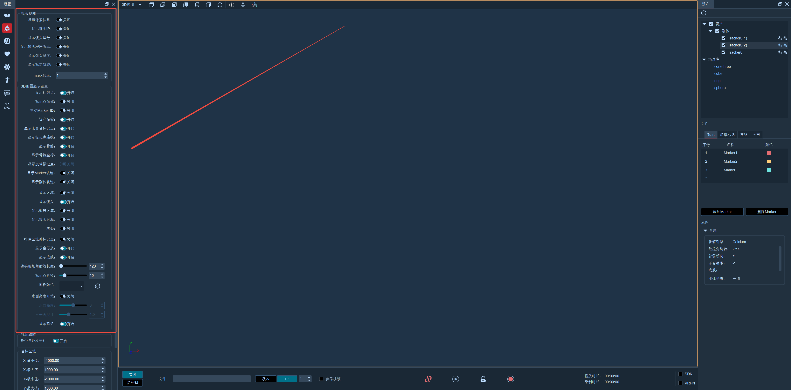

# （二）视图设置

点击软件上方工具栏的设置按钮，选择“视图设置”(7.2.1)；

#### **镜头视图**

* 显示像素信息：启用后，将鼠标悬停在2D视图中会显示出像素大小；
* 显示IP：启用后在2D视图中各个视图左下角都会显示出镜头的IP，2D视图中显示的IP和实际场地安装的镜头数码管一致；
* 显示镜头型号与镜头版本：启用后，在2D视图中会显示出该此视图对应镜头的型号与镜头的程序版本；
* 显示镜头温度：启用后在2D视图的左下角会显示出镜头的温度。注意：Pluto型号、Mars1.3HW型号的镜头没有温度显示；
*   标定轨迹：该功能软件默认不勾选。启用后在进行T型标定时，2D视图中会显示出标定的轨迹，重复在一个区域内挥杆，轨迹会重复叠加（7.2.2），当设置的挥杆时长结束后，各2D视图叠加上的标定轨迹也会消失；\

    <figure><figcaption></figcaption></figure>

<figure><figcaption>
7.2.2
</figcaption></figure>

#### **3D视图显示设置**

* Marker名称：开启后选中3D视图的一个命名点，会显示出该Marker的名称；
* Markerset名称：开启后3D视图中所有的Markerset会显示出名称；
* 显示未命名 marker：开启后3D视图中会显示未命名点。（无特殊要求，请不要更改3D视图显示设置窗口中的默认设置）；
* 骨骼：开启后3D视图中显示出Markerset的骨骼；
* Makrer连线：开启后会显示出3D视图中Markerset的连线；
* 骨骼坐标轴：开启后3D视图中会显示出骨骼的坐标轴；
* 反算Markers：开启后3D视图中会显示出反算点；
* 显示Marker轨迹：开启后在3D视图中会显示Marker点的移动轨迹，在后处理模式会将当前选中点所有帧的Marker点轨迹显示在3D视图上；
* 显示刚体轨迹：开启后在3D视图中会显示刚体骨骼的移动轨迹，在后处理模式会将当前选中骨骼的所有帧的骨骼轨迹显示在3D视图上；
* 追踪质量：开启后再3D视图中显示刚体的追踪质量；
* 显示区域：开启后会在3D视图中显示当前设置的区域；
* 显示镜头：开启后3D视图中上空会显示出悬浮的镜头，镜头位置和实际镜头摆放的位置一致；
* 显示覆盖区域：开启后3D视图中会实时显示出镜头的“覆盖区域”，后处理勾选“覆盖区域”，3D视图不会显示出镜头的覆盖区域；
* 显示镜头射线，在非冻结帧且软件播放的状态下开启“显示镜头射线”，选中3D视图中的某一个命名点，该点和参与此Makrer点重建的镜头之间会显示出一条射线；“镜头视场角射线长度”，修改长度值，3D视图上空悬浮的镜头的视场角射线的长度会发生变化；
* 质心：在实时模式创建海伦海耶斯全身模型后，开启质心，3D视图中海伦海耶斯模型会显示出质心；
* 排除区域外标记点：开启后，会屏蔽区域以外的所有已命名点和未命名点,并且视图中间红色字体闪烁；
* 显示坐标系：开启后，会在3D视图的原点处显示坐标系；关闭时，3D视图中不显示坐标系；
* 镜头视场角射线长度：默认长度为120，修改长度后3D视图上方的镜头模型的射线也会发生变化；
* Marker直径：默认Marker直径为15mm(无特殊要求，我们建议用户不要随意更改此处的数值，更改前可咨询我们的的技术工程师)。若用户用的是8mm或者其他规格大小的Marker球，在3D视图中重建出来的Marker点抖动或者识别不稳定，可以将Marker直径值修改为8或根据使用的Marker球的大小来设置直径值；设置的Marker直径值越大，在3D视图中Marker点的直径也会随着加大，反之Marker直径则会减小；
* 地板颜色：自定义设置3D视图地面颜色；
* 水面高度开关、水面高度、水平面尺寸：当使用水上水下融合场景时，在原有的坐标系平面的基础上，在3D视图中，新增一个水面。通过水面高度参数，来设置水面和地面的相对高度。通过水平面尺寸参数，来设置水平面和地面的相对大小。设置水面后，水面以上的空间，将由水上的镜头进行点重建，水面以下的空间，将由水下的镜头进行点重建。&#x20;
* 显示延迟：在3D视图左下角显示当前系统的延迟数据
* 目标区域设置：当开启“排除区域外标记点”功能时，不在目标区域范围内的Marker点将不会显示在3D视图中

#### **3D视图实时显示追踪Marker数量**

* 3D视图左下角通过数字显示当前动捕系统捕捉到的marker点数量：全部Marker点数量-已选中资产的Marker点数量（已选中资产当前捕捉到的Marker点的数量）

***

#### **3D视图地板颜色编辑**

1.  启动XINGYING后3D视图地板颜色为默认的颜色，若需要更改地板颜色，可在设置--视图设置中找到“地板颜色”，展开下拉列表有三种推荐的颜色可供选择（7.2.3）；\

    <figure><figcaption>
7.2.3
</figcaption></figure>
2.  点击“更多颜色”打开颜色表选择颜色，在颜色表窗口中可以选择上方的基本颜色，也可点击“拾取屏幕颜色”按钮取色（7.2.4）；\

    <figure><figcaption>
7.2.4
</figcaption></figure>
3. 在窗口下方的自定义颜色中选择一个颜色，点击“添加到自定义颜色”按钮后，选择的颜色会被添加到下拉列表中，方便下次设置（7.2.4）；
4. 也可在右侧的色板上拖动取色，取色后点击确认按钮，3D视图上的颜色即变为设置的颜色。在下方的编辑框中输入各项参数可以自定义地板颜色；
5. 在“HTML”中可输入颜色的具体色号来设置地板颜色；
6.  在更改默认的地板颜色后，设置的地板颜色会保存到相关配置文件中，下次启用XINGYING仍然为自定义设置的地板颜色。点击刷新按钮可将3D视图地板颜色重置为默认颜色（7.2.5）。\

    <figure><figcaption>
7.2.5
</figcaption></figure>
