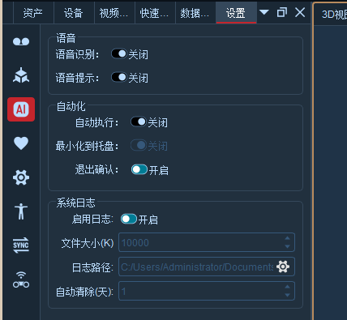

# （三）智能设置

点击软件上方工具栏的设置按钮，选择“智能设置”(7.3.1)；

* 语言识别：将“使用语音识别”复选框勾选，软件可以对用户发出的语言指令进行识别，如“连接镜头，开始播放、断开镜头”等语言，识别成功后软件会自动执行相应的指令；
* 语音提示：将“语音提示”复选框勾选，在用户对软件进行操作时，软件会给予语音提示；
* 自动执行：将自动执行功能勾选启用，软件重启后会自动执行“加载标定文件、连接镜头、播放、加载Markerset”的操作；
* 最小化到托盘：勾选“最小化到托盘”功能，软件启动后会自动最小化到桌面左下角的系统托盘中，只有在勾选了“自动执行”功能后才可以勾选使用“最小化到托盘”功能；
* 退出确认：默认开启；关闭此功能后，关闭软件立即退出，不再弹窗确认；
* 启用日志：用于生成日志，打印日志信息；
* 日志文件大小：日志在系统中存储的大小；
* 日志保存路径：日志文件的具体保存位置，文件路径可以修改；
* 自动清除：系统保存的日志达到设置指定天数后会清除之前的；

<figure><figcaption></figcaption></figure>
