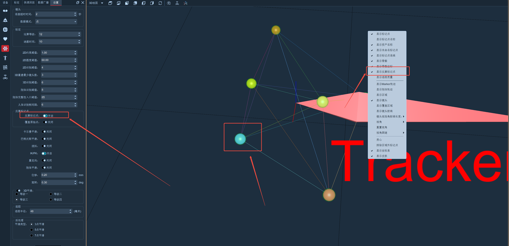

# （五）其他设置

点击软件上方工具栏的设置按钮，选择“其他设置”（7.5.1）；

<figure><figcaption>
7.5.1
</figcaption></figure>

#### **镜头**

1. 连接超时时间：连接超时时间默认为“2”秒。在镜头数量较少的环境下，连接镜头的时长可设置在2\~4S，镜头数量较多可将连接镜头时长设置到4\~8S（非必要情况下不要进行手动修改，修改前请咨询技术支持工程师进行指导操作最小化到托盘；
2. 数据模式：可切换”点模式和线段模式”，软件默认“点”模式（无特殊要求，请不要随意更改此功能）；

#### **标定**

1. 运算等级：在进行标定之前可以对“运算等级”参数进行设置，“运算等级”默认值为12，“运算等级”参数设置的越大，标定计算的时间就越久，计算的精度也越高，参数设置的越小则相反；
2. 遮蔽时间：在标定界面，选择自动遮蔽功能时，自动遮蔽持续的时间；
3. T型杆标定倒计时：在T型点击T标定后界面会出现倒计时，倒计时可根据用户自身需要来进行设置，默认为10秒倒计时；

#### **跟踪识别**

1. 2D约束阈值：默认为“1”。控制2D点提取精度，根据场地大小，标定结果，marker大小等综合考虑，在镜头数量较少时，如果无法正常提取到点，可以适当调大该参数。非必要请不要设置，设置前请咨询技术工程师；
2. 2D圆度阈值：线段模式生效，控制2D点的提取精度。非必要请不要设置，设置前请咨询技术工程师；
3. 2D识别阈值：默认为“6”，控制2D点提取精度，根据场地大小，标定结果，marker大小等综合设置。非必要请不要设置，设置前请咨询技术工程师；
4. 3D重建最小镜头数：默认为“3”。3D重建最小镜头数最小可设置成2，即创建3D点至少需要2个镜头同时看到此点；非必要请不要设置，设置前请咨询技术工程师；
5. 3D识别阈值：默认为“6”，单位mm。控制3D点提取的参数。非必要请不要设置，设置前请咨询技术工程师。
6. 刚体识别阈值：默认为“8”，单位mm。控制刚体点与点之间距离的变化范围。非必要请不要设置，设置前请咨询技术工程师。
7. 刚体完整性入口阈值：默认为“85”。刚体识别时，当前刚体实时提取的点数大于刚体创建时的marker点数\*刚体完整性入口阈值，正常识别刚体，小于刚体创建时的marker点数\*刚体完整性入口阈，刚体无法识别，显示白点；
8. 人体识别帧间隔：控制每个人体模板进行整体识别的次数，即前一帧识别失败，会间隔一定帧数再识别，防止每帧都识别拖了整体性能

#### **平滑**

1. 3D平滑：可在平滑点平均数选择“一、二、三、四”四种平滑等级，选择其中的一种平滑等级，同时打开XYZ图表，在实时模式下选中Markerset的一个点，可以使该点的坐标曲线波动幅度比不开3D平滑时的波动幅度更小；
2. 卡尔曼平滑：开启后使用卡尔曼滤波对刚体和人体进行平滑；
3. 巴特沃斯平滑：开启后使用巴特沃斯滤波对刚体和人体进行平滑；
4. 消抖：可以消除刚体静止状态下的抖动；
5. 刚体平滑：在实时模式创建刚体后，勾选刚体平滑，设置刚体平滑的位移和旋转阈值，设置阈值后，根据设置的位移和旋转阈值对刚体进行消抖；
6. 刚体平滑二级开关：资产属性中，新增一个刚体平滑开关，默认为关闭。只有在刚体平滑总开关和资产属性中的二级开关都为开启状态时，刚体平滑功能才生效；
7. 后处理平滑类型：可选择”3点平滑、5点平滑、7点平滑“，可在后处理模式中对Marker点进行平滑；
8. 启用IK/FK：实时模式下，人体Markerset出现骨骼丢失的时候，IK补偿会计算出丢失的骨骼的位置，若不勾选此功能，骨骼丢失后则不会启用IK计算丢失的骨骼位置；
9. 启用重定向数据：此功能一般用于创建人体模型并对模型进行角色化后，勾选“启用重定向数据”复选框，将角色化后的人体数据通过SDK向外广播发送；


<mark style="color:red;">并不是所有场景中都需要使用平滑防抖功能，在特殊场景中当3D视图中的点或者刚体抖动的幅度较大或者需要减少抖动来达到需求的时候可相对应的勾选上述功能（非必要请不要设置，设置前请咨询技术工程师）。</mark>

<mark style="color:red;">如使用VR场景时可以叠加使用3D平滑和卡尔曼平滑功对我们3D 视图中的刚体进行平滑设置，使VR场景中的抖动更小；</mark>


####

#### **视频叠加**

1. 显示未命名点轨迹：参考视频标定完成后，将3D视图中的marker点拿出场外，将一个未命名点放进场地中，勾选上“未命名点轨迹”选项，即未命名点轨迹显示功能，此时移动未命名点，在参考视频视图中就可以显示出该未命名点的轨迹了（7.5.2）。注意：在观察轨迹时需要确保场地中只有一个未命名的marker点，若出现多个未命名点，则无法显示出轨迹；
2. 轨迹时间：表示轨迹的显示时间，可以点击右侧的箭头调节时间，单位为s，最高可调至5s，默认为1s，时间越长，未命名点的轨迹在视图中显示的时间也越长；

.png>)

#### **反算标记点**

1. 人体模型不显示反算标记点；
2.  实时模式：在实时下创建了刚体后，打开软件设置，选择“其他设置”，开启“反算标记点”，在3D视图上右键点击“显示反算标记点”后（7.5.3），3D视图上命名点上会显示出绿色的反算标记点；\

    <figure><figcaption>
7.5.3
</figcaption></figure>
3.  覆盖原始点：在开启了反算标记点开关后，可开启覆盖原始点。将覆盖原始点开启，在实时模式下当前选中的刚体丢点后，软件会根据丢失点的位置计算出反算点，代替丢失点显示在原始点的位置上。覆盖原始点只对当前选中刚体有效，非选中的刚体不生效。\

    <figure><figcaption></figcaption></figure>
4. 后处理模式若要显示反算标记点，需要点击上方工具栏的解算按钮。

**重置系统参数**

将设置中各项参数的值进行初始化

<figure><figcaption></figcaption></figure>
