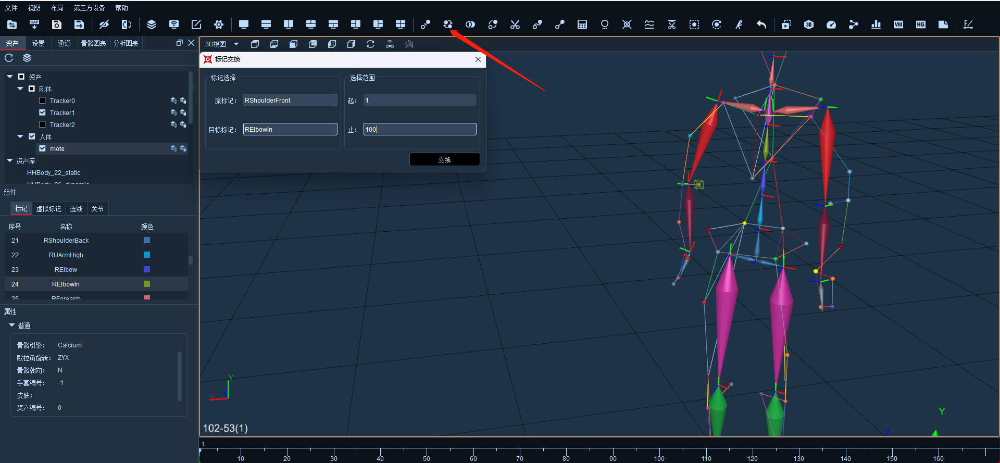

# （十）标记交换

*   点击软件上方标记交换，在原标记输入框处用鼠标点击选中，然后在3D界面选中需要交换的原标记点，选择完成后点击目标标记输入框，然后在3D界面选中需要交换的目标标记。输入修改点的起止范围，点击交换。此处选择范围不影响时间轴下放的选择范围；\

    <figure><figcaption></figcaption></figure>


注意标记交换只能选择命名标记点；

