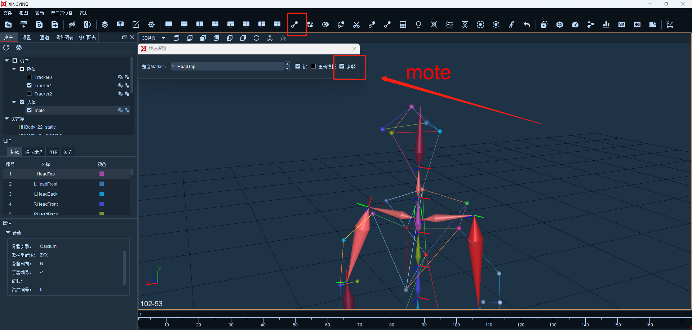

# (十一) 多帧识别

1.  后处理点击快速识别按钮，弹出对话框，勾选多帧，勾选多帧时会自动锁定，在资产面板中选中未识别上的点的名称后，快速识别对话框中点的名称也会变成属性栏中选中的点的名称。然后在3D界面中使用鼠标点击未识别上的Marker点，此时时间轴上指针在最后一帧则该Marker点就已经全部识别正确了，Marker点之间的Link连线也会自动补齐。\

    <figure><figcaption></figcaption></figure>
2. 若该Marker点存在多帧上均未识别上，则需要进行多次识别；
3. 在使用多帧识别的时候，需要将指针跳转到丢帧的第一帧因为多帧识别只能向后识别，如果丢帧数据在指针前面就无法识别。
