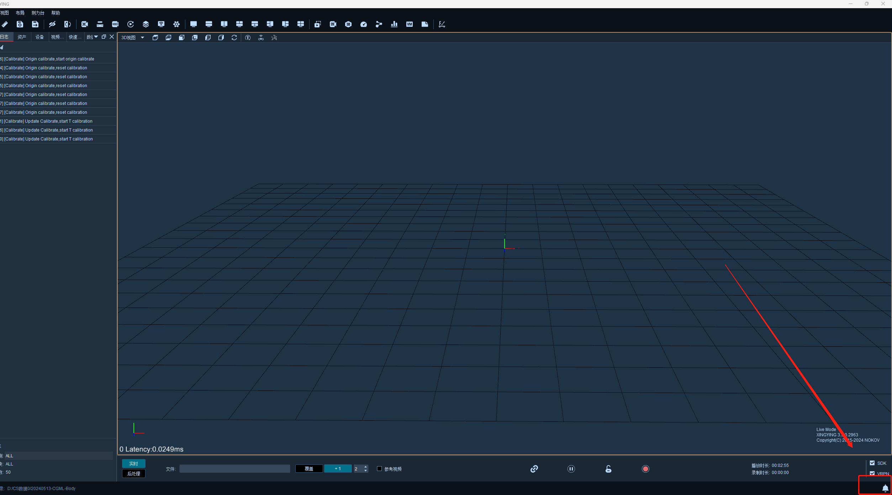
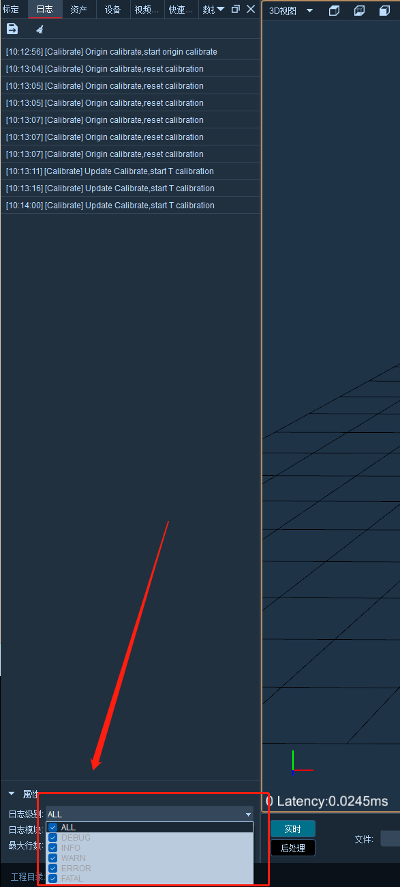

# （一）显示设置

打开软件，点击右下角日志功能（19.1.1），打开日志后悬浮窗上方显示的是导出日志和清空，在下方属性中分别是，日志级别，日志模块和最大行数，双击下拉框可以修改（19.1.2）；

<figure><figcaption>
19.1.1
</figcaption></figure>

<figure><figcaption>
19.1.2
</figcaption></figure>
