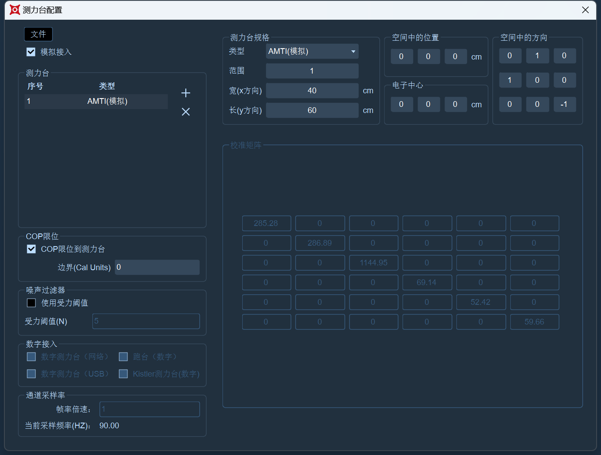

# AMTI

### **AD模拟方式接入AMTI测力台**

1. AD方式接入AMTI测力台需要使用镜头的触发同步，将同步线的一端接入IP为201的镜头后面的AUX口，另一端通过转接头和跳线与NI AD采集卡进行连接，根据AMTI的模拟信号线上的Fx、Fy等名称，按照AMTI测力台接线要求正确的将模拟信号线接入NI AD采集卡中；
2. 驱动程序安装：
   * 确认信号放大器与测力台已连接，信号放大器已接通电源。
   * 在控制面板中搜索“设备管理器”并单击它。
   * 找到“其他设备”，其标志上有一个黄色警告（16.1.3.1）
   * 右键单击“更新驱动程序”，选择“浏览我的电脑以查找驱动程序”，使用AMTI的U盘，在U盘的如下路径中找到“64-bit Drivers Ver. 3.4.7”文件夹，选择此文件夹点击下一步（16.1.3.2），进度条结束后显示出“Windows已成功更新你的驱动程序”表示驱动程序安装完成；
   *   若您没有驱动程序文件夹，请联系AMTI厂家获取\

       .png>)

       <figure><figcaption>
16.1.3.2
</figcaption></figure>
3. 安装“NetForce”：
   * 安装“NetForce”软件请联系我们的工程技术人员拷贝或者发送”NetForce Ver软件安装包”，点击“setup”开始安装，按照安装提示完成软件的安装。
4. 在“NetForce”软件中配置矩阵：
   * 打开“NetForce”软件，在软件上方点击“setup”，选择“Hardware Installation”（16.1.3.3）在“Hardware Installation”窗口右侧的“New Installation”下拉列表中选择“Optima \Gen-5”(16.1.3.4)，点击“Install”。
   * 在弹出的“AMTI System Configuration”窗口中，将“Analog Outputs”下拉列表中选择“Fully Conditioned”（16.1.3.5）;点击窗口下方的Optima按钮，点击Continue按钮，点击Browse按钮，在下图（16.1.3.6）中进入路径，选择“10382M.bcf”文件(16.1.3.7)，点击打开，等待下载完成即可，下载完成后点击Done按钮退出；
   *   在AMTI System Configuration窗口的Installed Amplifier中点击Configure下方的按钮；在弹出的窗口下方将Excitation的Fx/Fy/Fz/Mx/My/Mz全部设置为10，将Gain一排全部设置为1000，点击底部的Analog Adjust按钮，点击后将Analog Scale Factor一排的六个值全部记录下来（16.1.3.8），用1000去除以Analog Scale Factor中的每一个值，得出来的结果即为XINGYING软件中的矩阵值，点击Apply all，点击OK关闭窗口；在AMTI System Configuration窗口中点击Apply再点击Save保存此次配置，方便后续使用，点击Done退出，退出NetForce软件时会提示是否保存配置（16.1.3.9），点击“是”后会自动关闭软件；关闭NetForce软件后，拔掉AMTI测力台放大器与电脑连接的USB线\

       .png>)

       .png>)

       .png>)

       .png>)

       .png>)

       .png>)

       .png>)
5. 打开XINGYINM--点击测力台菜单栏--选择通道配置，在通道配置窗口中配置AMTI的模拟通道，在列表中鼠标右键选择“AMTI--FP1”，根据测试台的输出范围来配置每个通道的量程，在每个模拟通道“范围”下拉框中可选择+/-10mV、+/-10V等量程，点击窗口左上方的“选择”按钮全选上所有模拟通道.
6. 点击测力台菜单栏--选择测力台参数设置，在测力台参数设置中点击 “+”添加一个测力台，在右侧设置好AMTI测力台的参数，在校准矩阵的左上依次到右下，输入“AMTI NetForce”软件中得出的矩阵值。
7.  在测力台参数设置窗口勾选上模拟接入（16.1.3.10），即可实时使用AMTI测力台了。\

    <figure><figcaption></figcaption></figure>

***

### **USB方式接入AMTI测力台**

1. USB方式连接AMTI测力台首先将放大器通电，确认放大器电源开关开启，将测力台上的线与放大器的“TRANSDUCER INPUT”接口相连接；
2. 将同步线的一端接入IP为201的镜头后面的AUX口，将另一端的白色同步线连接放大器的“GENLOCK/TRIGGER INPUT”接口；
3. 在放大器上的USB口插入USB线，USB线的另一端连接XINGYING软件所在的电脑；
4. 打开XINGYING软件，打开测力台参数设置，点击“+”后会自动添加一个测力台，选中测力台名称切换测力台类型，在测力台参数设置窗口下方的“其他配置”中，勾选上“数字测力台（USB）”选项，在窗口右侧的“测力台规格”中将类型设置AMTI，根据测力台的大小来设置长宽；“在空间中的方向、在空间中的位置”中的参数可以使用系统默认的参数，也可根据您的需要自行修改其中的参数，窗口下方的“串口”中会显示出测力台的序列号（16.1.3.11）；
5.  关闭设置窗口，此时通过USB接入的AMTI测力台已经添加在3D视图中并可以开始使用了；\

    <figure><figcaption>
16.1.3.11
</figcaption></figure>
