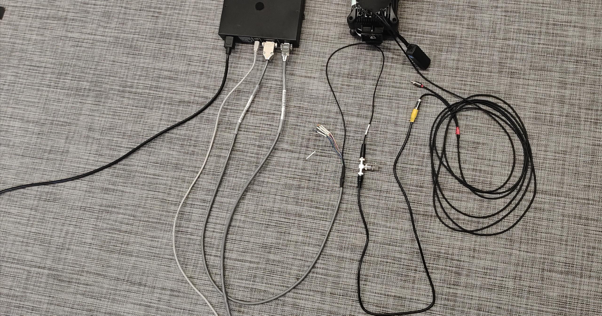
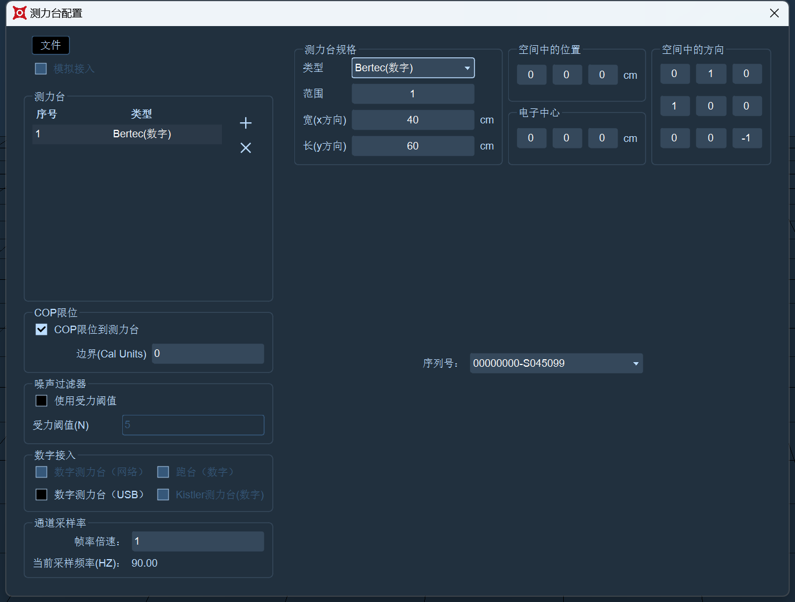

# Bertec


AD模拟方式的测力台和肌电不能与usb方式的数字测力台混用；

AD模拟方式的测力台和肌电不能与网络数字测力台混用；

AD模拟方式的测力台和肌电不能与数字肌电混用；


### **AD模拟方式连接Bertec测力台**

1. XINGYING软件支持通过NI6218/6225方式接入Bertec测力台。
2. AD接入测力台方案需要使用镜头的触发同步。
3.  测力台与电脑连接之后，需安装NI驱动，驱动安装完成后，打开 XINGYING ，点击软件上方菜单栏的测力台，选择“通道配置”，在通道配置窗口中配置Bertec的模拟通道，在列表中鼠标右键选择“Bertec--FP1”，可以根据自己所连接的测试台的输出范围来配置每个通道的量程，选择一个通道，在每个模拟通道“范围”下拉框中可选择+/-10mV、+/-10V等量程，点击窗口左上方的“选择”按钮全选上所有模拟通道（16.1.1.1）。\

    <figure><figcaption></figcaption></figure>
4.  点击软件上方的菜单栏“测力台”，选择“测力台参数设置”选项，在测力台参数设置窗口中点击“ ＋”号添加Bertec测力台（16.1.1.2）；\

    .png>)
5. 选中测力台名称，选择对应测力台类型，在右侧设置Bertec测力台的参数：测力台规格、在空间中的位置、方向以及校准矩阵;
6.  配置完模拟通道后，AD模拟测力台需要手动勾选上“模拟接入”选项（16.1.1.4），在使用AD模拟测力台时，若未添加通道直接勾选“模拟接入”，软件会弹窗提示“模拟通道数量和测力台数量不匹配”，此时需要先配置模拟通道后再勾选“模拟接入”选项；\

    <figure><figcaption>
16.1.1.4
</figcaption></figure>
7.  关闭设置窗口，我们就可以看到AD模拟的Bertec测力台已添加在坐标系中（16.1.1.5），测力台上会显示出测试台的序号。\

    .png>)

***

### **USB方式接入Bertec测力台**

1.  将测力台通电，放大器上的指示灯亮起，按下信号放大器的Zero按钮将信号归零，模拟信号线与放大器相连接，插入模拟输出接入同步线与镜头的触发同步（16.1.1.6）；\

    <figure><figcaption></figcaption></figure>
2. 将放大器上的USB线连接到XINGYING软件所在的电脑；
3.  打开XINGYING软件，点击测力台菜单栏，选择“测力台参数设置”，点击“+”后会自动添加一个Bertec测力台，选中测力台名称切换测力台类型，在测力台参数设置窗口下方的“其他配置”中，勾选上“数字测力台（USB）”选项（16.1.1.7），在窗口右侧的“测力台规格”中根据测力台的大小来设置长宽；“在空间中的方向、在空间中的位置”中的参数可以使用系统默认的参数，也可根据您的需要自行修改其中的参数，窗口右侧下方的“串口”中会显示出测力台的序列号；\

    <figure><figcaption></figcaption></figure>
4. 关闭测力台参数设置窗口，此时通过USB接入的Bertec测力台已经添加在3D视图中并可以开始使用了；
