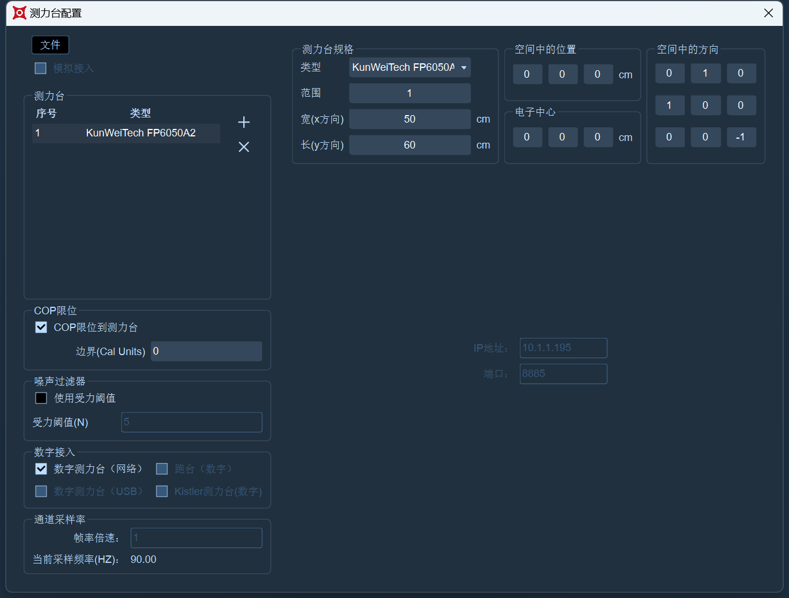

# 坤维

1. 数字测力台支持国产坤维数字测力台和埃力测力台，若使用埃力测力台请联系我们的工程人员获取帮助。以下配置说明只针对坤维测力台。
2. 将坤维测力台接通电源，由于坤维测力台的默认IP网段与动捕系统的网段不一致，需要先将坤维测力台的IP修改为10.1.1.X的网段；
3. 坤维测力台的IP设置方法请联系坤维厂家，若用户选择不使用10.1.1.X的IP地址，那么请使用双网卡主机并确保坤维测力台的IP被正确配置；
4. 将测力台IP设置好后可以在命令提示符中输入设置的IP地址看是否能够ping通，通信正常后便可以在动捕软件中配置测力台相关参数了，打开XINGYING--点击测力台菜单栏--选择“测力台参数设置”，点击“+”号添加一个测力台，选中添加的测力台切换为坤维类型，在右侧配置测力台的各项参数；
5. 在“IP地址”输入框中请输入您设置的测力台的IP地址，例如您坤维测力台IP地址为10.1.1.194，那么在IP地址中请填入10.1.1.194。在Port中输入对应的端口号，例如您的坤维测力台IP地址为10.1.1.19X，那么在它的端口号为888X，完成后在测力台参数设置窗口的“其他配置”中勾选上“数字测力台（网络）”；
6. 当有多块坤维测力台时请重复上述中步骤1\~5来进行配置，同时根据实际测力台的摆放位置来正确设置测力台的中心。
7.  各项参数配置完成后（16.1.2.1），关闭设置窗口，我们就可以看到测力台已添加在坐标系中；\

    <figure><figcaption>
16.1.2.1
</figcaption></figure>
