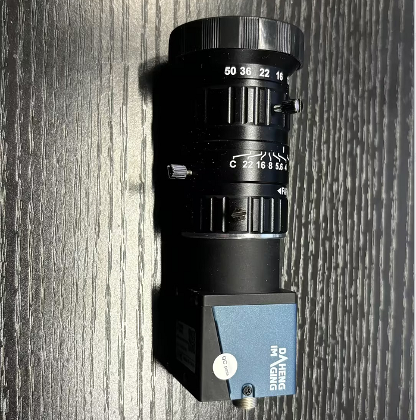
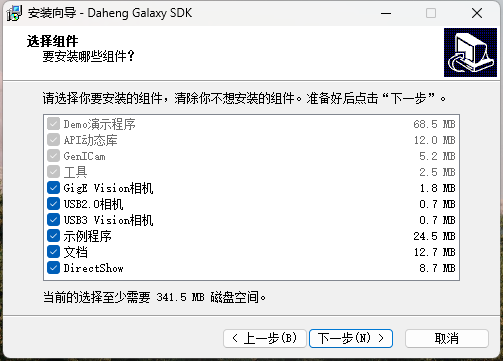
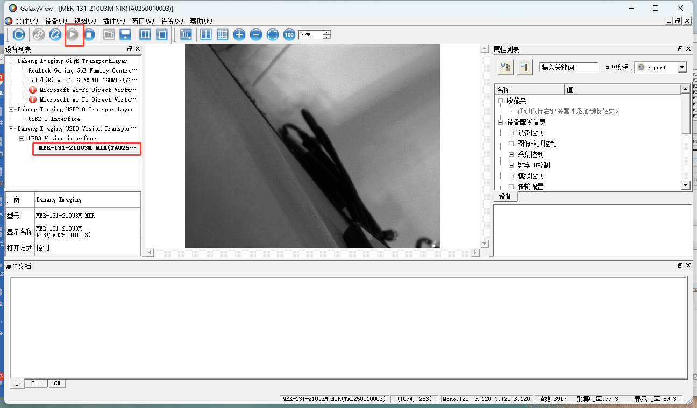

# 大恒

### 大恒：

<figure><figcaption></figcaption></figure>

*   使用大恒工业相机前，需先安装相机驱动。具体操作为打开驱动安装包，双击运行进行安装，安装时要选择默认的安装路径，直至安装完成。\

    <figure><figcaption></figcaption></figure>
*   将电脑接入大恒工业相机后，在工业相机播放器里双击打开 USB 相机，继而来点击播放按钮，这时播放器窗口中间就会呈现出相机的图像画面。\

    <figure><figcaption></figcaption></figure>
* 关闭工业相机软件。
* 接着打开动捕软件，并点击参考视频，此时相机的图像画面随即显示 。
