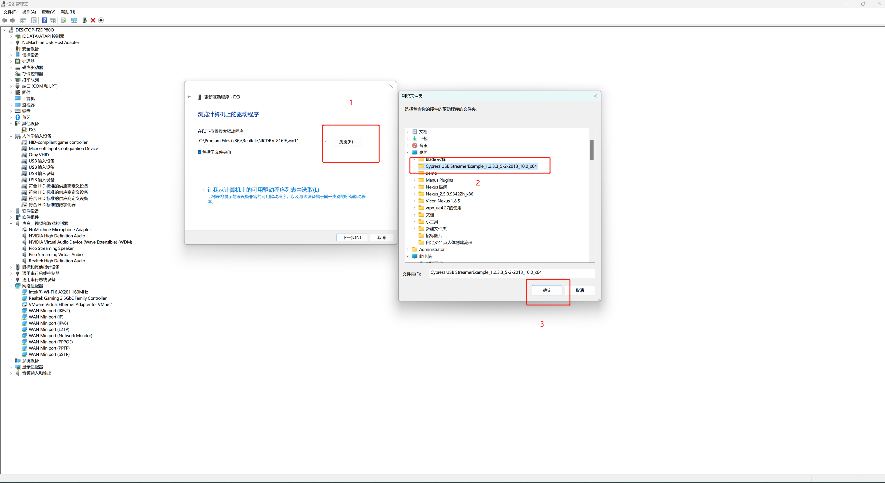

# DITECT

插入Ditect相机，把Cypress文件夹解压到桌面上，打开电脑设备管理器(16.3.5.1)，在其他设备中找到FX3，鼠标选中后点击鼠标右键，选择更新驱动程序，选择浏览我的电脑以查找驱动程序，然后在桌面上找到文件夹，选中后点击“确定”，然后点击下一步，更新完成后关闭设备管理器，配置完成后我们就可以使用Ditect相机了(16.3.5.2)；

<figure><figcaption>
16.3.5.1
</figcaption></figure>

<figure><figcaption>
16.3.5.2
</figcaption></figure>
