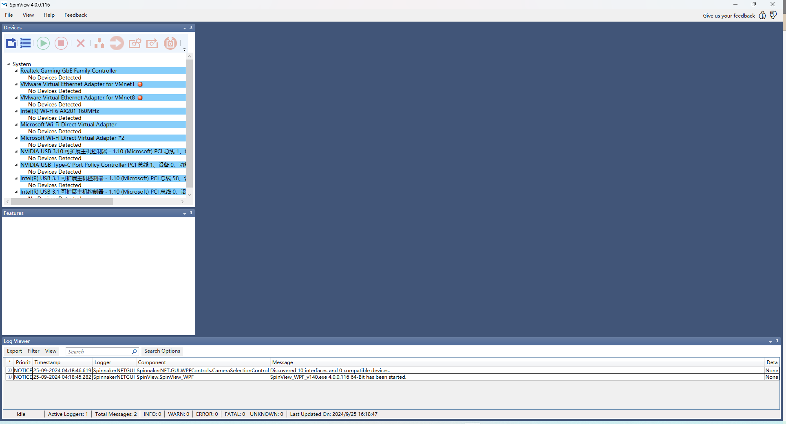
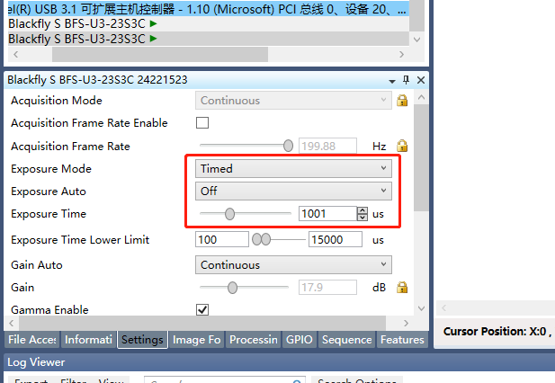
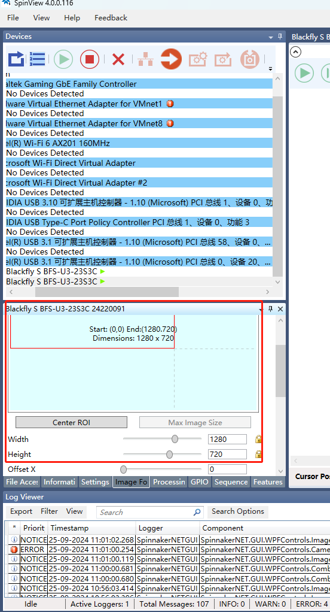

# FLIR工业相机

1. 安装FLIR工业相机软件；
2.  插入FLIR相机，打开SpinView程序，点击刷新，点击设备编号，点击播放，暂停播放；\

    <figure><figcaption>
16.1.1
</figcaption></figure>
3. &#x20;打开XINGYING软件，连接镜头并播放，点击参考视频；

### FLIR工业相机与软件同步

1.  使用连接头接入镜头同步线，插入FLIR相机；\
    \

    <figure><figcaption></figcaption></figure>
2.  打开SpinView程序，点击刷新，点击设备编号，点击Settings改相机曝光（与软件一致）(16.1.2)点击lmage Fo 修改相机分辨率为1280X720(16.1.3)，点击GPIO，开启触发同步，选择Lien 0为触发源，触发方式选择Risings Edge(16.1.4)\

    <figure><figcaption>
16.1.2
</figcaption></figure>

    <figure><figcaption>
16.1.3
</figcaption></figure>

    <figure><figcaption>
16.1.4
</figcaption></figure>
3. 打开XINGYING软件，连接镜头并播放，点击参考视频；
