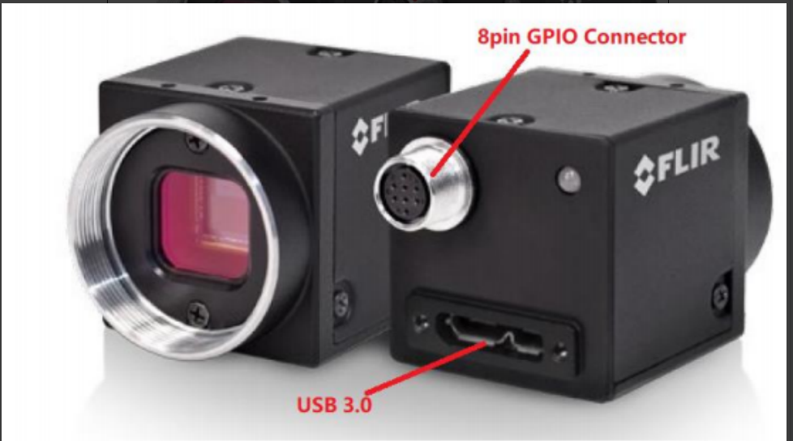
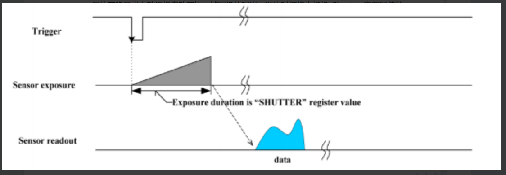
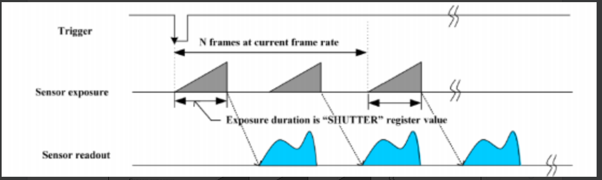
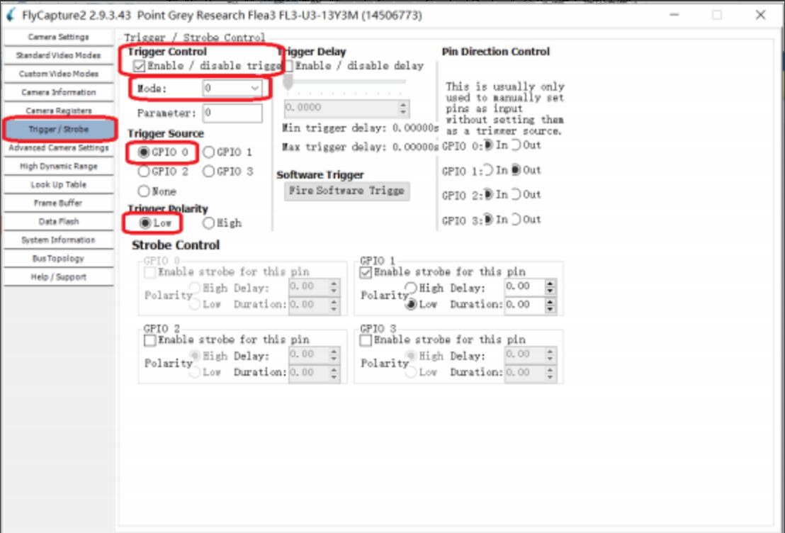
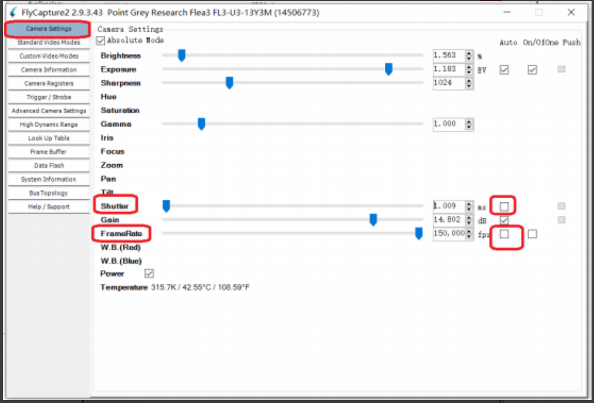

# 灰点

### FL3-U3-13Y3M-C 相机

* FL3-U3-13Y3M-C 相机是 Point Grey 公司（被 FLIR 收购）Flea3 USB 3.0 系列工业 相机中的一员，其主要特性如下表一所示。

| 型号             | FL3-U3-13Y3M-C                           |
| -------------- | ---------------------------------------- |
| 图像传感器          | Onsemi VITA1300 1/2‘’CMOS Sensor 黑白 全局快门 |
| 像元尺寸           | 4.8μm                                    |
| 最大分辨率/帧率       | 130 万像素， 1280x1024 @ 150fps              |
| 光学镜头接口         | C 型                                      |
| 数据接口           | USB3.0                                   |
| 内存             | 32MB DDR 帧缓存，1MB Flash                   |
| Exposure Range | 0.1129μs to 0.99 seconds                 |
| Trigger Modes  | Standard，bulb，multi-shot                 |
| 供电电源           | 5V via USB3.0 or 5\~24V via GPIO         |
| 相机尺寸           | 29mmx29mmx30mm（不含光学部分）                   |

*   L3-U3-13Y3M-C 相机的外部同步触发功能通过一个 8Pin 的 GPIO 连接器（Hirose HR25 圆形连接器母座）提供，如下图所示。\

    <figure><figcaption></figcaption></figure>

#### FL3-U3-13Y3M-C 相机 GPIO 连接器的信号定义如下表所示。

<figure><figcaption></figcaption></figure>

*   我们通常选用 GPIO0 作为 Trigger Source（触发源）来同步相机，由上表可知，GPIO0 为光耦隔离的输入信号，根据相机内部电路，光耦隔离的输入信号接线方式\

    <figure><figcaption></figcaption></figure>
* 在使用 GPIO0 作为外部输入触发信号时，MARS2H 的同步输出信号需要连接到 相机 GPIO 连接器的 pin1 和 pin6 上。

#### FL3-U3-13Y3M-C 相机支持的 3 种外部触发方式描述如下

*   Standard External Trigger Mode（Mode0）---在这种模式下，外部输入同步触发信 号的下降沿或上升沿将启动开始一帧图像的曝光，曝光时间将由相机 Shutter 寄存器值控 制。\

    <figure><figcaption>
Standard External Trigger Mode（Mode0）
</figcaption></figure>

*   Bulb Shutter Trigger Mode（Mode1）---在这种模式下，外部输入同步触发信号的 下降沿将开始一帧图像的曝光，曝光时间为触发脉冲的低电平持续时间。\

    <figure><figcaption>
Bulb Shutter Trigger Mode（Mode1）
</figcaption></figure>
*   Multi-Shot Trigger Mode（Mode15）---在这种模式下，一个外部输入同步触发脉 冲将启动多帧图像的曝光和捕获，可捕获帧数由模式设置中的参数设定，最大捕获帧数为 255\

    <figure><figcaption>
Multi-Shot Trigger Mode（Mode15）
</figcaption></figure>
* 由于 MARS2H 的同步输出信号为周期性的方波，根据分析，我们选择 Standard External Trigger Mode（Mode0）作为相机的外部触发方式

### MARS2H 镜头的同步接口

1.  MARS2H 镜头的同步输入/输出接口通过定制的音频线（一端为 3.5mm 耳机插头一分 为二成另一端两个 RCA 插头）可输出相应的同步输出信号，如下图所示，其中白色的 RCA 插头为同步信号输出端，RCA 内芯为同步输出信号，外芯为接地信号。\

    <figure><figcaption>
MARS2H 镜头同步输入/输出接口连接线
</figcaption></figure>
2.  MARS2H 镜头的输出同步信号为周期性方波，方波的频率为设置的镜头帧率，方波的 幅度为 5V。在空闲状态时，同步信号电平一直处于高电平状态，电压为 5V，当在动捕软件 （如 Seeker1.6）中点击“播放”按钮是，同步信号会立即变为低电平，并产生连续的波形， 占空比为 50%，当点击“停止”按钮后，同步输出信号恢复到高电平状态。同步输出波形如 下图所示。\

    <figure><figcaption></figcaption></figure>

### 连接线的制作

1. 需要制作一根连接线将 MARS2H 镜头的同步输出接口与 FL3-U3-13Y3M-C 相机的 GPIO 连接器对应信号连接起来。
2.  FL3-U3-13Y3M-C 相机的 GPIO 连接器接口的连接电缆如下图所示，可以在 FLIR 官 网或淘宝上购买。\

    <figure><figcaption>
FL3-U3-13Y3M-C 相机的 GPIO 连接线缆
</figcaption></figure>
3.  在相机 GPIO 线缆的接线端找到对应 Pin1 和 Pin6 的连接线（线缆上有说明标签），在 连接线上焊接上一个音频 RCA 母座，RCA 母座的内芯焊接到 Pin1，外芯焊接到 Pin6，如 下图所示。\

    <figure><figcaption>
FL3-U3-13Y3M-C 相机的 GPIO 线缆焊接 RCA 母座示意图
</figcaption></figure>

### MARS2H 镜头和 FL3-U3-13Y3M-C 相机的连接

*   MARS2H 镜头同步输出接口和 FL3-U3-13Y3M-C 相机的 GPIO 接口的连接关系如下 图所示。MARS2H 镜头的同步线接到 MARS2H 镜头的同步输入/输出接口插座上，FL3- U3-13Y3M-C 相机的 GPIO 线缆接到 FL3-U3-13Y3M-C 相机的 GPIO 连接器上，这两根 线通过 RCA 插头和 RCA 母座相连。\

    <figure><figcaption>
MARS2H 镜头与 FL3-U3-13Y3M-C 相机的连接示意图
</figcaption></figure>

### 软件的设置

1. 将 FL3-U3-13Y3M-C 相机通过 USB3.0 线缆连接到电脑上，按照上面的方法将 MARS2H 镜头同步线和 FL3-U3-13Y3M-C 相机的 GPIO 线缆连接起来，MARS2H 镜头接 上电源和网络，启动 XINGYING 软件。电脑端安装 FL3-U3-13Y3M-C 相机的图像捕获软 件 FlyCapture2，启动 FlyCapture2 软件。
2.  FlyCapture2 软件的界面如下图所示，通常情况下，软件中会显示相机捕获的实时 图像以及相机的相关信息。\

    <figure><figcaption></figcaption></figure>
3.  在“Settings“”菜单栏选择“Toggle Camera Control Dialog”命令，进入相机配置 界面，点击左侧的“Trigger/Strobe”选项，进入“Trigger/Strobe Control”配置页面。 按照下图所示进行外部触发功能的设置，设置 Trigger Mode 为“0”、Trigger Source 为“GPIO 0”、Trigger Polarity 为“Low”，最后在 Trigger Control 复选框中勾选 “Enable/disable trigger”启动外部触发功能 。\

    <figure><figcaption></figcaption></figure>
4.  点击左侧的“Camera Settings”选项，进入“Camera Settings”配置页面。取消 Shutter 自动复选框，设置 Shutter 值为 1ms 左右，取消 FrameRate 自动复选框，设置 FrameRate 为 CMOS Sensor 支持的最大分辨率时的最大帧率 150fps。如下图所示。\

    <figure><figcaption></figcaption></figure>
5. 经过这些设置后，FL3-U3-13Y3M-C 相机显示的图像是冻结不动的，它需要等待 GPIO0 上输入的同步触发脉冲进行图像捕获。
6. 随后，在电脑中的 XINGYING 软件上，连接 MARS2H 镜头，设置镜头帧率为 60fps， 点击“播放”按钮，如下图十四所示。MARS2H 镜头将输出 60HZ 的同步触发方波信号。
