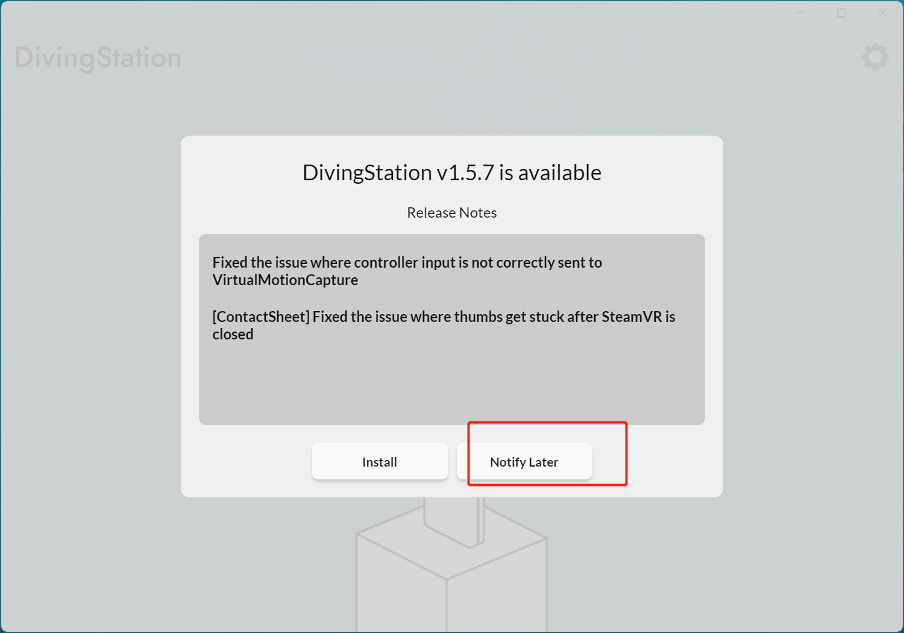

# 安装及其 配置校准

## **软件安装**

1. 双击“DivingStationInstaller.exe”程序，弹出安装窗口后点击“Install”开始安装
2.  进度条完成后，点击“Finish”，点击“Notify Later”\

    <figure><figcaption></figcaption></figure>

***

## **设置**DivingStation

### **连接加密狗**

<figure><figcaption></figcaption></figure>

1. 启动软件前，请先连接加密狗。
2.  拿出手套，向右滑动电源按钮以将其打开。\

    <figure><figcaption></figcaption></figure>


**提示**

为避免通信干扰，手套的的加密狗应远离其他加密狗的位置。 此外，根据环境的不同，使用 USB 集线器时通信可能会很慢。


***

<figure><figcaption></figcaption></figure>

### **配对** 

1.  您可以通过按下 DivingStation 上的配对按钮来连接手套。\

    <figure><figcaption></figcaption></figure>
2. 首先按住手套底部的按钮约 3 或 4 秒钟。 配对开始时，手套上的指示灯将闪烁。
3. 配对完成后，将显示已连接。

***

### **校准** 

1.  可以通过按下Calibration上的校准按钮来校准手套。\

    <figure><figcaption></figcaption></figure>
2. 按 Calibration按钮开始校准。 校准包括以下步骤：
   * **弯曲校准：**&#x5728;此校准中，从小指到食指全部弯曲，伸展拇指。
   *   **拉伸校准：**&#x5728;此校准中，只有拇指弯曲，其他手指伸出。\

       <figure><figcaption></figcaption></figure>

***

### **操纵杆校准** 

1.  首次需要校准操纵杆来确定操纵杆的中心和方向。 按下操纵杆校准按钮（Joystick Calibration）。\

    <figure><figcaption></figcaption></figure>
2. 按 Joystick Calibration按钮开始校准。
3. 校准包括以下步骤：
   * **中心校准：**&#x6B64;校准确定操纵杆中心的位置。 不要移动操纵杆。
   * **范围校准：**&#x6B64;校准确定操纵杆的最大运动范围。最大限度的将操纵杆转动数次。
   * **前向校准：**&#x6B64;校准确定操纵杆的前向。 弯曲手指，然后朝向下方向推操纵杆。


**提示**

由于需要点击鼠标，很难同时校准双手。 如果只选中 Left 和 Right 中的一个并执行校准，则可以一只手一只手的校准


