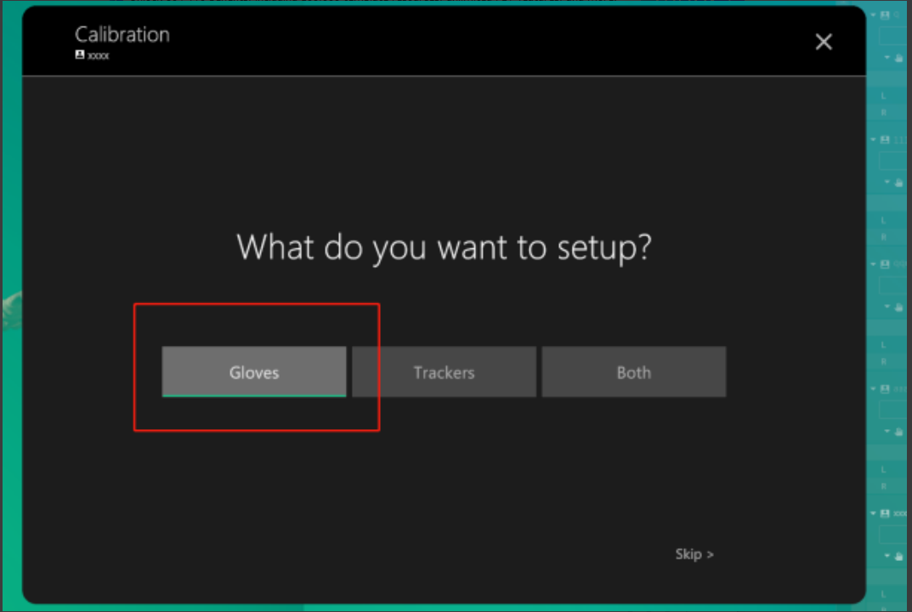
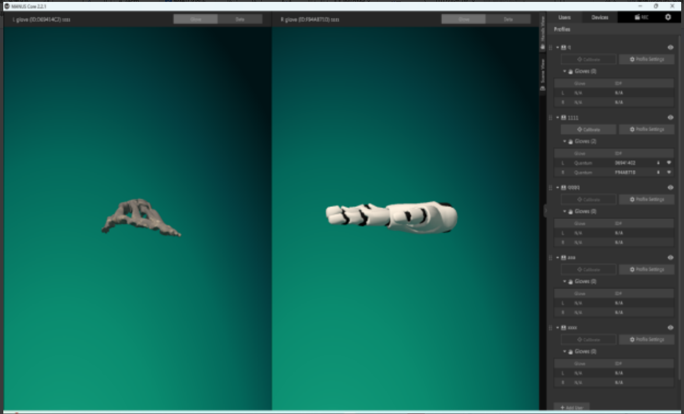

# Manus

### 软件安装

1. 双击Manus应用程序，显示安装程序，一直点击下一步，然后点击安装，安装完成后点击完成；
2.  插入Manus接收器，打开手套，打开Manus Core软件，输入用户名，添加手套，等待手套连接，然后根据软件提示进行手套标定，标定完成后显示手套界面；\
    \

    <figure><figcaption></figcaption></figure>

<figure><figcaption></figcaption></figure>

<figure><figcaption></figcaption></figure>

### 设备连接

1. 点击第三方设备，选择手套管理，默认IP地址（如果手套接收器再其他电脑上则输入那台电脑的ip地址），选择手套类型Manus（如果是Vrtix手套需要选择数量Vrtix手套最多连接12只6副），点击添加连接等待一会后，设备列表显示连接成功的左右手套，列表中显示：手套ID，类型，是否在线，左手右手，电量，信号值；
2.  连接成功后再左侧列表中绑定手套，如果连接多副手套可以下拉，选择绑定的左右手ID，如果是一副手套则保持默认，输入名称（这里名称是自定义的为了方便多副手套时创建人体编号的区分）配置完成后点击添加绑定，绑定完成后就可以创建手套人体了；\

    <figure><figcaption></figcaption></figure>

### 人体创建

1.  切换3D视图，然后让模特进入场地，点击冻结，确认点数是否正确，框选点，点击鼠标右键，点击创建人体下滑，选择“Baseline+Toe+Hand,Headband(53)模型”，保存默认属性，如果有多副手套则下拉编号选择想要的编号名称，点击创建（注意：创建手套贴点时需要保持，T-Pose站立，一直到模型创建完成），创建成功后再3D视图中就可以看见创建完的模型了解除冻结就可以使用模型了；\

    <figure><figcaption></figcaption></figure>
