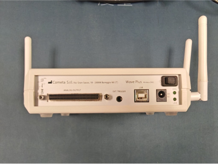
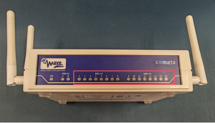
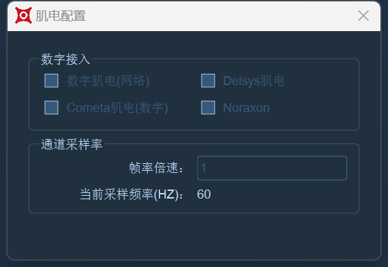
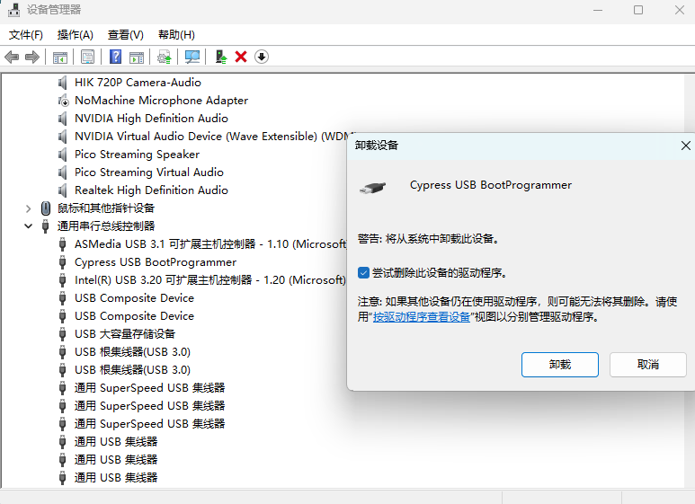
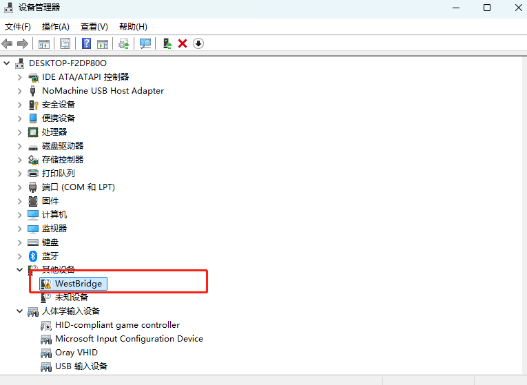
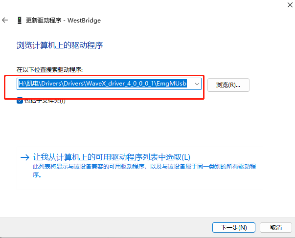
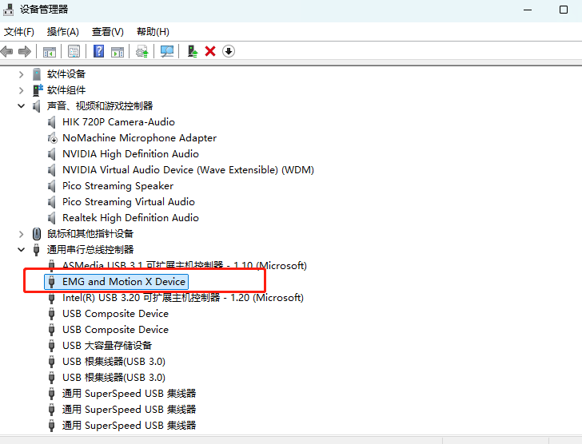
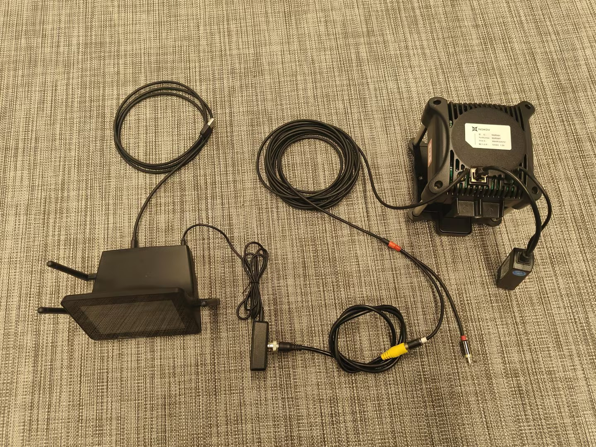
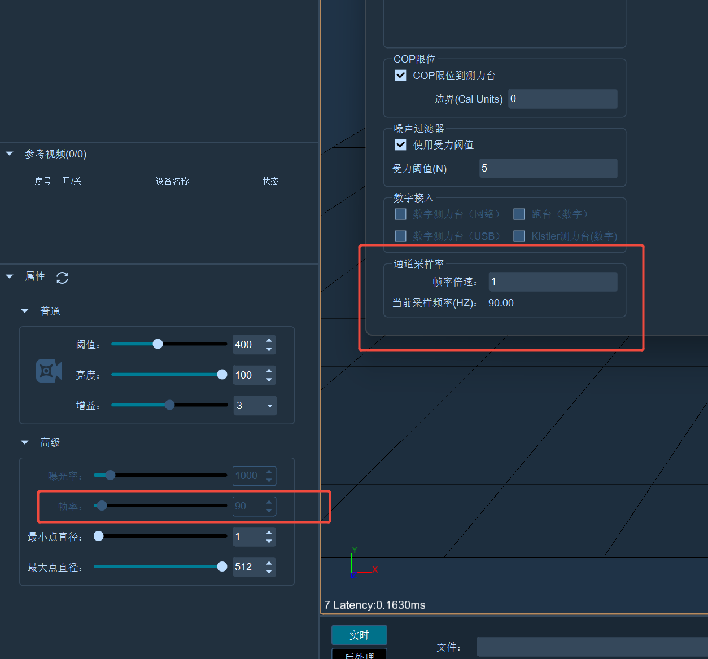

# Cometa

### **安装驱动**

* Cometa肌电接收盒通过usb连接到电脑，需要安装驱动。
* 设备管理器->其它设备->更新驱动->浏览我的计算机查找驱动 -> 选择驱动所在的目录->扫描自动安装。

### **设备连接**

*   接收盒使用USB连接线与PC连接\

    <figure><figcaption></figcaption></figure>
*   上电后，与信号发射器正常通信的会亮绿灯，未正常连接的不会亮灯，发射器低电的亮黄灯\

    <figure><figcaption></figcaption></figure>

### **软件配置**

* 打开软件，点击第三方设备，点击通道，配置肌电通道，范围500mv；
*   点击肌电配置，勾选Cometa肌电；\

    <figure><figcaption></figcaption></figure>
* 点击软件上方模拟图表，点击编辑页面，开启自适应；

***

## **Wave X**


若电脑中安装了“Ditect”相机驱动，Wave X接收器连接电脑后会被错误识别成“Ditect”设备导致Wave X无法在电脑上正常使用，请在设备管理器中将“Ditect”驱动卸载（16.2.4.1），卸载后再进行Wave X驱动的安装


<figure><figcaption>
16.2.4.1
</figcaption></figure>

### **安装驱动**

1.  将Wave X的专用接收器通过USB线与电脑连接，打开设备管理器，展开其他设备列表，选中带有黄色感叹号的“WestBridge”设备（16.2.4.2），右键点击更新驱动程序，选择“浏览我的电脑以查找驱动程序”，选择Wave X的驱动程序所在的文件夹，点击下一步安装驱动程序（16.2.4.3）。\

    <figure><figcaption>
16.2.4.2
</figcaption></figure>

    <figure><figcaption>
16.2.4.3
</figcaption></figure>
2.  安装成功后系统会识别到设备“EMG and Motion X Device”（16.2.4.4）

    <figure><figcaption>
16.2.4.4
</figcaption></figure>

### **硬件连接**

1.  将接收器接通电源，打开开关，将触发同步线插入接收器背面（16.2.4.5）。\

    <figure><figcaption>
16.2.4.5
</figcaption></figure>
2.  在触发同步线的插槽中连接BNC 转 RCA 连接线，将同步线的莲花头插入触发同步线的插槽，同步线白色的RCA插头为同步信号输出线，将其连接BNC 转 RCA 连接线，同步线另外一端插入Nokov光学镜头背后的AUX口，插头需一插到底，确定接线牢固（16.2.4.6）。\

    <figure><figcaption>
16.2.4.6
</figcaption></figure>
3. **主镜头同步：**&#x5C06;同步线插入主镜头背面的AUX口。
4. **副镜头同步：**&#x5728;使用数字测力台+数字肌电的场景，需要使用副镜头进行同步。使用两根同步线，将一根同步线连接主镜头与测力台的放大器，另外一根同步线连接副镜头与BNC 转 RCA 连接线。

### **软件配置**

1.  打开XINGYING软件，在第三方设备菜单栏中打开肌电配置窗口。若使用主镜头同步方案，勾选“Cometa（数字）”复选框，还需要同步则勾选“数字测力台（USB）、Cometa（数字）”复选框（16.2.4.7）。测力台的配置使用说明请阅读上文进行配置。\

    <figure><figcaption></figcaption></figure>
2.  在第三方设备菜单栏中打开通道配置窗口，根据使用的肌电模块数量添加模拟通道，为通道设置量程范围（16.2.4.8）。\

    <figure><figcaption>
16.2.4.8
</figcaption></figure>
3.  **采样频率设置**：Cometa肌电最大支持2000采样频率，采样频率=帧率×倍率。XINGYING软件默认的帧率为100fps，倍率默认为1，若有需要请自行在设备面板和测力台参数设置窗口进行修改（16.2.4.9）。\

    <figure><figcaption></figcaption></figure>
4.  以上配置完成后，点击软件下部的镜头连接按钮，点击播放，在工具栏中点击模拟图表按钮打开图表，打开模拟通道面板，勾选通道的复选框，开启自适应（16.2.4.10），在模拟图表中即可实时查看肌电模块的波形及其数据。\

    <figure><figcaption>
16.2.4.10
</figcaption></figure>

