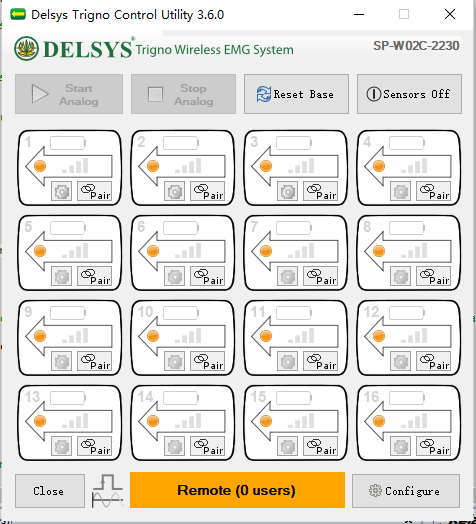
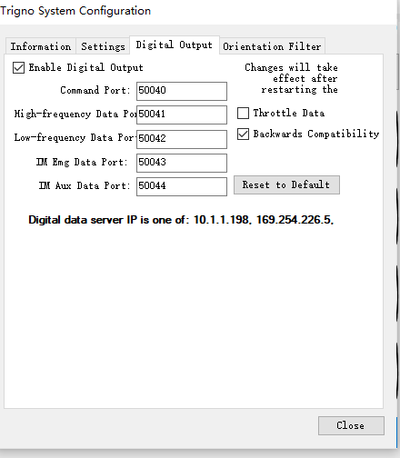
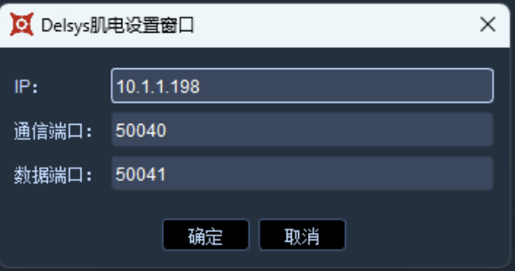

# Delsys

1.  在emgworks安装完成后，打开delsys trigno control Uitlity工具如下图。\

    <figure><figcaption></figcaption></figure>
2. 将EMG无线模块与trigno主机配对，配对完成后delsys trigno control Uitlity会显示已经配对成功的无线终端模块。（注意，在xingying中使用delsys之前请确保无线终端已经完成配对，xingying不支持使用中对无线终端进行配对操作）。
3.  点击configure按钮打开配置面板，选择Digital Output栏，第一次使用请确保Enable Digital Output已经勾选。Command Port和High-frequency Data Port非必要情况下请无修改。当正确配置了XingYing系统环境后，Digital Output栏最下方的 Digital

    &#x20;data server ip会显示出目前已经绑定了10.1.1.198.如果没有，请检查当前电脑的网卡是否已经正确设置。

    以上配置在第一次使用时需要配置，后面就只需要在使用时打开delsys trigno control Uitlity软件即可。\

    <figure><figcaption></figcaption></figure>
4. 打开软件，选择第三方设备，选择模拟通道，正确配置需要的肌电通道和量程，Delsys肌电建议量程为5mv或者10mv。
5.  再次选择第三设备，选择肌电配置，在其它配置栏勾选delsys肌电，即可正常使用delsys肌电。\

    <figure><figcaption></figcaption></figure>
6. Delsys肌电目前支持独立使用，也支持和Bertec，AMTI，kistler等数字测力台同时使用。当需要同时使用测力台和肌电设备时，注意数字测力台不需要选择模拟通道，只需要配置肌电的通道即可。
