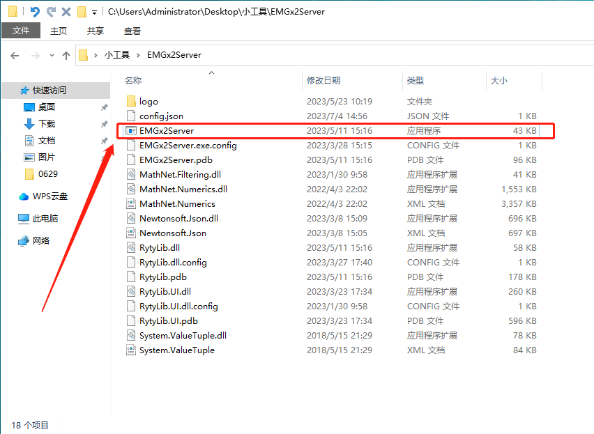
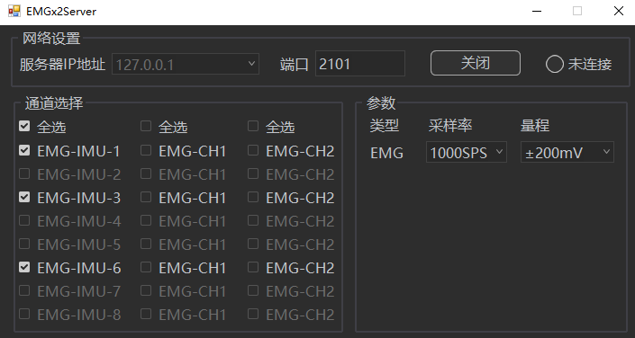
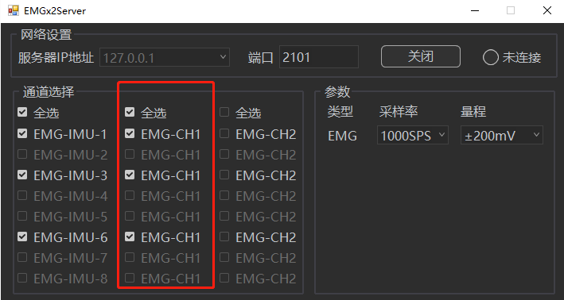

# 分布式无线肌电

### **分布式无线肌电**

1. 使用配送的路由器，电脑连接路由器，电脑与路由器（LAN口）请用网线连接，首次连接时可能需要进行认证并输入密码；
2. 使用医用双面胶贴于采集器上并将采集器打开使其变为工作状态，医用双面胶有高粘性和低粘性，高粘性会在采集器上残留就多胶，低粘性会残留较少胶。去除残留胶时，请使用橡皮檫擦除，并用酒精棉擦拭干净。设备不能泡于水中或消毒液中，不可使用带有腐蚀性洗液清洁设备；
3.  打开“EMGx2Server”文件夹，在文件夹中双击打开“EMGx2Server”（16.2.2.1），等待采集器连接，连接成功后对应的采集器名称会由灰色变为亮起可选择状态，此状态表示采集器已经连接成功了（16.2.2.2）。可咨询技术工程师来获取“EMGx2Server”文件；\

    <figure><figcaption>
16.2.1.1
</figcaption></figure>

    <figure><figcaption>
16.2.2.2
</figcaption></figure>
4. EMGx2Server中的服务器IP和端口保持默认不要修改，如果服务器状态是关闭状态，点击打开即可。
5.  在XingYing软件中点击菜单栏第三方设备-通道配置窗口，该窗口为采集器配置通道，注意添加的通道数量应和实际使用的采集器最大通道一致，即如果无线肌电使能了EMG-IMU-1,EMG-IMU-6两个，那么在xingying中需要配置通道1\~6共6个通道，且需要按顺序开启，目前软件不支持任意通道组合使用，如下图。\

    <figure><figcaption></figcaption></figure>

    在添加完通道后可以根据无线肌电的量程选择对应量程，选择完成后勾选前面的通道进行使能。
6.  关闭通道配置窗口，在第三方设备-肌电配置窗口中勾选“数字肌电（网络）”选项。\

    <figure><figcaption></figcaption></figure>
7. 关闭配置窗口，即可进行肌电数据和动捕数据的同步采集。
8.  将3D视图切换为模拟图表，在图表中鼠标右键选择”编辑页面“，在”通道配置“窗口中点击”通道“全选上通道，开启自适应，此时可以看到模拟图表中实时显示出采集器的数据和波形。这样模拟图表中就会显示出肌电的数据及其曲线波形了；\

    <figure><figcaption></figcaption></figure>
9. 使用数字肌电可以设置采集倍率，系统默认倍率为1倍，即肌电频率和动捕频率一致，也可以根据需要进行设置，数字肌电最大支持1000fps采集频率，计算方式为采样频率值=帧率倍速×帧率。
10. 当需要设置倍率时，可以在镜头断开连接情况下在第三方设备-测力台参数设置页面的通道采样频率下方输入帧率倍速，按下回车键后，设置的倍速生效。然后重新连接镜头并播放即可。


注意，在使用“EMGx2Server”前请在电脑上连接配送的路由器的WiFi，“EMGx2Server”窗口中的网络设置请不要更改，保持默认即可；请勿开启多个“EMGx2Server”程序，否则会导致端口占用无法检测到采集器，连接上采集器后将程序最小化即可；连接上所有采集器后，在”通道选择”的第二列中将各个采集器的”EMG-CH1“都勾选上（16.2.2.3）；


<figure><figcaption>
16.2.2.3
</figcaption></figure>
