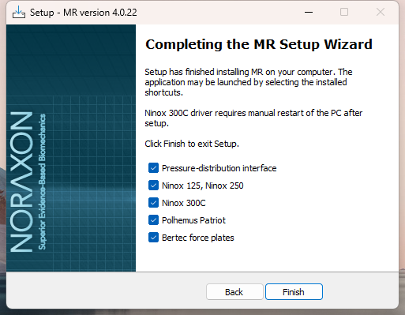
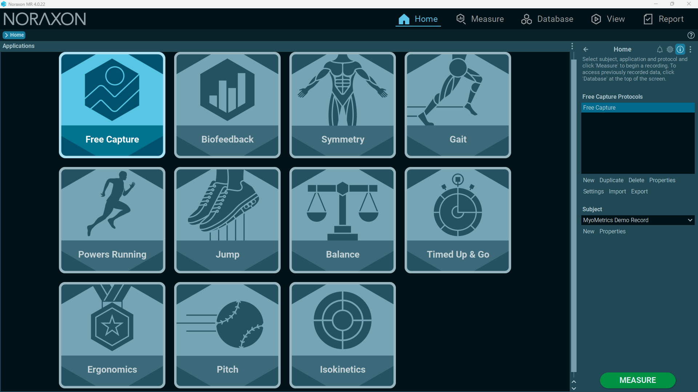
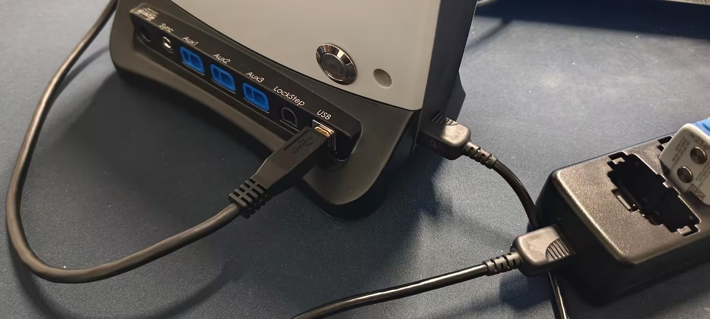
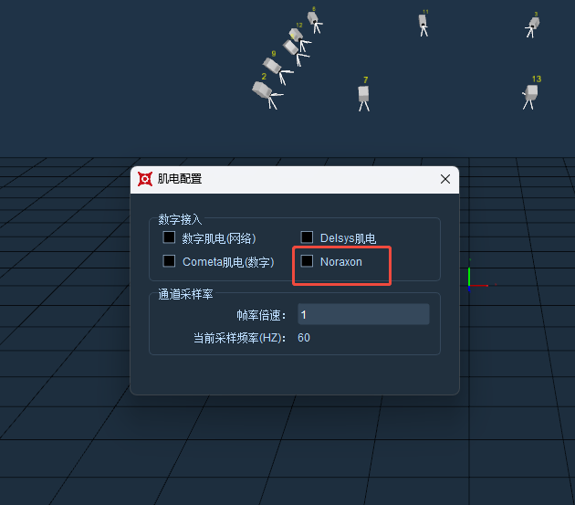
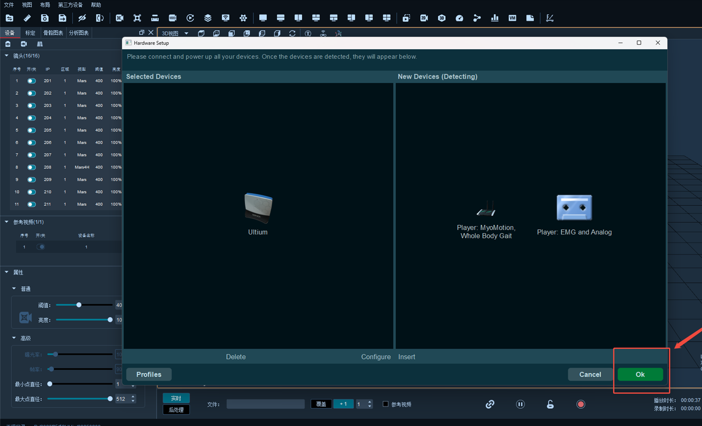

# Noraxon

### Noraxon肌电使用说明

1.  安装Noraxon软件，安装Noraxon Acquire SDK；\

    <figure><figcaption></figcaption></figure>
2.  打开Noraxon软件;\

    <figure><figcaption></figcaption></figure>

3.  USB连接线与电脑连接；\

    <figure><figcaption></figcaption></figure>
4.  打开XINGYING软件，点击第三方设备，选择通道配置，配置Noraxon肌电通道，选择肌电配置，勾选Noraxon；\

    <figure><figcaption></figcaption></figure>
5.  选择接入的设备（Ultium）点击确定，软件会显示硬件正在激活，请稍等；\

    <figure><figcaption></figcaption></figure>
6. 软件播放，打开模拟图表，全选通道，开启自适应；
