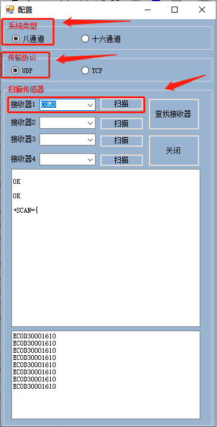
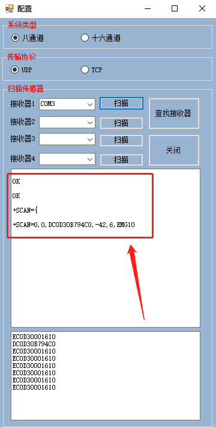
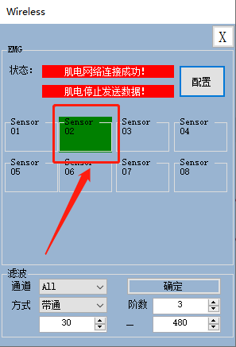
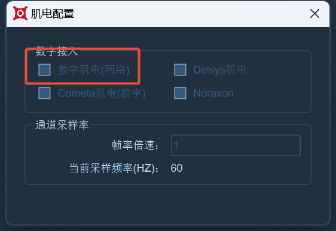
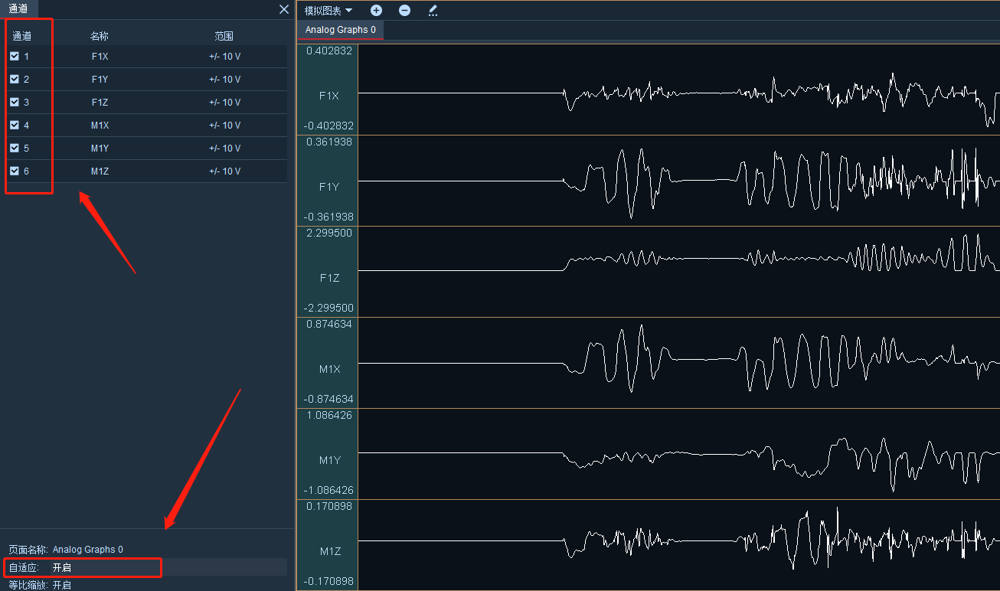

# 智芸薇

### **连接肌电（“智芸薇”肌电）**

1. 肌电分为传统肌电和国产无线数字肌电。无线肌电设备通过无线方式进行信号传输，实时发送所采集的肌电信号，并将其传输至无线信号接收器，在XINGYING软件中显示出肌电数据和波形。
2. 使用“智芸薇”无线数字肌电，将肌电无线信号接收器插入电脑，将肌电测试模块通电，通电后肌电测试模块绿色指示灯亮起；
3.  使用肌电的配套软件，双击“yw-wirlesssdk.exe”打开Wireless窗口，点击配置（16.2.1.1），系统类型选择“八通道”，传输协议选择“UDP”，在接收器1右侧点击扫描（16.2.1.2），扫描完成后下方会打印出肌电的ID名称（16.2..1.3），若肌电未通电，则下方不会打印出肌电ID信息；\

    <figure><figcaption>
16.2.1.1
</figcaption></figure>
4. 配置中成功打印出正确的肌电设备的ID后，Wireless中的Sensor模块会变成绿色（16.2.1.4），表示现在已经有一个肌电测试模块连接上了，可根据需求增添或减少肌电测试模块数量，重复上述步骤二的操作连接肌电模块。

<figure><figcaption>
16.2.1.2
</figcaption></figure> <figure><figcaption>
 16.2.1.3
</figcaption></figure>

<figure><figcaption>
16.2.1.4
</figcaption></figure>

### **肌电数据波形**

1. 在第三方设备中打开通道配置窗口，在列表中鼠标右键添加模拟通道，点击“选择”按钮，全选上添加的模拟通道；
2.  在软件中连接数字肌电时，请不要将“Wireless”关闭。打开“肌电配置”，在“其他配置”中勾选“数字肌电（网络）”选项（16.2.1.5）。\

    <figure><figcaption></figcaption></figure>
3.  接下来在工具栏中开启模拟图表，在图表上右键点击“编辑页面”，在通道窗口中点击“通道”添加模拟通道，并在窗口下方开启自适应，将专用肌电贴贴于所测肌肉肌腹处，再将肌电测试模块两端纽扣扣在专用肌电贴上，这样模拟图表中就会显示出肌电的数据及其曲线波形了（16.2.1.6）；\

    <figure><figcaption>
16.2.1.6
</figcaption></figure>
4. 使用数字肌电可以手动设置倍率，在测力台参数设置窗口中的通道采样频率下方输入帧率倍速，按下回车键后，设置的倍速生效，采样频率值=帧率倍速×帧率。
