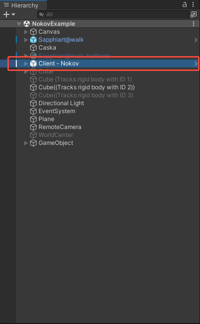
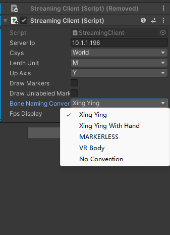
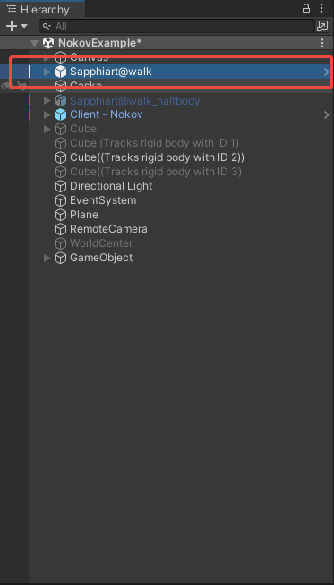
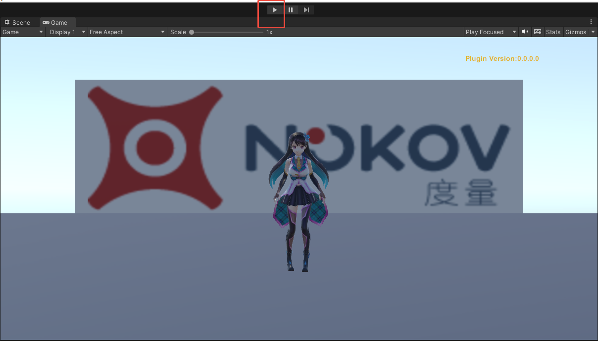
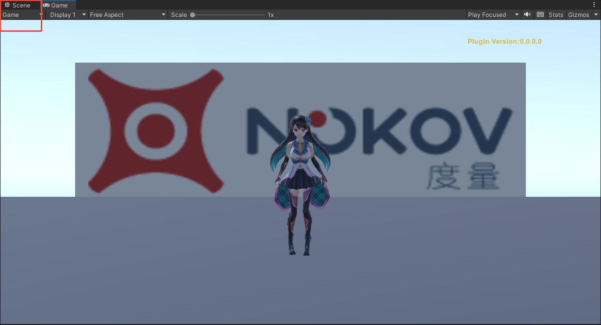

# （六）Unity插件

### **插件的导入**

1.  将“Nokov\_Unity\_Plugin\_XXXX.unitypackage”的插件安装包解压缩，创建Unity项目，点击Assets（17.6.1），选择”Import package--CustomPackage...”，导入解压缩后的Unity插件（17.6.2）；\

    <figure><figcaption>
17.6.1
</figcaption></figure>

    <figure><figcaption>
17.6.2
</figcaption></figure>
2.  首次导入，日志面板有红色编译错误，警告打开工程属性，设置允许不安全的代码。将Unity上方的Edit->ProjectSettings->Player-Allow Unsafe code 勾选上（17.6.3）；\

    <figure><figcaption>
17.6.3
</figcaption></figure>

***

### **Unity设置与使用**

1.  选中导入安装包中的”Assets—Nokov—Scenes—NokovExample”，并双击打开（17.6.4）；\

    <figure><figcaption>
17.6.4
</figcaption></figure>
2.  点击Hierachy面板中的”Client - Nokov”，将右侧的Host Ip修改为10.1.1.198，Bone Naming Convention选择”XINGYING”（17.6.5、17.6.6），若XINGYING软件中播放的是手套人体数据，Bone Naming Convention中请选择“Xing Ying With Hand”；

    
<figure><figcaption>
17.6.5
</figcaption></figure> <figure><figcaption>
17.6.6
</figcaption></figure>

3.  点击场景中的”Sapphiart@walk”，确保Inspector中三个模块被勾选上，并确保”Nokov Skeleton Animation(Script)”中的”Skeleton Asset Name”的名称和XINGYING中人体名称保持一致（17.6.7、17.6.8），修改后回车键保存；\

    
<figure><figcaption>
17.6.7
</figcaption></figure> <figure><figcaption>
17.6.8
</figcaption></figure>

4.  确保XINGYING软件处于播放状态，点击Unity中的播放按钮，并让XINGYING里的人体运动起来，Unity中的模型就会被驱动，进行同步运动（17.6.9）；\

    <figure><figcaption>
17.6.9
</figcaption></figure>
5.  可切换到Scene场景视图里观察模型不同角度（17.6.10）。\

    <figure><figcaption>
17.6.10
</figcaption></figure>

***

### 命名点与未命名点的显示

1.  在Unity中点击“Client-Nokov”，将Draw Unlabeled Markers复选框勾选上（17.6.11），点击Unity软件上方的“Play”按钮，在Unity场景中便会显示出未命名点。\

    <figure><figcaption>
17.6.11
</figcaption></figure>
2.  勾选“Draw Markers”复选框（17.6.12），点击“Play”按钮后，Unity场景上会显示出人体的命名点。\

    <figure><figcaption>
17.6.12
</figcaption></figure>
3.  展开“Client-Nokov”后，列表中会显示命名点和未命名点的ID，在列表上选中命名点或未命名点的ID名称后，可以在Unity场景中查看命名点或未命名点的位置，在右侧会显示选中点的XYZ位置坐标（17.3.13）。\

    <figure><figcaption>
17.3.13
</figcaption></figure>
4. 下拉框选择缩放比例、下拉框选择向上轴：点击“Client-Nokov”，在右侧点击“Lenth Unit”展开下拉框选择缩放比例（17.6.14），可选择“meter、Centimeter、Millimeter”三个单位对Unity场景中的对象进行缩放，默认单位为“Meter”；点击“Up Axis”选项展开下拉框可选择Unity场景中的向上轴，可选择“Y、Z”两种轴向，默认向上轴为“Y”；

<figure><figcaption>
17.6.14
</figcaption></figure>

***

### **VRPN手柄接入Unity**

1. 请先按照上文“十七、手柄连接说明与VRPN数据接入UE说明“中的说明对手柄进行连接和动捕进行设置；
2. 将被捕捉物贴上反光标记点，在XINGYING软件实时模式下创建一个刚体。
3. 打开Unity，新建一个工程。
4.  将插件拖入“Assets”中（17.6.11），插件请联系我们的技术工程师获取。点击“Import”导入，导入后在“Assets--UVRPN--Sences”目录中双击“Demo”进入Unity场景（17.6.12），切换到“Sence”（17.6.13）；\

    <figure><figcaption>
17.6.11
</figcaption></figure>

    <figure><figcaption>
17.6.12
</figcaption></figure>

    <figure><figcaption>
17.6.13
</figcaption></figure>
5. 参数设置：
   *   设置本机地址：在“VRPN\_Manager”中将“Host：（IP/localhost）”的地址设置为“127.0.0.1”（17.6.14），若连接的是其他主机，则将此处的IP地址改为其他主机的服务端IP地址，设置好IP后按下回车键并Ctrl+S保存；\

       <figure><figcaption>
17.6.14
</figcaption></figure>
   *   开启日志：开启日志可详细看到手柄按键被按下的打印信息，打印错误日志后可有助于找到问题所在从而解决问题。选择“Window--General--Console”，并将“Debug Log”勾选上（17.6.15）；\

       <figure><figcaption>
17.6.15
</figcaption></figure>
   *   设置Flystick：点击“Flystick”，在“VRPN\_Tracker（Script）”模块中的“Tracker”输入框输入VR Tracker软件创建的刚体名称，“Channel”设置为0并按下回车键保存（17.6.16）。\

       <figure><figcaption>
17.6.16
</figcaption></figure>
   *   在“VRPN\_Button（Script）”模块中的“Tracker”输入框输入手柄的名称（joystick1、joystick2），勾选上“Debug log”方便打印日志信息（17.6.17），若连接第一个手柄则输入“joystick1”并按下回车键，此处的“Channel”值表示响应的手柄键位的编号；\

       <figure><figcaption>
17.6.17
</figcaption></figure>
   *   在“VRPN\_Analog（Script）”模块中的“Tracker”输入框输入手柄的名称（joystick1、joystick2），“Channel”设置为0（17.6.18）。\

       <figure><figcaption>
17.6.18
</figcaption></figure>

***

### 实时驱动Tracker 

1.  当上述配置均设置完成后，将“VRPN\_Button（Script）”模块中的“Channel”值设置为1按下回车键保存配置，点击播放切换到“Sence”显示出场景，移动刚体后，Unity中的物体也会被同步驱动，此时按下手柄上的编号为“1”的按键，Unity中“Console”会打印出手柄键位的信息，“Button 1 Hold”表示手柄的按键1被按下，“Button 1 Up”表示手柄的按键1按下后被松开（17.6.19）。\

    <figure><figcaption>
17.6.19
</figcaption></figure>
2. 若需要使用手柄的其他按键，在“VRPN\_Button（Script）”模块中将“Channel”值设置为对应的编号即可。
3.  若使用手柄轮盘，无需在“Channel”中进行设置，直接滑动轮盘即可，“VRPN\_Analog（Script）”模块中的“Analog”坐标值会实时变化（17.6.20）；\

    <figure><figcaption>
17.6.20
</figcaption></figure>
4.  位移和旋转的反转：在使用刚体实时驱动Unity场景中的物体时，可以对刚体数据的位移和旋转进行反转，在“VRPN\_Tracker（Script）”模块中的“Position Tracking”表示刚体的位移，“RotationTracking”表示刚体的旋转，勾选“X、Y、Z”则代表将“X、Y、Z”轴的坐标值进行反转（17.6.21）。\

    <figure><figcaption>
17.6.21
</figcaption></figure>
