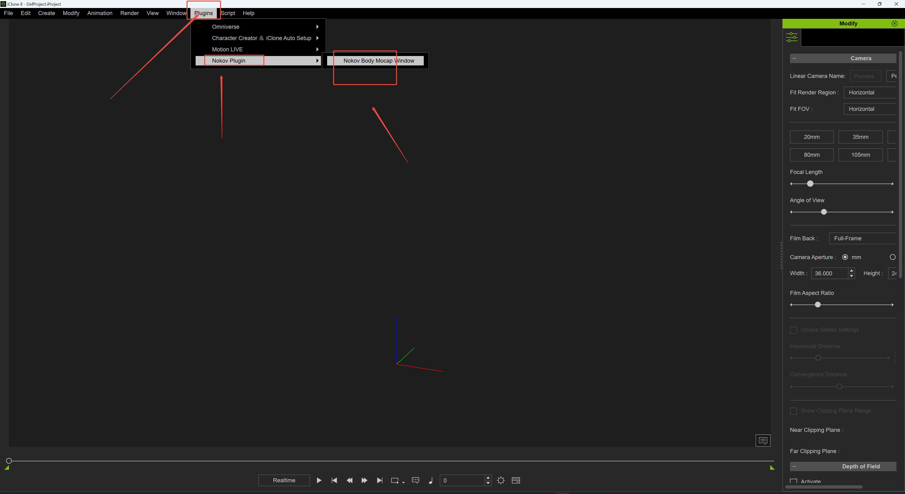
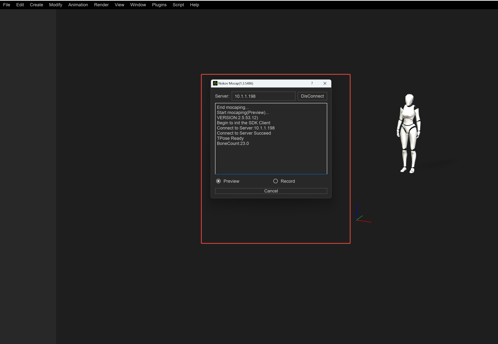
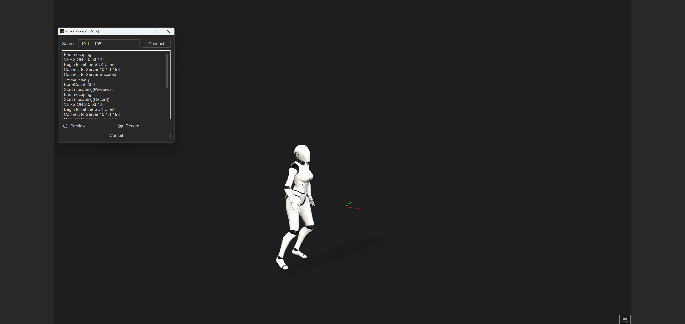
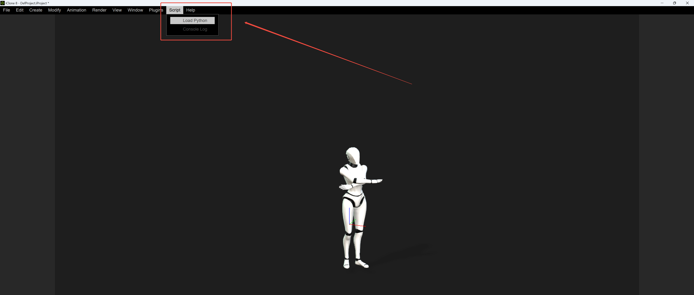

# （七）IClone插件

### **配置IClone的Python环境**

1. 输入以下网址：
   * “https://wiki.reallusion.com/IC\_Python\_API:Python\_Extension\_Libraries”，按照网页中的步骤来配置Pyhon环境；
2. 安装依赖库
   * 在命令提示符将路径切换到“PluginClone”文件夹中的“deps”中，在“deps”目录下来安装我们的依赖库；
   *   在命令提示符中输入“iClonepy.exe -m pip install .\seekerpy-1.0.1-py3-none-any.whl”（17.7.1）；\

       <figure><figcaption>
17.7.1
</figcaption></figure>
   *   在命令提示符中输入“iClonepy.exe -m pip install .\nokovpy-2.0.1-py3-none-any.whl”（17.7.2）。\

       <figure><figcaption>
17.7.2
</figcaption></figure>

###

***

### **运行插件—方式一**

1.  安装完成依赖库后，便可以运行插件了，运行插件有两种方式，首先是第一种，在桌面上找到IClone软件图表，打开IClone文件位置，在“Reallusion\iClone 8\Bin64\OpenPlugin”目录下，将“PluginIClone”文件夹拷贝到此路径中（17.7.3）；\

    <figure><figcaption>
17.7.3
</figcaption></figure>
2. 接下来在XINGYING实时模式播放人体数据或者在后处理模式加载一组人体数据，同时在XINGYING软件中打开设置，在“数据广播”面板中将网卡地址设置为“10.1.1.198”，并开启“启用SDK”。
3. 启动IClone，在“PluginIClone ->models”文件夹中的“Test.iAvatar”模型拖拽到IClone场景中；
4.  在菜单栏“Plugins->NokovPlugin->Nokov Body Mocap Window”打开插件窗口（17.7.4），在插件窗口中“Server”中输入“10.1.1.198”，输入ServerIP为动捕软件设定的SDK广播地址；\

    <figure><figcaption></figcaption></figure>
5.  单击Connect按钮，日志窗口会打印连接信息（17.7.5）；\

    <figure><figcaption></figcaption></figure>
6. 可根据需要选择Preview(实时预览)/Record(录制)后点击start；
7.  此时播放动捕数据，实时驱动IClone中的模型（17.7.6）。\

    <figure><figcaption></figcaption></figure>


注意：在点击Connect获取连接信息和点击start运行IClone插件时，请保证动捕中人体在3D视图中；


***

### **运行插件—方式二**

1.  第二种方式无需拷贝“PluginIClone”文件夹到OpenPlugin中。启动IClone软件，点击菜单栏“Script->Load Python”（17.7.7），在“PluginIClone”插件文件夹选择“main.py”，点击打开；\

    <figure><figcaption></figcaption></figure>
2. 接下来参考上文“运行插件—方式一”中的步骤2\~7即可驱动IClone中的模型。
