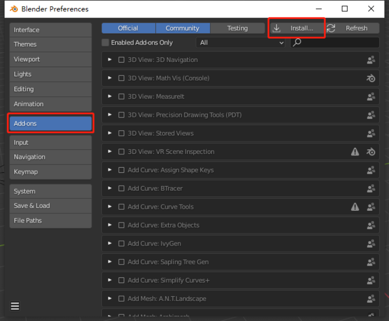

# （十） Blender插件

1. 下载PluginBlender插件压缩包。
2. 打开Blender软件。
3.  点击界面上的Edit->Preferences（17.10.1），然后在弹出的界面上点击Add-ons，点击Install...按钮（17.10.2），选择插件压缩包，点击Install Add-on按钮（17.10.3）。\

    <figure><figcaption>
17.10.1
</figcaption></figure>

    <figure><figcaption>
17.10.2
</figcaption></figure>

    <figure><figcaption>
17.10.3
</figcaption></figure>
4.  勾选启用PluginBlender插件（17.10.4）。\

    <figure><figcaption>
17.10.4
</figcaption></figure>
5.  点击左上角的Add->Nokov Amature按钮创建骨骼（17.10.5）。\

    <figure><figcaption>
17.10.5
</figcaption></figure>
6.  在右上角选中刚刚创建的骨骼，并点击小箭头展开插件面板（17.10.6）。\

    <figure><figcaption>
17.10.6
</figcaption></figure>
7.  选中Nokov Mocap，在面板中下拉框选择IP，点击Connect按钮连接，在Character Name中输入想要使用的XingYing中的人体名称，然后勾选Live（17.10.7），在Blender界面下方点击播放按钮（17.10.8）。

    <figure><figcaption>
17.10.7
</figcaption></figure>

    <figure><figcaption>
17.10.8
</figcaption></figure>
