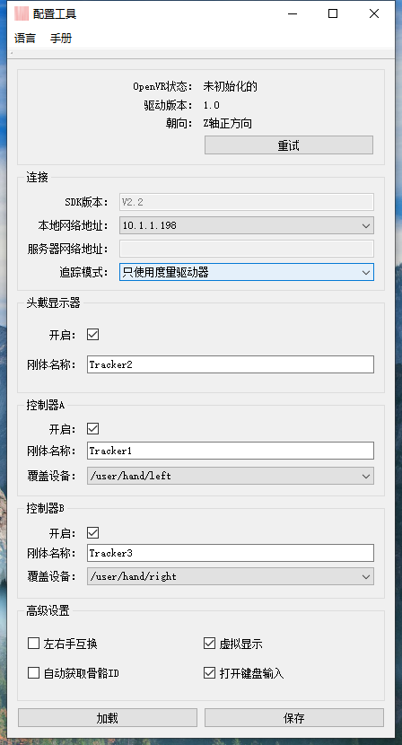
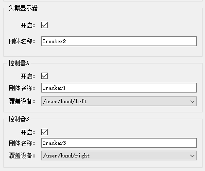
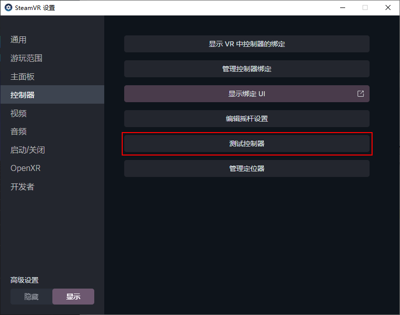

# （十一）Open VR插件

### **安装注册Steam和Steam VR**

* 使用Open VR插件前需要在电脑上注册一个Steam账号，安装Steam平台和Steam VR。

### **安装插件**

*   双击安装OpenVr-NokovDriver.exe驱动程序，具体的插件版本请联系我们的技术工程师获取。\

    <figure><figcaption></figcaption></figure>

    安装完成后会自动打开插件的配置工具Config Tool。\

    <figure><figcaption></figcaption></figure>

***

### **SteamVR管理加载项**

1.  打开SteamVR，依次打开设置，将高级设置选择为显示，依次点击启动/关闭--管理加载项\

    <figure><figcaption></figcaption></figure>
2.  在加载项中开启nokov和Gamepad Support，将其他的加载项关闭禁用。\

    <figure><figcaption></figcaption></figure>

3. vrpath设置：在下方图片的目录下输入cmd命令进入命令行工具。使用vrpathreg.exe工具检查vrpath是否设置（可通过vrpathreg.exe -help命令查看可使用的参数），在命令行中使用如下命令检查vrpath是否设置了正确的OpenVR driver版本，设置该项的原因具体参见[https://github.com/ValveSoftware/openvr/blob/master/docs/Driver\_API\_Documentation.md#building--development-environment。](https://github.com/ValveSoftware/openvr/blob/master/docs/Driver_API_Documentation.md#building--development-environment%E3%80%82)
4.  如下图目录所示则为设置成功

    <figure><figcaption>
vrpath设置
</figcaption></figure>

    <figure><figcaption>
输入命令行路径
</figcaption></figure>


安装插件时会自动设置OpenVR vrpath，如果打开SteamVR后在加载项中没有找到nokov，请检查OpenVR vrpath是否设置正确。


***

### **Config Tool 基本设置**

1. 安装完Open VR插件后便会自动打开我们的配置工具，Config Tool.exe应用程序在C:\Program Files\Nokov\OpenVR\_Nokov\_Driver\_1.4.xxx\ConfigTool路径下。下面为您介绍我们配置工具的功能
2. 配置工具支持翻译功能，点击应用左上角的Language按钮可以切换中、英文语言。手册菜单中主要的功能是可以直接打开...\Steam\config\steamvr.vrsettings文件，此文件主要包含SteamVR在运行时读取的配置文件，也包括我们的nokov driver配置（请勿手动修改相关配置信息）。
3. 本地网络地址：本地网络地址和服务器网络地址是我们通过nokov的定位软件（XINGYING或AI\_Mocap）中的SDK流功能向我们的目标计算机串流数据的地址。本地网络地址中设置的网络地址需和XINGYING或AI\_Mocap软件中设置的网卡发送地址保持一致。

***

### **追踪模式**

在Congig Tool中可设置三种追踪模式：

1. 使用标准追踪模式时，我们可以使用nokov的定位信息配合头戴设备的旋转来实现更加精确的定位功能，同时使用头戴设备的偏移来与定位系统的偏移叠加。
2. 使用只使用度量驱动器这种模式时，我们完全使用nokov的定位系统中的定位和旋转信息。
3.  使用只追踪头戴显示器模式时，我们完全使用头戴设备的定位和旋转信息，这时需要自己提供外部的定位系统，如HTC Vive的定位器。\

    <figure><figcaption></figcaption></figure>

***

### **刚体ID**

1. 在头戴显示器和两个控制器上分别贴反光标记点，并在XINGYING或AI\_Mocap中分别为头戴显示器和两个控制器创建刚体，在Config Tool中为头戴显示器、控制器A/B设置正确的刚体ID，通过这三个刚体来为VR的Hmd和控制器提供定位数据。
2. 请在Config Tool中开启显示器和控制器的开关。头戴显示器和两个控制器的刚体的ID请选择正确，选择错误会导致位置错误。
3.  控制器A、B的覆盖设备区分左右手，请勿选错。\

    <figure><figcaption></figcaption></figure>

***

### **Config Tool高级设置**

1. #### 左右手互换：左右手互换就是交换左右控制器驱动的数据。
2. #### 虚拟显示：虚拟显示是在没有穿戴头戴设备时的一种方案，在没有接入HTC、Vive、Pico等头戴设备则可以勾选上“虚拟显示”使用模拟输入，只通过数据驱动便可以将画面输出到显示器上。如果没有开启“虚拟显示”则必须使用头戴设备。
3. #### 自动获取骨骼ID：我们还有另一种方式，那就是勾选自动获取骨骼ID，在XINGYING或AI\_Mocap中使用带Head、LeftHand、RightHand关节的人体模板建立人体，在接收到动捕数据时会自动获取这三个关节的数据并绑定到Hmd和左右手控制器上。
4.  #### 打开键盘输入：打开键盘输入是通过配置可以打开或关闭我们的键盘输入功能，通过键盘按键映射模拟常规的VR手柄的输入。我们也有自己的度量控制器手柄，详情请联系我们的技术工程师获取。

    <figure><figcaption></figcaption></figure>

***

### **Steam VR设置**

Steam VR房间设置

1.  进入场景后首先进行房间设置\

    <figure><figcaption>
Steam VR房间设置
</figcaption></figure>

2.  点击最上方的房间设置。\

    <figure><figcaption>
房间设置
</figcaption></figure>

3.  房间设置后我们可以进行房间规模的设置，房间规模小我们选择仅站立。\

    <figure><figcaption>
校准头戴式显示器
</figcaption></figure>

4.  这里因为我们在Config Tool中打开了Virtual Hmd选项，数据接入过来后头戴显示器会显示已就绪，如果没有打开此选项则必须佩戴头戴显示器。\

    <figure><figcaption>
定位地面
</figcaption></figure>

5.  校准地面时因为我们是使用动捕数据进行校准的，定位高度可以直接填自己眼睛到地面的高度。\

    <figure><figcaption>
设置完成
</figcaption></figure>

6. 完成后如果人体在动捕场地中的朝向朝向正Z方向，我们的正面就是朝向正面方向。

***

### **按键映射测试**

1.  打开Steam VR，依次选择设备--控制器设置--控制器--测试控制器。\

    
<figure><figcaption>
控制器设置
</figcaption></figure> <figure><figcaption>
测试控制器
</figcaption></figure>

2. 在测试控制器界面的左下角将按键映射设置为左手。通过键盘上的Z、X、C、V、B测试左手控制器的A、B、X、Y和扳机键，也可以用W、A、S、D键测试ThumbStick的按键映射。
3.  在测试控制器界面的左下角将按键映射设置为右手。通过键盘上的“N”、“M”、“，”、“。”、“/”测试右手控制器的A、B、X、Y和扳机键。\

    <figure><figcaption>
按键映射测试
</figcaption></figure>
4.  控制Hmd和Controller移动的按键映射如下图所示，Hmd的移动可以理解为VR视角的移动，添加保存的偏移只有在开启SteamVR后有效，重启SteamVR后添加的偏移会被重置为0，此时需要重新保存偏移。按住Ctrl键后通过以下按键控制移动：\

    <figure><figcaption>
按键映射表
</figcaption></figure>


切换为右手的按键映射后如果看不到UI界面，则将按键映射再次切换为左手再切换回来就可以显示出UI界面了


***

### **动捕设置**

**使用XINGYING动捕软件（创建刚体作为定位）**

1. 打开XINGYING动捕软件，进行标定，确保标定轴向为Y轴向上。标定完成后在HTC头盔上和左右手柄上贴点（建议每个刚体的贴点不少于三个，点与点的位置需不对称）。实时模式下将头盔和手柄面向Z轴正方向创建刚体。将XINGYING帧率设置为90，开启SDK广播，开启3D平滑和卡尔曼平滑，将软件播放；
2. 在启动Steam VR前，请先在XINGYING动捕软件中配置好参数，开启SDK广播，创建刚体并播放；
3.  配置好XINGYING动捕软件中的设置后启动Steam VR，若已经启动了Steam VR，请重启Steam VR。启动后可以看到头盔和两个手柄的图标亮起，成功连接上头盔和两个手柄还会有三个”T“图标亮起，这就代表现在头盔和手柄都已经正确连接上了，下图为使用HTC Vive作为演示接入OpenVR插件的示例。\

    <figure><figcaption>
使用HTC头盔接入
</figcaption></figure>

4.  若Steam崩溃或者异常退出了，系统会自动屏蔽加载项，则需要在设置中将加载项取消屏蔽，点击管理加载项，点击取消所有屏蔽，然后重启Steam VR即可；\

    <figure><figcaption>
部分加载项已屏蔽
</figcaption></figure>

    <figure><figcaption>
取消屏蔽
</figcaption></figure>

5.  重启后HTC设备正确连接上后，Steam VR中对应的图标正常亮起后，戴上头盔后正确显示出虚拟场景则表示已经在使用动捕系统的定位，接下来就可以开始使用了，场景如下，此时为打开Steam VR Home的场景，此选项可以在Steam VR设置通用项中关闭。\

    <figure><figcaption>
Steam VR Home
</figcaption></figure>

**使用XINGYING动捕软件（创建人体作为定位）**

1. 在XINGYING中确保Y轴向上，朝向Z轴正方向创建53点人体模型。使用人体作为定位需要在Config Tool中勾选开启“自动获取骨骼ID”的高级设置选项&#x20;

***

### **使用AI\_Mocap软件**

1. 在AI\_Mocap中朝向Z轴正方向建立Markerless22点人体，站立姿势应该手部呈现握持手柄姿势。
2.  打开虚拟头戴显示器（Virtual Hmd)数据接入成功SteamVR应该是以下状态：\

    <figure><figcaption>
Steam VR 状态
</figcaption></figure>

3.  Hmd指示灯常亮且Headset View中有手部模型显示。如果手部模型距离自身较近可以通过按键映射来调整Hmd偏移来观看手部模型位置。\

    <figure><figcaption>
Steam VR中调整Hmd偏移后观察控制器的位置
</figcaption></figure>

***

### **Ninja Fruit配置**

1. 在Steam中下载“Fruit Ninja VR”水果忍者游戏后，在XINGYING创建53点人体、刚体或者在AI\_Mocap软件中创建22点人体来作为定位
2.  从插件安装目录的...\nokov\resources\input下拷贝这两个配置文件到Ninja Fruit本地文件目录，替换该目录下的actions.json文件。\

    <figure><figcaption>
Fruit Ninja 本地文件夹
</figcaption></figure>

    \

    <figure><figcaption></figcaption></figure>
3. 水果忍者游戏读取游戏默认的控制器映射，不替换的话将无法看到手部控制器模型，此时如果数据串流无误可以在打开水果忍者后看到玩家的左右手两个控制器的模型。
4. 打开键盘按键输入时可以在游戏暂停时可以按下键盘按键Z、N打开或关闭菜单，X、C或右手M、，关闭暂停菜单，W、S切换选项。
