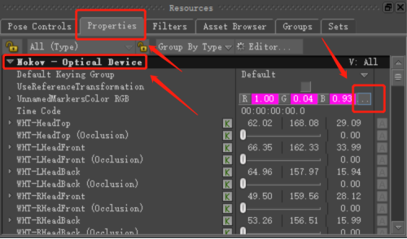

# （四）MotionBuilder插件

### **插件安装**

* 下载最新的插件版本“Nokov-MobuPlugin.XXX.exe”，此插件版本适应MotionBuilder2018-2022版本，将插件安装包解压缩，双击解压缩后的插件，把插件安装在软件目录之中（17.4.1）。完成之后，点击Finish，插件就安装进来了（手套人体在Motionbuilder中的应用同下）。

<figure><figcaption>
17.4.1
</figcaption></figure>

***

### **MotionBuilder的设置与使用**

1.  打开MotionBuilder，点击“Resources—Asset Browser—Devices“，找到其中的” Nokov- Optical Device“，并将其拖入Viewer视图中（17.4.2）。\

    <figure><figcaption>
17.4.2
</figcaption></figure>
2.  点击界面下方“Navigator—I/O devices—I/O Seeker - Optical Device“中的Online按钮，使其进入Live状态，点击”Model binding“，选择其中的Create按键，并在”Optical model“下方点击”Generate a new optical model“，播放后，取消勾选Live后再次勾选，此时运动XINGYING软件中的人体，MotionBuilder中的模型就会被驱动，进行同步运动。\

    <figure><figcaption></figcaption></figure>
3.  选择右边窗口的“Define—Skeleton”，在弹出的窗口中点击“Define”按钮创建一个骨架，在场景里选中关节，在右侧窗口的骨架中选中对应的关节，右键点击Assign Skeleton Bone完成绑定，所有关节绑定完成后，点击带锁图标（Lock Character），选择“Biped”完成角色化。\

    <figure><figcaption></figcaption></figure>
4. 在MotionBuilder中导入要被驱动的模型，对它进行同第3步的角色化处理。
5.  在“Character Controls”窗口，Character栏选择导入的模型角色，Source栏选择XINGYING人体骨骼角色。让XINGYING软件里的人体运动驱动模型。\

    <figure><figcaption></figcaption></figure>

***

### **MotionBuilder自动绑定功能**

1. 在对动捕数据进行骨骼重定向时，可以使用MotionBuilder中的自动绑定功能进行一键绑定；
2. 首先连接上动捕人体数据，动捕软件中打开设置，设置IP网卡地址为“10.1.1.198”，并勾选上“SDK”选项。在MotionBuilder中连接上动捕数据，具体步骤参考上文“MotionBuilder的设置与使用”；
3.  在MotionBuilder左下方的“Navigator”选项卡中将“I/O Devices”展开，点击“I/O Nokov-Optical Device”，在右侧中间的“Information”中勾选“Use Tpose”复选框，点击“Characterize”按钮；\

    <figure><figcaption></figcaption></figure>
4.  此时动捕人体骨骼在MotionBuilder中就被自动绑定了（17.4.7），展开“Characters”，会显示出绑定的人体名称，人体名称和动捕中人体名称一致。\

    <figure><figcaption></figcaption></figure>

***

### **Motionbuilder角色化要求**

1.  在MotionBuilder对动捕数据进行角色化时，导入的模型骨骼尽量与XINGYING人体骨骼保存一致，模型的骨骼层级与XINGYING人体骨骼层级需要一致。XINGYING人体骨骼层级（17.4.8），骨骼名称（17.4.9），骨骼前缀“Body3”指的是XINGYING人体名称；\

    <figure><figcaption>
17.4.8
</figcaption></figure>

    <figure><figcaption>
17.4.9
</figcaption></figure>
2. 在MotionBuilder导入模型后，请将模型姿势调整至T-Pose，与XINGYING人体T-Pose姿势保持一致后再驱动；
3.  模型的骨骼坐标轴需要和XINGYING人体骨骼坐标轴一致。XINGYING人体骨骼坐标轴（17.4.10）。\

    <figure><figcaption>
17.4.10
</figcaption></figure>

***

### **Motionbuilder刚体创建**

1.  在XINGYING实时模式创建一个刚体或后处理模式加载刚体数据，打开Motionbuilder软件，将XINGYING插件拖入场景中，点击界面下方“Navigator—I/O devices—I/O Seeker - Optical Device“中的Online按钮，使其进入Live状态，点击”Model binding“，选择其中的Create按键，并在”Optical model“下方点击”Generate a new optical model“。播放XINGYING软件，Motionbuilder场景中便会显示出Marker点（17.4.11）；\

    <figure><figcaption>
17.4.11
</figcaption></figure>
2.  在MotionBuilder左下方的“Navigator”选项卡中将“I/O Devices”展开，点击“I/O Nokov-Optical Device”，在右侧中间的“Information”中点击“Create RigidBody”后，刚体就创建成功了（17.4.12）。\

    <figure><figcaption>
17.4.2
</figcaption></figure>
3.  在“Navigator”选项卡将“Scene”展开，在“Scene”中将Nokov-Optical Device：Optical展开，下拉至底部，可以看到创建的刚体名称，名称和XINGYING中的刚体名称一致，双击刚体名称，场景中的刚体会显示出连线，选中的刚体也会高亮显示，由红色变为绿色（17.4.13）。\

    <figure><figcaption>
17.4.13
</figcaption></figure>

***

### 未命名点的显示

*   使用Motionbuilder插件获取到动捕数据后，若动捕数据中存在未命名点，那么在Motionbuilder场景中也会显示出未命名点，未命名点的颜色默认为紫色，命名点的颜色为蓝色。

    调整未命名点颜色：在Motionbuilder中可以修改场景中动捕数据的未命名点的颜色，操作如下：首先在“Navigator”选项卡中将“I/O Devices”展开，选中“I/O Nokov-Optical Device”，

    接下来在Motionbuilder界面的右下角选择Properties，在Default下方点击“...”按钮，在弹出的Color窗口中可以修改未命名点的颜色。\

    <figure><figcaption>
17.4.14
</figcaption></figure>

***

### 场景刷新

*   获取到XINGYING的人体数据后，若XINGYING的模板发生变化，可以在Motionbuilder底部的中间选择“Information”选项卡，点击“Refresh”按钮可以刷新Motionbuilder场景，防止XINGYING的人体模板发生变化后人体骨架卡在场景上。\

    <figure><figcaption>
17.4.15
</figcaption></figure>

***

### Use Tpose

* 在对XINGYING人体数据角色化和需要驱动的模型角色化后，需要选择创建的角色与源，在对应之前我们需要勾选上Use Tpose复选框，使场景上的XINGYING人体骨架强制显示为标准的Tpose姿势，因为导入Motionbuilder中的模型通常为标准的Tpose，所以我们的人体骨架也要和模型的姿势保持一致后，再选择角色与源，这样XINGYING的人体数据实时驱动模型后，模型会和XINGYING人体模型的动作保持一致。
