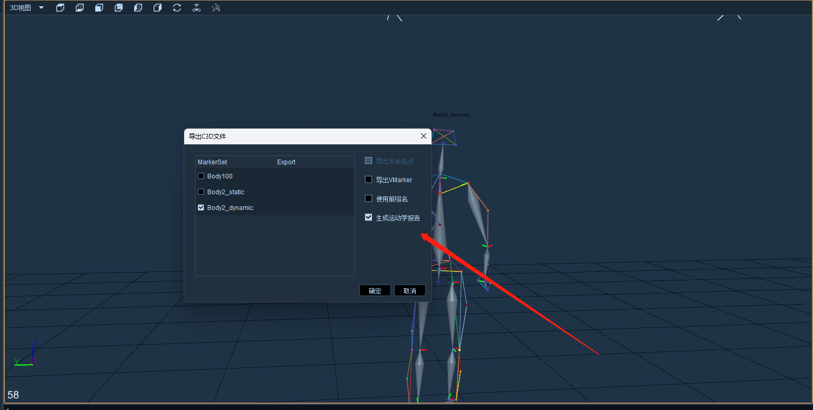

# （八）C3D文件

### **导出c3d文件**

* 在后处理模式加载含有Markerset或测力台的数据，可点击文件--导出c3d文件（13.8.1）。
* 在导出C3D文件窗口中，可指定某一个Markerset进行导出，也可将所有Markerset全部导出，导出的c3d文件中会包含Markerset的命名点，若动捕数据中有测力台，那么导出c3d文件时也会将测力台和模拟通道的数据导出。

<figure><figcaption></figcaption></figure>

***

### **导出生物力学报告**

*   首先需要CGM2动态模型数据并且需要人体从Y轴负反向朝Y轴正方向走动；

    在导出C3D文件窗口中，去掉静态模板勾选只保留动态模板，勾选生成运动学报告，点击确定；\

    <figure><figcaption></figcaption></figure>


注意如果人体朝其他方向走动则会导出报告失败；


***

### **导入c3d文件**

* 点击文件--导入c3d文件，选择文件后缀名为.c3d的文件导入，导入后3D视图中会显示出这个c3d文件中记录的所有命名点和测力台数据。
* 也可将XINGYING中导出的c3d文件导入到Visual 3D等软件中使用。
