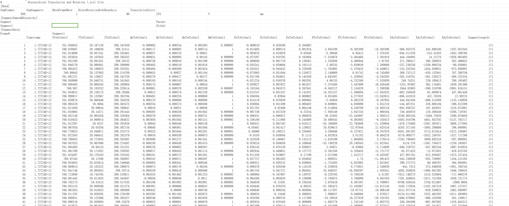

# （二）XRS文件

1. 对包含Rigid的cap文件，可以导出xrs文件查看Rigid的运动数据；
2.  后处理模式，加载动捕数据后，点击“文件”，选择导出XRS文件，系统提示导出XRS文件成功，点击确认（13.2.1）。系统默认将XRS文件保存到工作路径，命名规则：cap文件名+‘-’+markerset名+’.xrs’；\

    .png>)
3.  Xrs文件支持用Excel方式打开，数据格式”帧，时间戳，xyz坐标，四元数qx，qy，qz，qw，欧拉角，角速度，角加速度，刚体长度”（如图13.2.2）；\

    <figure><figcaption>
13.2.2
</figcaption></figure>
