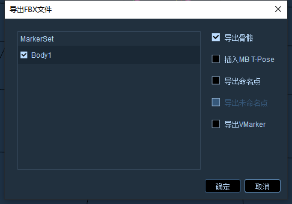

# （六）FBX文件

1. 刚体或人体数据在后处理模式都可以导出FBX，导出的FBX可以导入到Motionbulider、UE等动画软件中。
2. 在后处理加载带有Markerset的动捕数据，点击文件--导出FBX文件，在导出FBX文件窗口中可指定Markerset名称导出（13.6.1），在窗口右侧可选择“导出骨骼、插入MB T-Pose、导出命名点、导出VMarker”导出FBX文件。
3. 选择“插入MB T-Pose、导出骨骼”导出FBX文件，导出的FBX文件都会插入一帧标准T-Pose。选择插入MB T-Pose会在导出的FBX文件中插入一帧Motionbuilder小蓝人的标准T-Pose。

