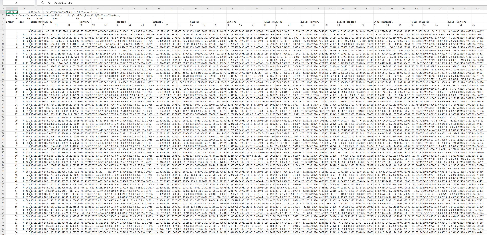

# （三）TRC文件

1. TRC文件是点的坐标数据文件，会将cap文件包含的已命名点和未命名点的数据坐标输出成文件；
2.  后处理模式，加载动捕数据后，点击“文件”，选择导出TRC文件，系统提示导出TRC文件成功，点击确认（13.3.1）。系统默认将TRC文件保存到工作路径，命名规则：cap文件名+‘-’+markerset名+’.xrs’，还会默认导出未命名点的坐标数据，命名规则：cap文件名+‘-’+Unnamed+’.xrs’；\

    .png>)
3.  Trc文件支持用Excel方式打开，数据格式”帧，时间，时间戳，xyz坐标”（13.3.2）；\

    .png>)

***

### 导出反算标记点数据

*   在后处理模式加载带有反算标记点的cap数据，点击文件--导出trc文件，使用excel表格打开trc文件，trc文件中会显示每个命名点的反算标记点的每一帧的XYZ数据，数据中刚体的命名点丢失后反算点自动补齐代替了原始点，那么原始点的XYZ数据也会被补充。trc文件中反算标记点的名称为“RCalc\_标记点名称”（13.3.3）。\

    <figure><figcaption>
13.3.3
</figcaption></figure>
