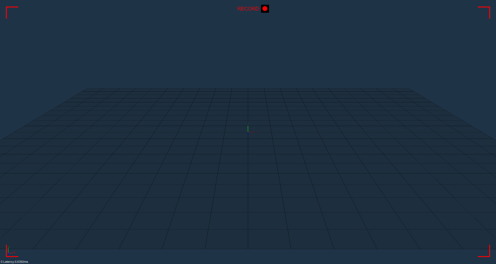
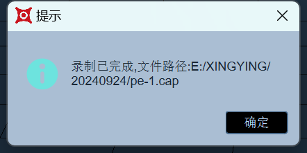

# （一）数据采集

1. 采集数据前，需确保软件已加载配置文件，可通过“文件– 加载标定文件” 选项进行加载，或者通过标定生成一个新的配置文件；
2. 将被捕捉物贴好反光标记点，放入场地内；
3.  在软件界面下方的“文件框”处输入需要采集的数据文件名，文件名避免中文或和特殊符号，确认后点击回车（10.1.1）；\

    .png>)
4.  输入采集数据文件名后，点击下方的红色录制按钮 ，开始采集数据，在采集数据时3D视图上方会闪烁“RECORD”的提示，视图的四角上会显示红色的框表示正在录制中（10.1.2）。\

    <figure><figcaption>
10.1.2
</figcaption></figure>
5.  再次点击录制按钮，即可停止录制，此时会弹窗提示提示已采集好数据（10.1.3）；\

    <figure><figcaption>
10.1.3
</figcaption></figure>
6.  录制一组数据后，“文件”输入框右侧的数字会变为 2，表示即将录制是该文件名的第二组数据，在文件名不变的情况下，每录制一组数据后，该数字均会递进（10.1.4、10.1.5）;\

    .png>)

    .png>)
7.  假如第二组数据录制时有问题，或出于其他原因，想重新录制该组数据，即将数字更改为 2，同时点击左侧的“覆盖”，点击录制按钮，即可重新进行录制（10.1.6），对其他组数据也可一样操作；\

    .png>)
8. 在进行录制的时候，会检查XINGYING当前录制目录中是否有使用标定文件，若当前的录制目录中没有标定文件，则会把上一次加载的标定文件自动拷贝到当前录制目录；
