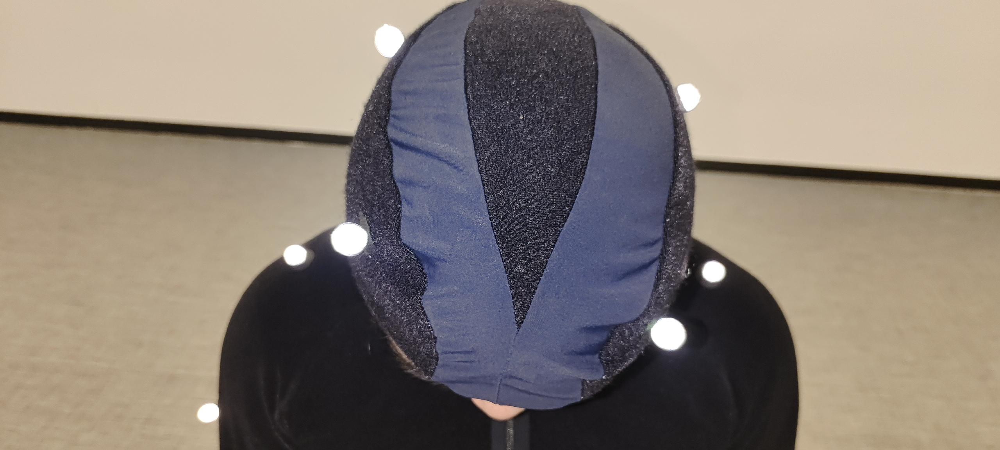
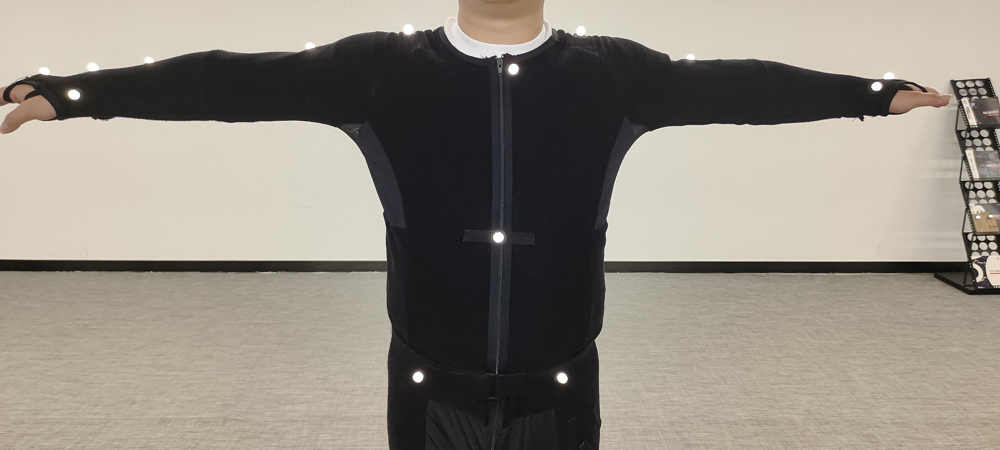
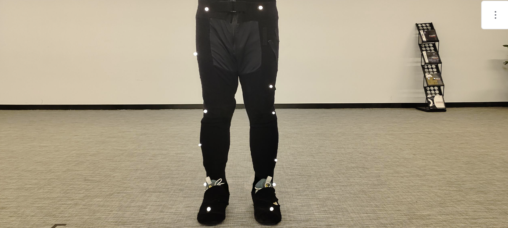
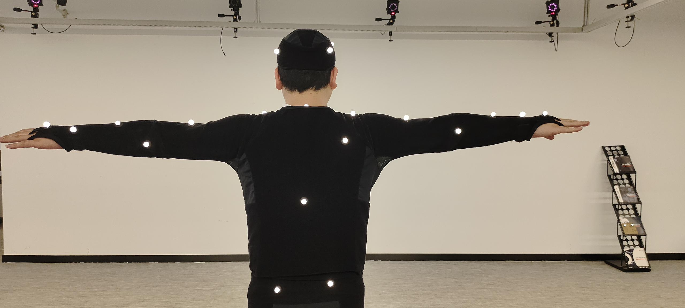
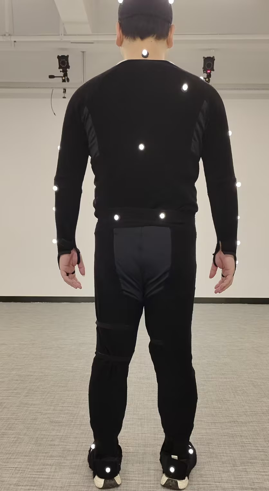
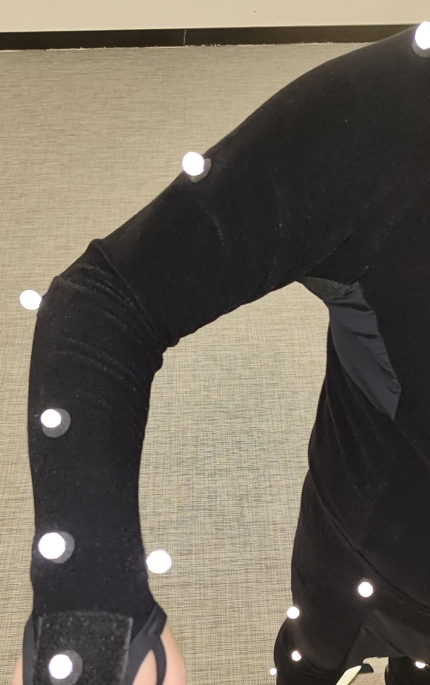
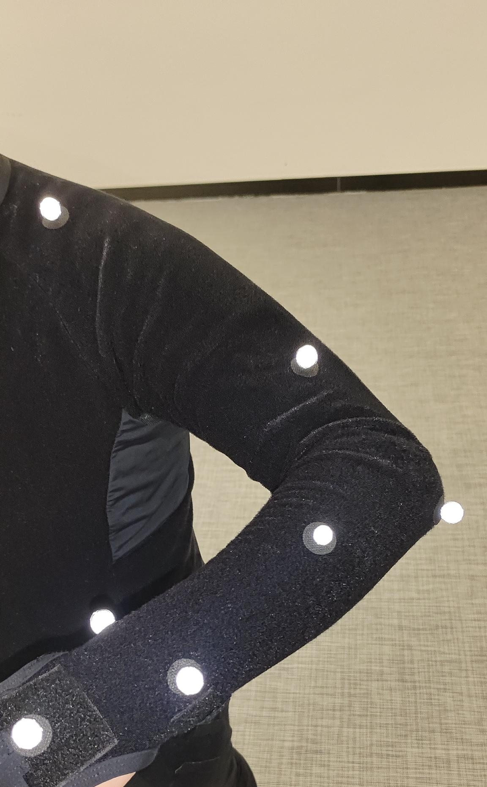

# （八）PlugIn Gait 贴点说明

### PlugIn Gait 人体模板贴点说明

<table data-header-hidden><thead><tr><th></th><th></th><th width="141"></th><th width="141"></th><th></th></tr></thead><tbody><tr><td>描述</td><td>Marker点名称</td><td>PlugIn Gait FullBody(39)</td><td>PlugIn Gait LowerBody(16)</td><td>放置位置</td></tr><tr><td>右后头部</td><td>RF.Head</td><td>√</td><td> </td><td>右后脑</td></tr><tr><td>左后头部</td><td>LF.Head</td><td>√</td><td> </td><td>左后脑</td></tr><tr><td>左前头部</td><td>LB.Head</td><td>√</td><td> </td><td>左前太阳穴</td></tr><tr><td>右前头部</td><td>RB.Head</td><td>√</td><td> </td><td>右前太阳穴</td></tr><tr><td> 第七颈椎</td><td>C7</td><td>√</td><td> </td><td>在第七颈椎椎弓突上</td></tr><tr><td> 第十胸椎</td><td>T10</td><td>√</td><td> </td><td>在第十胸椎椎弓突上</td></tr><tr><td>锁骨</td><td>CLAV</td><td>√</td><td> </td><td>在颈动脉切迹处，锁骨与胸骨相接的地方</td></tr><tr><td>胸骨</td><td>STRN</td><td>√</td><td> </td><td>在胸骨剑突处</td></tr><tr><td>右背部</td><td>RBAK</td><td>√</td><td> </td><td>在右肩胛骨的任何位置</td></tr><tr><td>右肩</td><td>R.Shoulder</td><td>√</td><td> </td><td>在肩锁关节处</td></tr><tr><td>右上臂</td><td>R.Upperarm</td><td>√</td><td> </td><td>在右臂上半外侧表面的1/3处（与左臂上半外侧表面不对称放置）</td></tr><tr><td>右肘</td><td>R.Elbow</td><td>√</td><td> </td><td>在肘外上髁处</td></tr><tr><td>右前臂</td><td>R.Forearm</td><td>√</td><td> </td><td>在右前臂下半外侧表面的1/3处（与左前臂下半外侧表面不对称放置）</td></tr><tr><td>右手腕内侧</td><td>R.WristIn</td><td>√</td><td> </td><td>在连接到手腕带的杆的拇指侧，尽可能靠近右腕关节中心。可以使用松动标记，但为了更好地跟踪轴向旋转，建议使用杆。</td></tr><tr><td>右手腕外侧</td><td>R.WristOut</td><td>√</td><td> </td><td>在连接到手腕带的杆的小指侧，尽可能靠近右腕关节中心。可以使用松动标记，但为了更好地跟踪轴向旋转，建议使用杆。</td></tr><tr><td>右手指</td><td>R.Finger</td><td>√</td><td> </td><td>在右手中指的近端指关节上方</td></tr><tr><td>左肩</td><td>L.Shoulder</td><td>√</td><td> </td><td>在肩锁关节处</td></tr><tr><td>左上臂</td><td>L.Upperarm</td><td>√</td><td> </td><td>在左臂上半外侧表面的1/3处（与右臂上半外侧表面不对称放置）</td></tr><tr><td>左肘</td><td>L.Elbow</td><td>√</td><td> </td><td>在肘外上髁处</td></tr><tr><td>左前臂</td><td>L.Forearm</td><td>√</td><td> </td><td>在左前臂下半外侧表面的1/3处（与右前臂下半外侧表面不对称放置）</td></tr><tr><td>左手腕内侧</td><td>L.WristIn</td><td>√</td><td> </td><td>在连接到手腕带的杆的拇指侧，尽可能靠近左腕关节中心。可以使用松动标记，但为了更好地跟踪轴向旋转，建议使用杆。</td></tr><tr><td>左手腕外侧</td><td>L.WristOut</td><td>√</td><td> </td><td>在连接到手腕带的杆的小指侧，尽可能靠近左腕关节中心。可以使用松动标记，但为了更好地跟踪轴向旋转。</td></tr><tr><td>左手指</td><td>L.Finger</td><td>√</td><td> </td><td>在左手中指的近端指关节上方</td></tr><tr><td>右髂前上棘</td><td>R.ASIS</td><td>√</td><td>√</td><td>右侧前上棘</td></tr><tr><td>左髂前上棘</td><td>L.ASIS</td><td>√</td><td>√</td><td>左侧前上棘</td></tr><tr><td>右髂后上棘</td><td>R.PSIS</td><td>√</td><td>√</td><td>右侧后上棘（位于骶髂关节下方，脊柱与骨盆相连接的位置）</td></tr><tr><td>左髂后上棘</td><td>L.PSIS</td><td>√</td><td>√</td><td>左侧后上棘（位于骶髂关节下方，脊柱与骨盆相连接的位置）</td></tr><tr><td>右大腿</td><td>R.Thigh</td><td>√</td><td>√</td><td>在右大腿下半外侧表面</td></tr><tr><td>右膝盖</td><td>R.Knee</td><td>√</td><td>√</td><td>在右膝的屈伸轴上</td></tr><tr><td>右小腿</td><td>R.Shank</td><td>√</td><td>√</td><td>在右小腿下1/3表面上</td></tr><tr><td>右踝</td><td>R.Ankle</td><td>√</td><td>√</td><td>在外踝沿着通过跨外踝轴的想象线</td></tr><tr><td>右脚后跟</td><td>R.Heel</td><td>√</td><td>√</td><td>在跟骨上，与脚趾标记在足底表面的高度相同</td></tr><tr><td>右脚趾</td><td>R.Toe</td><td>√</td><td>√</td><td>在第二跖骨头上，位于前脚和中足之间的屈肌处，中足一侧</td></tr><tr><td>左大腿</td><td>L.Thigh</td><td>√</td><td>√</td><td>在左大腿下半外侧表面</td></tr><tr><td>左膝盖</td><td>L.Knee</td><td>√</td><td>√</td><td>在左膝的屈伸轴上</td></tr><tr><td>左小腿</td><td>L.Shank</td><td>√</td><td>√</td><td>在左小腿下1/3表面上</td></tr><tr><td>左踝</td><td>L.Ankle</td><td>√</td><td>√</td><td>在外踝沿着通过跨外踝轴的想象线</td></tr><tr><td>左脚后跟</td><td>L.Heel</td><td>√</td><td>√</td><td>在跟骨上，与脚趾标记在足底表面的高度相同</td></tr><tr><td>左脚趾</td><td>L.Toe</td><td>√</td><td>√</td><td>在第二跖骨头上，位于前脚和中足之间的屈肌处，中足一侧</td></tr></tbody></table>

### **人体贴点示意图**

PlugIn Gait FullBody(39)

<figure><figcaption></figcaption></figure> <figure><figcaption></figcaption></figure> <figure><figcaption></figcaption></figure>

PlugIn Gait FullBody(16)

<figure><figcaption></figcaption></figure> <figure><figcaption></figcaption></figure> <figure><figcaption></figcaption></figure>

### **真实贴点示意图**

<figure><figcaption>
正面头部顶视图
</figcaption></figure>

<figure><figcaption>
上半身视图
</figcaption></figure>

<figure><figcaption>
腿部正面视图
</figcaption></figure>

<figure><figcaption>
后背视图
</figcaption></figure>

<figure><figcaption>
后背正视图
</figcaption></figure>

<figure><figcaption>
右臂视图
</figcaption></figure> <figure><figcaption>
左臂视图
</figcaption></figure>

