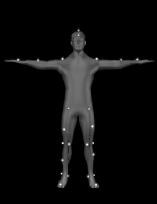
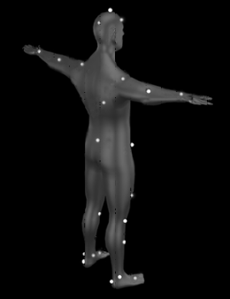
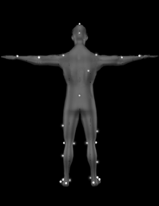
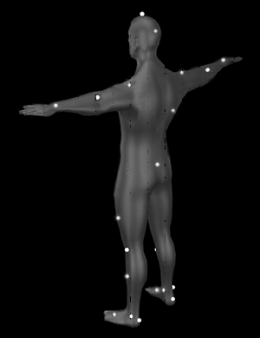

# （二）海伦海耶斯模型

### **Helenhayes贴点说明**

<table data-header-hidden><thead><tr><th width="159"></th><th width="133"></th><th></th><th></th><th></th><th></th></tr></thead><tbody><tr><td>描述</td><td>Marker点名称</td><td>Helenhayes FullBodyWithHead(29 Static)</td><td>Helenhayes FullBody(26 Static)</td><td>Helenhayes LowerBody(19 Static)</td><td>放置位置</td></tr><tr><td>头顶</td><td>Top.Head</td><td>√</td><td></td><td></td><td>在头顶的中央顶部</td></tr><tr><td>
头的前面

头的后面
</td><td>
Front.Head

Rear.Head
</td><td>√</td><td></td><td></td><td>在头的前部和后部</td></tr><tr><td>
左肩

右肩
</td><td>
L.Shoulder

R.Shoulder
</td><td>√</td><td>√</td><td></td><td>肩峰突起的尖端</td></tr><tr><td>
左肘

右肘
</td><td>
L.Elbow

R.Elbow
</td><td>√</td><td>√</td><td></td><td>肱骨外上髁</td></tr><tr><td>
左手腕

右手腕
</td><td>
L.Wrist

R.Wrist
</td><td>√</td><td>√</td><td></td><td>在桡骨茎突和尺骨茎突中间</td></tr><tr><td>骶骨</td><td>R.Offset</td><td>√</td><td>√</td><td></td><td>骶骨接口处的上位面</td></tr><tr><td>
左前腰

右前腰
</td><td>
L.ASIS

R.ASIS
</td><td>√</td><td>√</td><td>√</td><td>盆骨前部左右两侧突出的骨头上</td></tr><tr><td>
左大腿上部

右大腿上部
</td><td>
L.Thigh

R.Thigh
</td><td>√</td><td>√</td><td>√</td><td>大腿中部往上1cm</td></tr><tr><td>
左外侧膝

右外侧膝
</td><td>
L.Knee

R.Knee
</td><td>√</td><td>√</td><td>√</td><td>将标记放在膝关节轴的外侧突出处</td></tr><tr><td>
左内侧膝

右内侧膝
</td><td>
L.Knee.Medial

R.Knee.Medial
</td><td>√</td><td>√</td><td>√</td><td>膝关节轴的内侧突出处</td></tr><tr><td>
左外侧踝关节

右外侧踝关节
</td><td>
L.Ankle

R.Ankle
</td><td>√</td><td>√</td><td>√</td><td>踝轴的侧面，内踝骨的外侧突出处</td></tr><tr><td>
左内侧踝关节

右内侧踝关节
</td><td>
L.Ankle.Medial

R.Ankle.Medial
</td><td>√</td><td>√</td><td>√</td><td>踝轴的内侧;内踝骨的内侧突出处</td></tr><tr><td>
左脚趾

右脚趾
</td><td>
L.Toe

R.Toe
</td><td>√</td><td>√</td><td>√</td><td>脚的中心，在第二和第三跖骨中间</td></tr><tr><td>
左脚跟

右脚跟
</td><td>
L.Heel

R.Heel
</td><td>√</td><td>√</td><td>√</td><td>脚跟骨中心</td></tr></tbody></table>

***

### **Helenhayes骨骼说明**

<table data-header-hidden><thead><tr><th width="169"></th><th width="163"></th><th></th><th></th><th></th></tr></thead><tbody><tr><td>骨骼名称</td><td>Origin Marker</td><td>Long Axis</td><td>Plane Axis</td><td>父段骨骼</td></tr><tr><td>Pelvis</td><td>V_Pelvis_Origin</td><td>V_Mid_Hip</td><td>V.Sacral</td><td>GLOBAL</td></tr><tr><td>R.Thigh</td><td>V_R.Hip_JC</td><td>V_R.Knee_JC</td><td>R.Knee</td><td>Pelvis</td></tr><tr><td>L.Thigh</td><td>V_L.Hip_JC</td><td>V_L.Knee_JC</td><td>L.Knee</td><td>Pelvis</td></tr><tr><td>R.Shank</td><td>V_R.Knee_JC</td><td>V_R.Ankle_JC</td><td>R.Ankle</td><td>R.Thigh</td></tr><tr><td>L.Shank</td><td>V_L.Knee_JC</td><td>V_L.Ankle_JC</td><td>L.Ankle</td><td>L.Thigh</td></tr><tr><td>R.Foot</td><td>V_R.Ankle_JC</td><td>R.Toe</td><td>R.Ankle</td><td>R.Shank</td></tr><tr><td>L.Foot</td><td>V_L.Ankle_JC</td><td>L.Toe</td><td>L.Ankle</td><td>L.Shank</td></tr><tr><td>Trunk</td><td>V_Pelvis_Origin</td><td>V_Mid_Shoulder</td><td>R.Shoulder</td><td>Pelvis</td></tr><tr><td>Head/Neck</td><td>V_Mid_Shoulder</td><td>Top.Head</td><td>Front.Head</td><td>Trunk</td></tr><tr><td>R.UpperArm</td><td>R.Shoulder</td><td>R.Elbow</td><td>L.Shoulder</td><td>Trunk</td></tr><tr><td>L.UpperArm</td><td>L.Shoulder</td><td>L.Elbow</td><td>R.Shoulder</td><td>Trunk</td></tr><tr><td>R.Forearm</td><td>R.Elbow</td><td>R.Wrist</td><td>L.Elbow</td><td>R.UpperArm</td></tr><tr><td>L.Forearm</td><td>L.Elbow</td><td>L.Wrist</td><td>R.Elbow</td><td>L.UpperArm</td></tr><tr><td>R.Hand</td><td>R.Wrist</td><td>V_R.Hand</td><td>L.Wrist</td><td>R.Forearm</td></tr><tr><td>L.Hand</td><td>L.Wrist</td><td>V_L.Hand</td><td>R.Wrist</td><td>L.Forearm</td></tr><tr><td>PelvisWRTLab</td><td>V_Mid_Hip</td><td>V_Pelvis_Origin</td><td>V.Sacral</td><td>GLOBAL</td></tr><tr><td>TrunkWRTLab</td><td>V_Pelvis_Origin</td><td>V_Mid_Shoulder</td><td>R.Shoulder</td><td>GLOBAL</td></tr></tbody></table>

***

### **海伦海耶斯人体贴点示意图**

   

&#x20;                                                       Helenhayes FullBodyWithHead(29 Static)

<figure><figcaption></figcaption></figure> <figure><figcaption></figcaption></figure> <figure><figcaption></figcaption></figure> <figure><figcaption></figcaption></figure>

&#x20;                                                                  Helenhayes FullBody(26 Static)

<figure><figcaption></figcaption></figure> <figure><figcaption></figcaption></figure> <figure><figcaption></figcaption></figure> <figure><figcaption></figcaption></figure>

&#x20;                                                                  Helenhayes LowerBody(19 Static)
