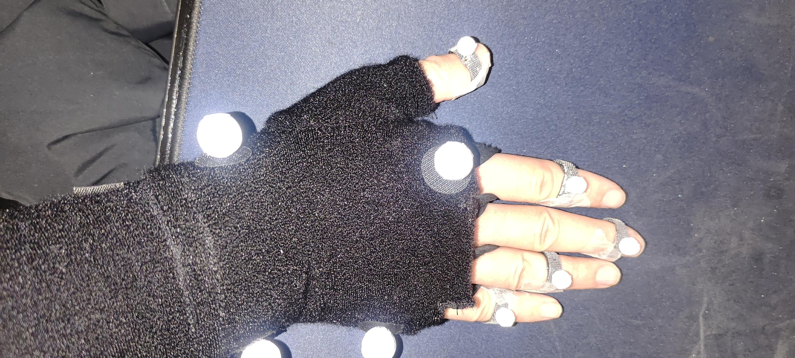
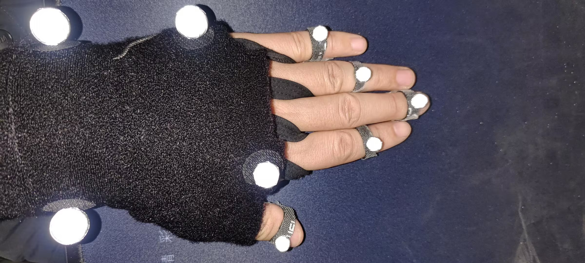

# （七）63点手指贴点说明

<table><thead><tr><th width="96">序号</th><th width="221">名称</th><th width="336">说明</th></tr></thead><tbody><tr><td>1</td><td>FingerPinky</td><td>小指的第二和第三指骨之间</td></tr><tr><td>2</td><td>FingerRing</td><td>无名指的第二和第三指骨之间</td></tr><tr><td>3</td><td>FingerMiddle</td><td>中指的第三指骨之间</td></tr><tr><td>4</td><td>FingerIndex</td><td>食指的第二和第三指骨之间</td></tr><tr><td>5</td><td>FingerThumb</td><td>大拇指的第三指骨之间</td></tr></tbody></table>

### 真实图片

<figure><figcaption></figcaption></figure>

<figure><figcaption></figcaption></figure>

贴点说明

参考上述贴点示意图，将反光marker贴在手指各关节处，人体其他贴点与53贴点一致
