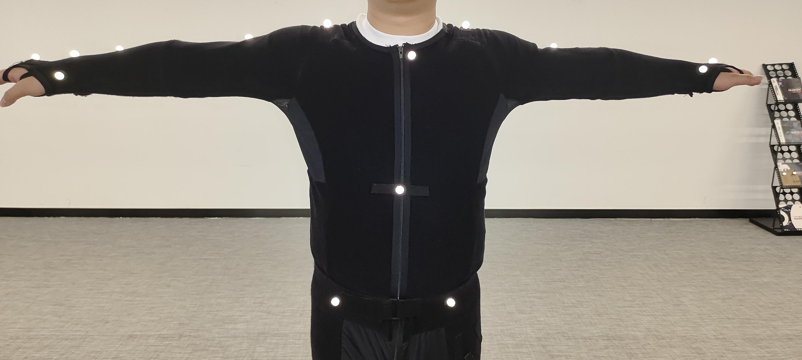
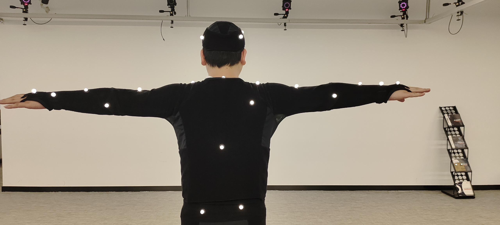

# （四）CGM2人体贴点模型

### CGM2人体模板贴点说明

| 描述              | Marker点名称      | CGM2 FullBody(43 Static) | CGM2 LowerBody(20 Static) | 放置位置                                                   |
| --------------- | -------------- | ------------------------ | ------------------------- | ------------------------------------------------------ |
| 右后头部            | RF.Head        | √                        |                           | 右后脑                                                    |
| 左后头部            | LF.Head        | √                        |                           | 右后脑                                                    |
| 左前头部            | RB.Head        | √                        |                           | 右前太阳穴                                                  |
| 右前头部            | LB.Head        | √                        |                           | 左前太阳穴                                                  |
| 
 第七颈椎
 | C7             | √                        |                           | 在第七颈椎椎弓突上                                              |
| 
 第十胸椎
 | T10            | √                        |                           | 在第十胸椎椎弓突上                                              |
| 锁骨              | CLAV           | √                        |                           | 在颈动脉切迹处，锁骨与胸骨相接的地方                                     |
| 胸骨              | STRN           | √                        |                           | 在胸骨剑突处                                                 |
| 右背部             | RBAK           | √                        |                           | 在右肩胛骨的任何位置                                             |
| 右肩              | R.Shoulder     | √                        |                           | 在肩锁关节处                                                 |
| 右上臂             | R.Upperarm     | √                        |                           | 在右臂上半外侧表面的1/3处（与左臂上半外侧表面不对称放置）                         |
| 右肘              | R.Elbow        | √                        |                           | 在肘外上髁处                                                 |
| 右前臂             | R.Forearm      | √                        |                           | 在右前臂下半外侧表面的1/3处（与左前臂下半外侧表面不对称放置）                       |
| 右手腕内侧           | R.WristIn      | √                        |                           | 在连接到手腕带的杆的拇指侧，尽可能靠近右腕关节中心。可以使用松动标记，但为了更好地跟踪轴向旋转，建议使用杆。 |
| 右手腕外侧           | R.WristOut     | √                        |                           | 在连接到手腕带的杆的小指侧，尽可能靠近右腕关节中心。可以使用松动标记，但为了更好地跟踪轴向旋转，建议使用杆。 |
| 右手指             | R.Finger       | √                        |                           | 在右手中指的近端指关节上方                                          |
| 左肩              | L.Shoulder     | √                        |                           | 在肩锁关节处                                                 |
| 左上臂             | L.Upperarm     | √                        |                           | 在左臂上半外侧表面的1/3处（与右臂上半外侧表面不对称放置）                         |
| 左肘              | L.Elbow        | √                        |                           | 在肘外上髁处                                                 |
| 左前臂             | L.Forearm      | √                        |                           | 在左前臂下半外侧表面的1/3处（与右前臂下半外侧表面不对称放置）                       |
| 左手腕内侧           | L.WristIn      | √                        |                           | 在连接到手腕带的杆的拇指侧，尽可能靠近左腕关节中心。可以使用松动标记，但为了更好地跟踪轴向旋转，建议使用杆。 |
| 左手腕外侧           | L.WristOut     | √                        |                           | 在连接到手腕带的杆的小指侧，尽可能靠近左腕关节中心。可以使用松动标记，但为了更好地跟踪轴向旋转。       |
| 左手指             | L.Finger       | √                        |                           | 在左手中指的近端指关节上方                                          |
| 右髂前上棘           | R.ASIS         | √                        | √                         | 左侧前上棘                                                  |
| 左髂前上棘           | L.ASIS         | √                        | √                         | 右侧前上棘                                                  |
| 右髂后上棘           | R.PSIS         | √                        | √                         | 左侧后上棘（位于骶髂关节下方，脊柱与骨盆相连接的位置）                            |
| 左髂后上棘           | L.PSIS         | √                        | √                         | 右侧后上棘（位于骶髂关节下方，脊柱与骨盆相连接的位置）                            |
| 右大腿             | R.Thigh        | √                        | √                         | 在右大腿下半外侧表面                                             |
| 右膝盖             | R.Knee         | √                        | √                         | 在右膝的屈伸轴上                                               |
| 右小腿             | R.Shank        | √                        | √                         | 在右小腿下1/3表面上                                            |
| 右踝              | R.Ankle        | √                        | √                         | 在外踝沿着通过跨外踝轴的想象线                                        |
| 右脚后跟            | R.Heel         | √                        | √                         | 在跟骨上，与脚趾标记在足底表面的高度相同                                   |
| 右脚趾             | R.Toe          | √                        | √                         | 在第二跖骨头上，位于前脚和中足之间的屈肌处，中足一侧                             |
| 左大腿             | L.Thigh        | √                        | √                         | 在左大腿下半外侧表面                                             |
| 左膝盖             | L.Knee         | √                        | √                         | 在左膝的屈伸轴上                                               |
| 左小腿             | L.Shank        | √                        | √                         | 在左小腿下1/3表面上                                            |
| 左踝              | L.Ankle        | √                        | √                         | 在外踝沿着通过跨外踝轴的想象线                                        |
| 左脚后跟            | L.Heel         | √                        | √                         | 在跟骨上，与脚趾标记在足底表面的高度相同                                   |
| 左脚趾             | L.Toe          | √                        | √                         | 在第二跖骨头上，位于前脚和中足之间的屈肌处，中足一侧                             |
| 右膝内侧            | R.Knee.Medial  | √                        | √                         | 在右大腿下半内侧表面                                             |
| 右踝内侧            | R.Ankle.Medial | √                        | √                         | 在右脚踝内侧                                                 |
| 左膝内侧            | L.Knee.Medial  | √                        | √                         | 在左大腿下半内侧表面                                             |
| 左踝内侧            | L.Ankle.Medial | √                        | √                         | 在左脚踝内侧                                                 |

### **人体贴点示意图**

<figure><figcaption></figcaption></figure> <figure><figcaption></figcaption></figure> <figure><figcaption></figcaption></figure>

### **真实贴点示意图**

<figure><figcaption>
正面头部顶视图
</figcaption></figure>

<figure><figcaption>
上半身视图
</figcaption></figure>

<figure><figcaption>
腿部正面视图
</figcaption></figure>

<figure><figcaption>
后背视图
</figcaption></figure>

<figure><figcaption>
后背正视图
</figcaption></figure>

<figure><figcaption>
右臂视图
</figcaption></figure> <figure><figcaption>
左臂视图
</figcaption></figure>

### 20人体模板贴点说明

#### **人体贴点示意图**

<figure><figcaption></figcaption></figure> <figure><figcaption></figcaption></figure>

