# （一）53点人体贴点及其骨骼说明

### **53点贴点说明**

| 序号 | Marker点名称      | 说明                        |
| -- | -------------- | ------------------------- |
| 1  | HeadTop        | 头顶                        |
| 2  | LHeadFront     | 头左侧前面                     |
| 3  | LHeadBack      | 头左侧后面                     |
| 4  | RHeadFront     | 头右侧前面                     |
| 5  | RHeadBack      | 头右侧后面                     |
| 6  | C7             | 颈部后基部                     |
| 7  | T10            | 胸骨背部对称点                   |
| 8  | CLAV           | 锁骨                        |
| 9  | STRN           | 胸骨（身体上半部中心线中点）            |
| 10 | LShoulderFront | 左肩前                       |
| 11 | LShoulderBack  | 左肩后                       |
| 12 | LUArmHight     | 左上臂                       |
| 13 | LElbow         | 左手肘                       |
| 14 | LElbowIn       | 左手肘（对称侧）                  |
| 15 | LFoream        | 左前臂 外侧                    |
| 16 | LWristIn       | 左手腕内（大拇指一侧）               |
| 17 | LWristOut      | 左手腕外                      |
| 18 | LHandIn        | 左手部食指关节根部                 |
| 19 | LHandOut       | 左手部小指关节根部下2cm（间隔一个marker） |
| 20 | RShoulderFront | 右肩前                       |
| 21 | RShoulderBack  | 右肩后                       |
| 22 | RUArmHight     | 右上臂                       |
| 23 | RElbow         | 右手肘                       |
| 24 | RElbowIn       | 右手肘（对称侧）                  |
| 25 | RFoream        | 右前臂外侧                     |
| 26 | RWristIn       | 右手腕内(大拇指一侧)               |
| 27 | RWristOut      | 右手腕外                      |
| 28 | RHandIn        | 右手部食指关节根部                 |
| 29 | RHandOut       | 右手部小指关节根部下2cm（间隔一个marker） |
| 30 | WaistLFront    | 左髋部前                      |
| 31 | WaistLSide     | 左髋部侧边 （前后中间位置）            |
| 32 | WaistLBack     | 左髋部后                      |
| 33 | WaistRFront    | 右髋部前                      |
| 34 | WaistRSide     | 右髋部侧边 （前后中间位置）            |
| 35 | WaistRBack     | 右髋部后                      |
| 36 | LThight        | 左大腿                       |
| 37 | LKness         | 左膝盖(外)                    |
| 38 | LknessIn       | 左膝盖(膝盖正中间)                |
| 39 | LShin          | 左小腿                       |
| 40 | LAnkleOut      | 左脚踝                       |
| 41 | LHeel          | 左脚后根                      |
| 42 | LMT5           | 左脚前脚掌外侧                   |
| 43 | LMT1           | 左脚前脚掌内侧                   |
| 44 | LToe           | 左脚前脚掌正前部                  |
| 45 | RThight        | 右大腿                       |
| 46 | RKness         | 右膝盖(外)                    |
| 47 | RKnessIn       | 右膝盖(膝盖正中间）                |
| 48 | RShin          | 右小腿                       |
| 49 | RAnkleOut      | 右脚踝                       |
| 50 | RHeel          | 右脚后根                      |
| 51 | RMT5           | 右脚前脚掌外侧                   |
| 52 | RMT1           | 右脚前脚掌内侧                   |
| 53 | RToe           | 右脚前脚掌正前部                  |

***

### 53点人体骨骼属性

| 序号 | 骨骼名称          | 关联点                                                                 | 父段骨骼          |
| -- | ------------- | ------------------------------------------------------------------- | ------------- |
| 1  | Hips          | WaistLFront、WaistLSide、WaistLBack、WaistRFront、WaistRSide、WaistRBack | GLOBAL        |
| 2  | Spine         | T10、STRN、WaistLBack、WaistRBack                                      | Hips          |
| 3  | Spine1        | T10、STRN                                                            | Spine         |
| 4  | Spine2        | C7、T10、CLAV、STRN                                                    | Spine1        |
| 5  | Spine3        | C7、T10、CLAV、STRN                                                    | Spine2        |
| 6  | LeftShoulder  | C7、CLAV、LShoulderFront、LShoulderBack                                | Spine3        |
| 7  | LeftArm       | LShoulderFront、LUArmHigh、LElbow、LElbowIn                            | LeftShoulder  |
| 8  | LeftForeArm   | LForearm、LWristIn、LWristOut                                         | LeftArm       |
| 9  | LeftHand      | LHandIn、LHandOut                                                    | LeftForeArm   |
| 10 | RightShoulder | C7、CLAV、RShoulderFront、RShoulderBack                                | Spine3        |
| 11 | RightArm      | RShoulderFront、RUArmHigh、RElbow、RElbowIn                            | RightShoulder |
| 12 | RightForeArm  | RForearm、RWristIn、RWristOut                                         | RightArm      |
| 13 | RightHand     | RHandIn、RHandOut                                                    | RightForeArm  |
| 14 | Neck          | HeadTop、LHeadFront、RHeadBack、RHeadFront、RHeadBack                   | Spine3        |
| 15 | Head          | HeadTop、LHeadFront、LHeadBack、RHeadFront、RHeadBack                   | Neck          |
| 16 | LeftUpLeg     | LThigh、LKnee、LKneeIn                                                | Hips          |
| 17 | LeftLeg       | LKnee、LKneeIn、LShin、LAnkleOut                                       | LeftUpLeg     |
| 18 | LeftFoot      | LHeel、LMT5、LMT1                                                     | LeftLeg       |
| 19 | LeftToeBase   | LToe、LMT5、LMT1                                                      | LeftFoot      |
| 20 | RightUpLeg    | RThigh、RKnee、RKneeIn                                                | Hips          |
| 21 | RightLeg      | RKnee、RKneeIn、RShin、RAnkleOut                                       | RightUpLeg    |
| 22 | RightFoot     | RHeel、RMT5、RMT1                                                     | RightLeg      |
| 23 | RightToeBase  | RToe、RMT5、RMT1                                                      | RightFoot     |

***

### **53点人体贴点示意图**

<figure><figcaption></figcaption></figure> <figure>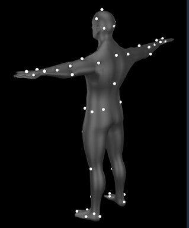<figcaption></figcaption></figure>

***

### **真实贴点示意图**

<figure>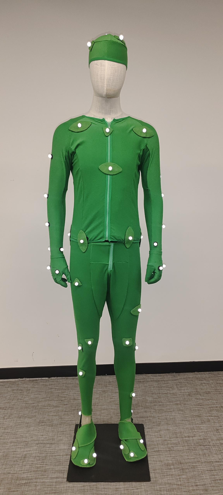<figcaption>
正面全身视图
</figcaption></figure> <figure>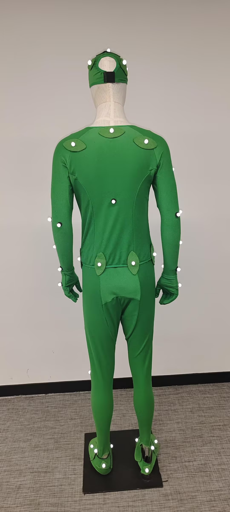<figcaption>
背面全身视图
</figcaption></figure>

<figure>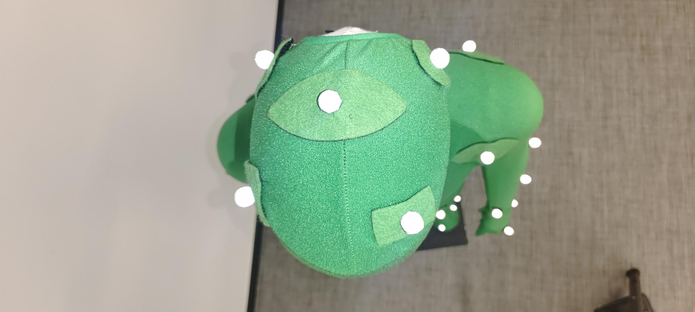<figcaption>
正面头部顶视图
</figcaption></figure>

<figure>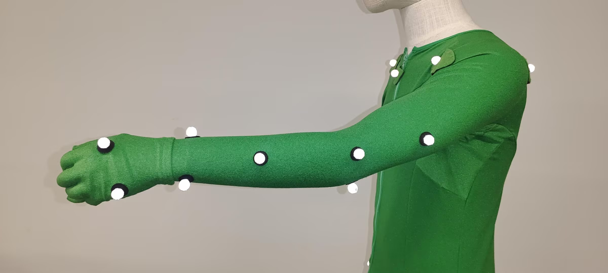<figcaption>
左臂视图
</figcaption></figure>

<figure>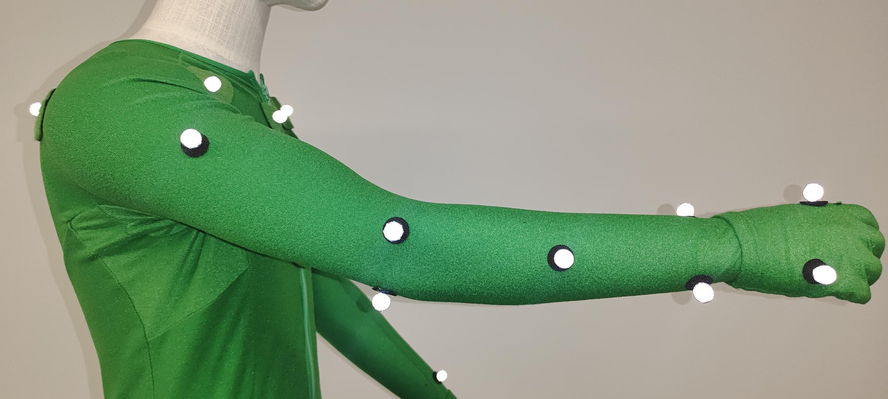<figcaption>
右臂视图
</figcaption></figure>

<figure><figcaption>
左手细节图
</figcaption></figure> <figure><figcaption>
右手细节图
</figcaption></figure>

<figure><figcaption>
左脚掌视图
</figcaption></figure>

<figure>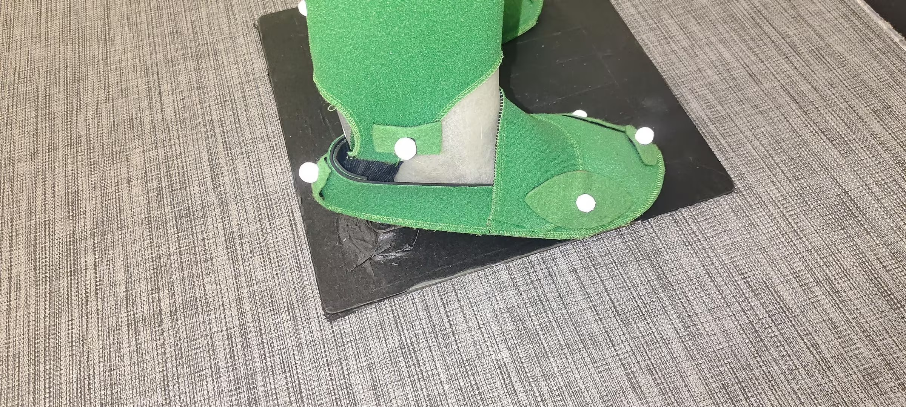<figcaption>
右脚掌视图
</figcaption></figure>

<figure>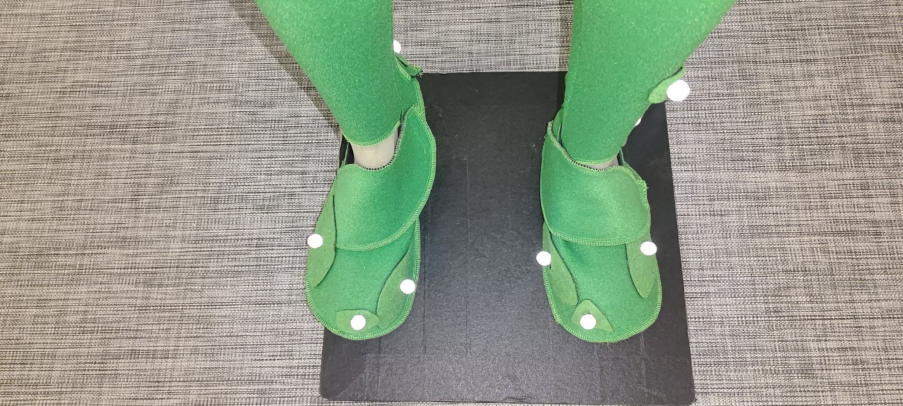<figcaption>
正面脚掌视图
</figcaption></figure>

<figure>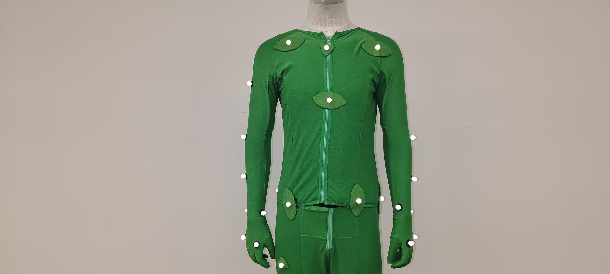<figcaption>
正面上半身视图
</figcaption></figure>

<figure>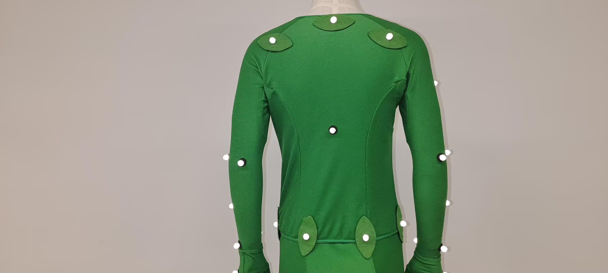<figcaption>
背面上半身视图
</figcaption></figure>

<figure>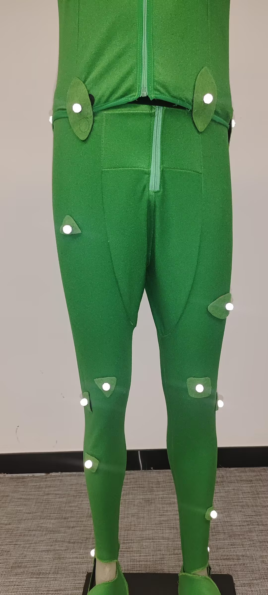<figcaption>
腿部正面视图
</figcaption></figure>

***

### **53点人体具体贴点和注意事项**

1. 头部5个，头顶最高点一个，其余4个在前、后、左、右各标记1个标记点，**前后左右的点不要完全对称，偏移头顶的点使它与其他4点距离不一样。**
2. 上半躯干8个点，领口处1个（锁骨位置），前中心线中点1个（胸骨），脊柱与肩线交点处1个（颈部尾端），**后中心线中点1个，且与前中线中心在同一水平线上**，左右肩膀前后各一个。
3. 手臂16个点，**左右大臂各一个点，不对称，右边大臂的点在中间靠下位置，左边大臂的点在中间靠上位置，两个大臂点不要太靠上或太靠下，抬起手臂与肩膀平行时，大臂的点不要处在两个肩膀上贴点的中线上，应偏向前肩膀的点。左右小臂各一个点，不对称，左小臂中间靠上1个，右小臂中间靠下1个，且都靠外侧，不要贴在中间,这个地方贴点时可让演员将手臂向上弯曲放在肩膀上，调整小臂的贴点，使的小臂上的贴点和手腕内侧贴点(WristIn)的距离比小臂上的贴点和手腕外侧贴点(WristOut)的距离要远**。每个肘关节位置2个，（肘部，靠近骨头的地方，可要求演员将手臂向上弯曲(双手放在肩膀上)方便观察贴点）。左右肩膀前后各1个，每个腕关节2个，食指根部1个，**小拇指的根部下方大约2cm处1个**，关节处的贴点可以通过弯曲关节的方式来检查测试位置是否正确。
4. 腰部6个，髋部前面2个，后面与前面对称2个，**后面的点略高于前面的点，侧面各1个，不对称，一个可以稍微靠前一点，一个靠后一点**。
5. 腿部8个，大腿中部外侧各1个，左侧大腿的点贴在中部向上一点，右侧大腿的点贴在中部向下一点，和右侧不对称。膝关节2个，膝盖外侧贴一个点，剩余的一个点贴在膝盖正中间，防止遮挡。左小腿的点贴在中部以上偏外侧，右小腿的点贴在中部以下偏外侧。
6. 脚部10个。**前脚掌正前方1个**，前脚掌弯曲关节处2个，确保内侧标记比外侧标记向前更远，脚踝处1个，脚后跟1个，脚跟标记和脚前两侧的两个标记位于同一个平面上。**左右腿脚踝，前脚掌两侧的贴点高度尽量保持一致。**
7. 如果有肘关节标记遮挡的问题，把肘关节内标记放在肘关节略高于肘关节的手臂后面，而不是肘关节内。
8. 如果遇到了膝盖标记遮挡的问题，请将内膝标记贴在稍微靠前一点的位置，而不是内膝上。
9. 身体左右腰部、膝关节、脚踝上贴点尽量高度一致。
10. 翻转手腕和小臂时，如果出现识别不上的情况时，请检查调整小臂的贴点，左右小臂各一个点，不对称，左小臂中间靠上1个，右小臂中间靠下1个，且都靠外侧，不要贴在中间,这个地方贴点时可让演员将手臂向上弯曲放在肩膀上，调整小臂的贴点，使的小臂上的贴点和手腕内侧贴点(WristIn)的距离比小臂上的贴点和手腕外侧贴点(WristOut)的距离要远。
11. 注意上述黑色加粗部分的说明
12. 将容易松动和出现褶皱的位置用绑带固定，如腰，上臂，手腕，手掌等位置。
