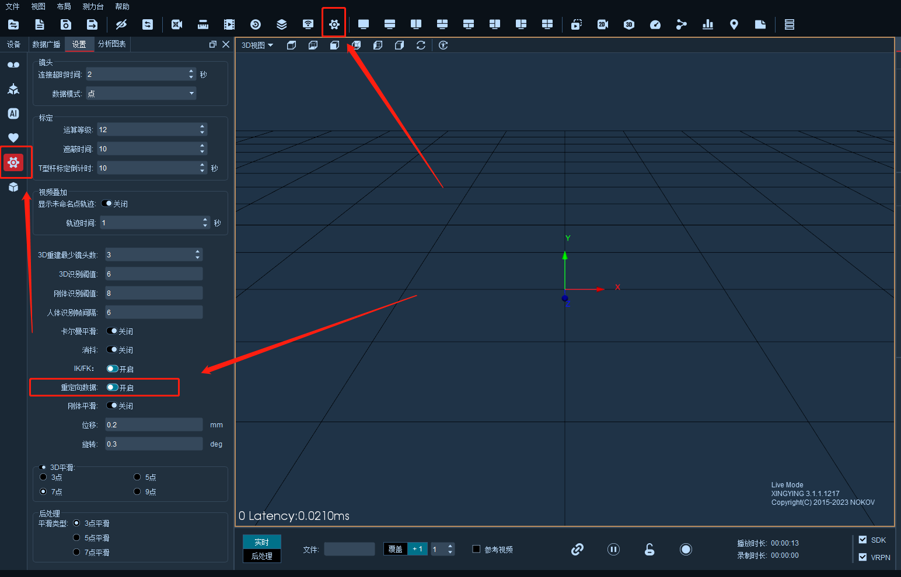

# （一）模型资产导入

### 模型资产导入功能支持在实时和后处理模式导入FBX和HTR文件对人体数据进行重定向。 

***

### **实时模式**

1.  在实时模式创建五十三点人体模型后点击软件左上角“文件”按钮，点击“导入模型资产”,软件会弹出模型资产导入窗口，在模型资产导入窗口中点击“导入”，选择需要导入的FBX模型文件或HTR模型文件，点击”打开”导入模型文件（15.1.1）；\

    <figure><figcaption>
15.1.1
</figcaption></figure>
2. 成功导入模型文件后，”模型名称”选项框中会显示出当前导入的模型文件名称，若导入过多个模型文件，可通过左侧的下拉框来选择需要进行绑定的模型文件，导入多个模型文件时焦点会定位在新导入的模型文件处；
3.  成功导入模型后窗口左侧会显示出导入模型的骨架和骨骼名称，点击骨骼名称可展开显示子骨骼，点击“-”可收起。导入模型文件后，选中一段骨骼，在窗口中间区域会显示出选中骨骼的全局的位移和旋转信息、父段名称、骨骼长度的信息（15.1.2）；\

    <figure><figcaption>
15.1.2
</figcaption></figure>
4. 若导入UE、MotionBuild模型，模型导入窗口会自动匹配上模型骨骼自动绑定上，无需手动绑定；
5.  鼠标悬停在最右侧人体骨骼图的骨骼位置上，会显示出该骨骼位置需绑定的骨骼的名称，在左侧骨骼树状图选中对应的骨骼，并在右侧人体图上选中对应的骨骼（15.1.3），再次点击可取消选中该段骨骼（选中的骨骼会高亮显示）。模型绑定后，将鼠标悬停在绑定的骨骼上，界面会显示出绑定骨骼对应的模型骨骼名称；\

    <figure><figcaption>
15.1.3
</figcaption></figure>
6.  选中骨骼后点击鼠标右键，点击绑定，若骨骼绑定错误，可右键选中绑错的骨骼，点击取消绑定（15.1.4），依次正确的对人体的骨骼进行绑定，绑定好的骨骼会变成绿色，全部绑定完成后，点击上方的“模型重定向”，软件会弹出提示“绑定成功”。点击“OK”（15.1.5），此时FBX模型就已经和人体Markerset绑定成功了，关闭模型资产导入窗口；\

    <figure><figcaption>
15.1.4
</figcaption></figure>

    <figure><figcaption>
15.1.5
</figcaption></figure>
7. 点击模型资产导入窗口右上角的“清除绑定”按钮，软件会弹窗提示，点击确定，绑定上的所有骨骼会被一键清除；
8. 点击模型资产导入窗口上方的“清除”按钮后，当前使用的模型文件会被移除，模型移除后”模型名称”选项框中模型文件也会被一同移除，移除后再从软件右下角点击模型导入，选择导入刚才被移除的模型文件，无需再次重新绑定骨骼，软件会自动加载上次绑定的骨骼并进行模型绑定；

***

### **启用重定向数据**

* 若需要使用SDK来获取重定向的人体数据，打开设置面板，选择其他设置，开启“启用重定向数据”（15.1.6），在软件右下角开启“SDK” ，此时重定向的人体数据就会向外广播发送了，在UE中就可以收到重定向后的人体数据了，若未勾选“启用重定向数据”，SDK发送出去的就是原始的人体数据；


在使用SDK插件获取重定向的混合人体数据时，若将“启用重定向数据”按钮取消勾选了的情况下，需要重新连接SDK插件，否则会导致客户端获取到的动捕数据为原始人体数据；


***

### **后处理模式**

*   后处理模式导入模型进行骨骼重定向，需在设置中开启“启用重定向数据”和“SDK”然后需要点击后处理菜单栏的“解算”按钮对人体骨骼进行重新解算，便可以使用SDK插件获取到重定向的人体数据。这是实时和后处理模式的区别。\

    
