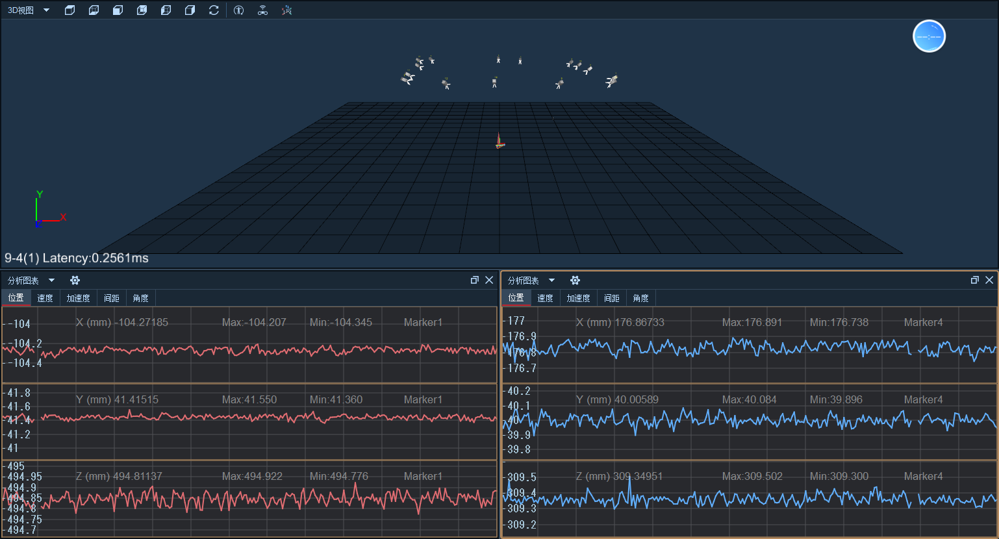

# （一）分析图表

1.  点击界面上方“窗口分割– 2个窗口：上/下”选项，让主界面分割为上下两个窗格，选中窗格时会有橙色边框，此时点击“视图类型”，让其中一个窗口显示“3D视图”，一个窗口选择“分析图表”（11.1.1）；\

    <figure><figcaption>
11.1.1
</figcaption></figure>
2. 在实时模式选中一个命名点后分析图表上会显示出当前值和最大、最小值（11.1.2），在后处理模式只会显示整组数据的XYZ的最大最小值；
3.  在分析图表的右侧会显示纵轴刻度值，在实时模式下会根据命名点的数据实时变化，后处理模式无变化；\

    <figure><figcaption>
11.1.2
</figcaption></figure>
4.  点击“位置/速度/加速度”表示对 Marker 点所在位置（坐标）、速度、加速度进行分析，如选中“速度”，点击任意 Marker，在图表处可显示出该点的速度和波形曲线（11.1.3），实时模式下会显示当前值和最大最小值； \

    <figure><figcaption>
11.1.3
</figcaption></figure>
5.  “间距”表示对两个 Marker 点之间直线距离的计算分析，在3D视图或资产面板列表中选择两个Marker，分析图表中会显示出这两个Marker之间的间距和曲线（11.1.4），注意不要选择同一个点。两个点为一组，最多可选择十组点查看间距数据。在间距列表上会显示每一组命名点间距的ID；\

    <figure><figcaption>
11.1.4
</figcaption></figure>
6.  “角度”表示对多个 Marker 点所连直线的夹角，选择四个Marker查看角度数据，分析图表会显示出多个Marker点所呈夹角的角度变化。四个Marker点为一组，最多显示十组数据（11.1.5）；\

    <figure><figcaption>
11.1.5
</figcaption></figure>

***

### 图表交互键

1. 按住Shift+滚轮可放大或缩小分析图表数据曲线；
2. 按住Shift+左键上下移动，可上下平移数据曲线，纵轴上的刻度也会跟随变化；
3. 缩放
   * 按住Ctrl+左键左右移动，会对图表下方的横轴进行放大或缩小，横轴上显示的刻度也会跟随变化；
   * 按住Ctrl+左键上下移动，会对图表左侧的纵轴进行放大或缩小，纵轴上显示的刻度也会跟随变化；
   * 在对图表进行缩放操作时，图表上的X、Y、Z轴的波形会同步进行缩放。
4. 当鼠标放置在数据曲线的某一帧上时，会显示出这一帧的数值（11.1.6），前面的数字为当前这一帧的帧号，后面的数字为这一帧的值。


在分析图表、模拟图表、VMarker图表、骨骼图表上都可使用交互键进行操作


<figure><figcaption>
11.1.6
</figcaption></figure>

***

### 标记编辑

1.  #### 在后处理模式的分析图表中，可以绘制标记点的轨迹，也可以对选中的轨迹进行平移（11.1.7）；

    <figure><figcaption>
11.1.7
</figcaption></figure>
2. #### 绘制轨迹：选择一个命名点，打开分析图表，在图表上方点击“绘制轨迹”按钮，在分析图表的某一条纵轴上摁住鼠标左键拖动绘制marker坐标数据。“绘制轨迹”功能可以绘制丢点的数据，也可以对已有的坐标数据重新绘制；
3.  平移轨迹：在分析图表中的某一条纵轴上摁住鼠标左键拖动绘制一个矩形框选一段曲线，通过鼠标左键上下拖动选中的曲线来编辑对应的坐标数据（11.1.8）。

    <figure><figcaption>
11.1.8
</figcaption></figure>

***

### 分析图表单独控制

1. 开启多个分析图表，可以选择不同Marker点，进行数据查看;
2.  后处理导出Ly文件，开启多个图表则导出选中点的图表数据，如果都不选中就导出所有分析图表数据（11.1.9）；\

    <figure><figcaption>
11.1.9
</figcaption></figure>
