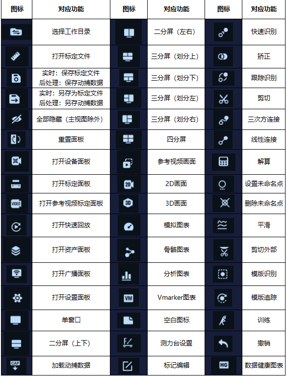

# （二）工具栏

1. 工具栏中的快捷按钮分为六个工具区，各个工具区之间使用竖线分割，第一个工具区可以切换目录，打开、保存、另存标定文件；
2. 第二个工具区全部隐藏、重置浮窗面板；
3. 第三个工具区可以打开设备、标定、视频标定，快速回放，资产、数据广播的浮窗面板；
4. 第四个工具区可对主面板设置不同的分屏布局；
5. 第五个工具区可以将主面板显示为不同的视图类型；
6. 在软件中成功连接上测力台或者在后处理模式播放测力台数据，在第六个工具区点击测力台数据按钮，在窗口中会显示测力台的FX、FY、FZ等数据，切换后处理则会添加显示：快速识别，追踪识别，剪切，三次方连接，线下连接，解算，设置未命名点，删除未命名点，平滑，剪切外部，模板识别，模板追踪，训练，矫正，撤销，等功能；详细参考以下表格：

<figure><figcaption></figcaption></figure>

***

#### 主面板 

* 在主面板左上方点击倒三角按钮展开，可以将主面板选择显示为不同的视图类型，在主面板上方可选择3D视图的不同观测视角，点击最后一个按钮会将3D视图的观测视角重置，在3D视图中点击右键后可设置3D视图中的显示；

***

#### 窗口合并、拖拽自定义 

* 将浮动面板拖拽至指定窗口中，在窗口上会显示一个十字型，在十字型上选择上下左右任意一个方向，松开鼠标，浮动面板在位置即为选择的十字型的位置；
