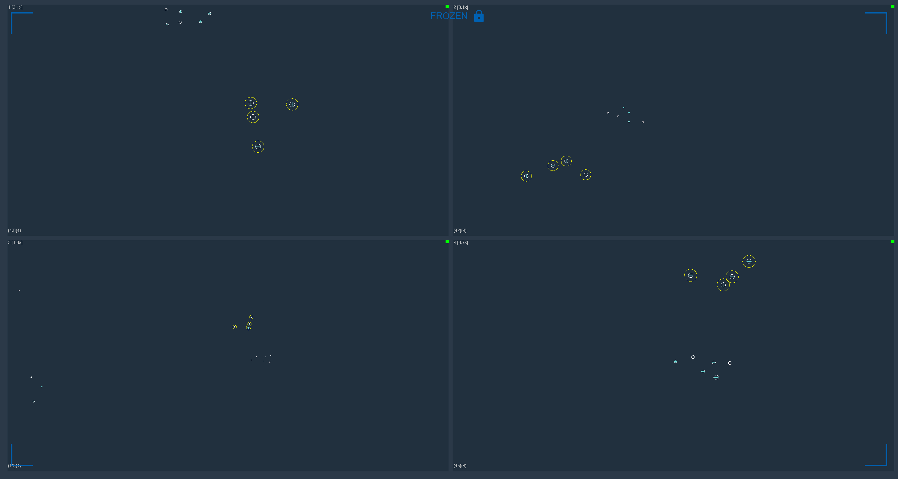

# （六）2D选点标定

1. 场地中存在反光物体导致2D视图中提取到了杂点，在进行L标定时，无需手动遮蔽2D视图中的杂点，在存在杂点的2D视图中使用2D选点的功能，框选L杆上的四个2D点进行标定；
2. 首先将L杆放置在场地中，点击软件下方的冻结帧使2D视图处于冻结状态；
3.  找到存在杂点的2D视图，框选L杆上的四个点，2D点被框选上后会以黄色的圆圈高亮显示，同时2D视图左下方会显示框选的2D点数。使用上述步骤对有杂点的2D视图进行一样的处理；\

    <figure><figcaption></figcaption></figure>
4. 冻结状态选取2D点的方式如下：
   * Ctrl+鼠标左键（点选方式）
   * Shift+鼠标左键拖动（框选方式）
5.  处理完成后打开标定面板，选择基础标定，选择正确的L杆类型与标定的轴向，点击L标定按钮，可以看到存在杂点但选取了L杆上的四个点的2D视图L标定通过，点击取消冻结按钮，进行T标定及其后续操作（更新标定时也可以使用2D选点方式进行L标定）。\

    <figure><figcaption></figcaption></figure>

