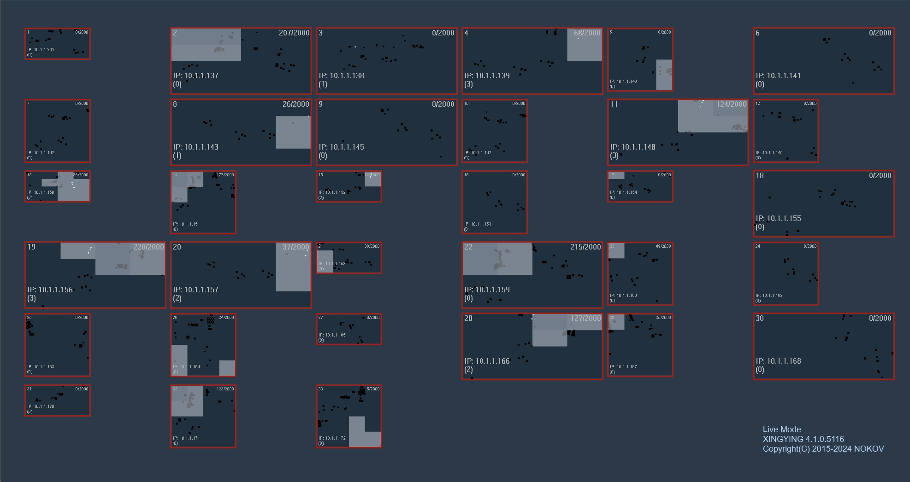
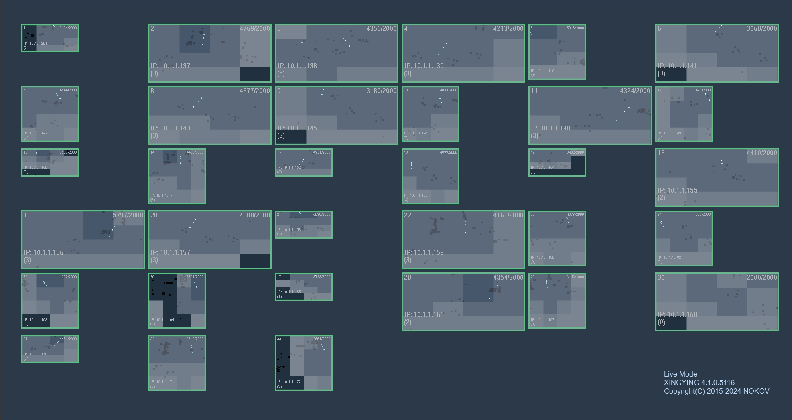

# （四）标定进度提示

**挥杆进度提示**

1、软件通过时间（5.4.1）和有效帧（5.4.2）两个条件来判断T标定数据采集流程是否完成，只有当两个条件都满足时，才结束数据采集流程。


<mark style="color:orange;">标定-标定设置-高级中设置镜头的有效帧数</mark>


<figure><figcaption>
5.4.1
</figcaption></figure>

<figure><figcaption>
5.4.2
</figcaption></figure>

2、如果持续时长已达到，但是有部分镜头的有效帧还没有达到要求，则进度停在99%，直到所有镜头的有效帧都达到要求。

3、T标定挥杆过程中，在2D视图中，通过显示不同的边框颜色来标识不同的标定进度：

* 已采集的有效帧数为0%\~30%时 ，镜头颜色显示深红色。

<figure><figcaption>
5.4.1
</figcaption></figure>

* 已采集的有效帧数为30%\~60%时 ，镜头颜色显示浅红色。

<figure><figcaption>
5.4.2
</figcaption></figure>

* 已采集的有效帧数为60%\~99%时 ，镜头颜色显示橙色。

<figure><figcaption></figcaption></figure>

* 已采集的有效帧数为100%时 ，镜头颜色显示绿色。

<figure><figcaption>
5.4.4
</figcaption></figure>

**标定完成提示音**

在标定完成或者数据采集完成时，播放预置的提示音，提示操作结果。

